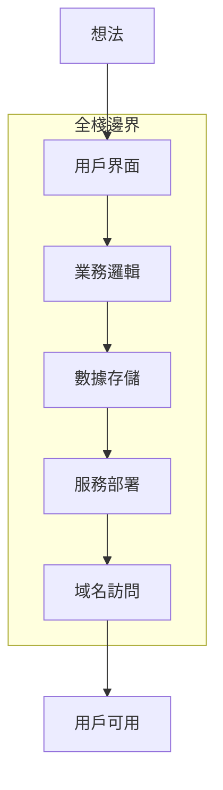
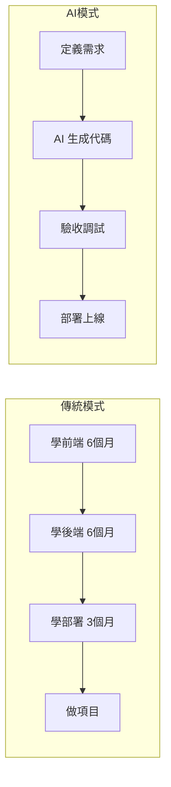
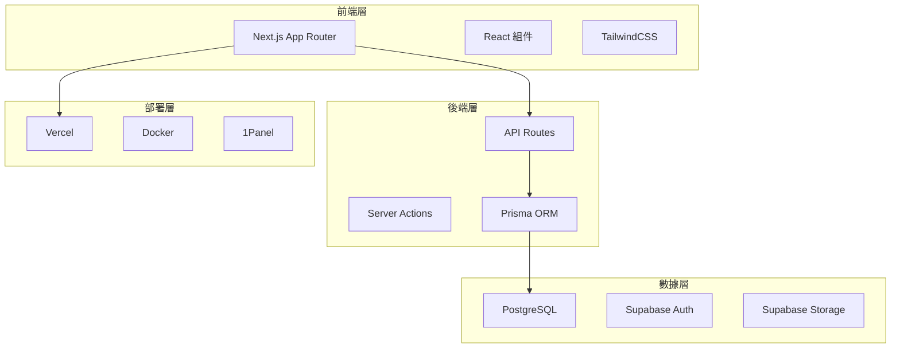

# 0.0.1 到底什麼纔算全棧

> **一句話破題**：全棧 = 一個人能把想法變成可訪問的在線產品，從界面到數據庫到部署，端到端閉環。

## 全棧的本質

全棧不是"精通所有技術"，而是**能獨立交付完整產品**。

傳統定義把全棧理解爲"前端 + 後端"，這是**技術視角**。

Vibe Coding 時代的全棧是**產品視角**：能不能讓用戶通過一個 URL 使用你的產品？

## 全棧的三個層次

| 層次 | 能力要求 | 典型產出 |
|-----|---------|---------|
| **L1：原型級** | 能跑通演示流程 | 本地 demo、截圖展示 |
| **L2：產品級** | 能部署上線、處理真實用戶 | 可分享的 URL、基礎用戶系統 |
| **L3：商業級** | 能承載付費、處理規模化 | 支付集成、性能優化、監控告警 |

本課程目標：帶你從 L1 到 L2，併爲 L3 打下基礎。

## AI 時代的全棧可能性

| 對比維度 | 傳統路徑 | AI 輔助路徑 |
|---------|---------|------------|
| 學習週期 | 1-2 年系統學習 | 數週實戰驅動 |
| 核心技能 | 語法、算法、框架 | 需求表達、結果驗收 |
| 產出速度 | 按月計 | 按天/周計 |
| 瓶頸所在 | 編碼能力 | 需求清晰度 |

## 本課程的全棧技術棧

這套技術棧的選擇邏輯：

1. **Next.js**：前後端一體，減少技術切換成本
2. **Supabase**：開箱即用的後端服務，省去基礎設施搭建
3. **Vercel**：零配置部署，專注於產品而非運維
4. **TypeScript**：類型安全讓 AI 生成的代碼更可靠

## 覺知

> **全棧不等於全能**
> - 你不需要手寫 Webpack 配置——Next.js 已經封裝好了
> - 你不需要從零搭建用戶系統——Supabase Auth 開箱即用
> - 你不需要管理服務器——Vercel 處理部署和擴容
> 
> 全棧的本質是**知道每一層在做什麼**，而不是**親手實現每一層**。

## 本節小結

- 全棧 = 端到端交付能力，從想法到可訪問的在線產品
- AI 時代的全棧門檻大幅降低，核心技能從"寫代碼"轉向"定義需求"
- 本課程技術棧：Next.js + Supabase + Vercel，一套打通全鏈路
