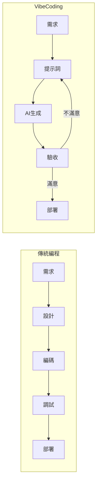
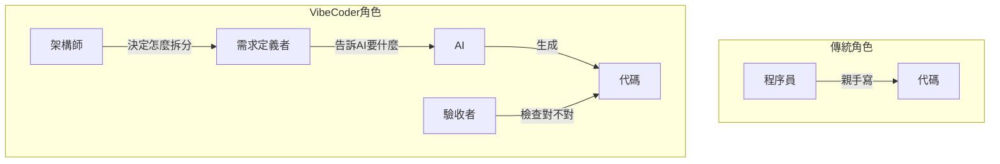
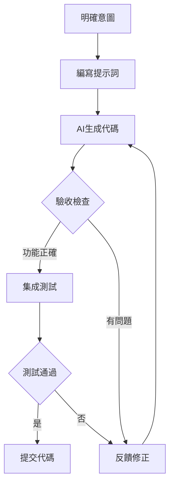

# 0.0.2 爲什麼 Vibe 一下就能編程

> **一句話破題**：Vibe Coding 的本質是用自然語言表達意圖，讓 AI 處理實現細節——你負責"做什麼"，AI 負責"怎麼做"。

## 什麼是 Vibe Coding

Vibe Coding 是 Andrej Karpathy 在 2025 年 2 月提出的概念：

> "你完全沉浸在氛圍中，擁抱指數級增長，忘記代碼的存在。"

這不是"讓 AI 幫你寫代碼"那麼簡單。它是一種**全新的人機協作範式**：

## 核心差異對比

| 維度 | 傳統編程 | Vibe Coding |
|-----|---------|-------------|
| **輸入** | 精確的代碼語法 | 自然語言描述 |
| **輸出** | 開發者寫的代碼 | AI 生成的代碼 |
| **核心技能** | 語法、算法、調試 | 需求表達、結果驗收 |
| **迭代方式** | 修改代碼 → 運行 → 調試 | 修改提示詞 → 生成 → 驗收 |
| **學習曲線** | 陡峭，需要系統學習 | 平緩，邊做邊學 |
| **最大瓶頸** | 編碼速度和技術深度 | 需求清晰度和驗收能力 |

## 角色轉變

| 傳統身份 | Vibe Coding 身份 |
|---------|-----------------|
| 代碼編寫者 | 需求定義者 |
| 語法調試者 | 結果驗收者 |
| 實現者 | 架構決策者 |

你不再是"寫代碼的人"，而是"指揮 AI 寫代碼的人"。

## Vibe Coding 的工作流

**關鍵步驟解析**：

1. **明確意圖**：用一句話說清楚要實現什麼
2. **編寫提示詞**：把意圖轉化爲 AI 能理解的描述
3. **AI 生成代碼**：讓 AI 處理具體實現
4. **驗收檢查**：確認代碼是否符合預期
5. **反饋修正**：如果不對，告訴 AI 哪裏需要調整

## 什麼時候用 Vibe Coding

| 場景 | 適合度 | 原因 |
|-----|-------|-----|
| 快速原型 | ⭐⭐⭐⭐⭐ | 最小成本驗證想法 |
| CRUD 業務 | ⭐⭐⭐⭐⭐ | 模式固定，AI 生成質量高 |
| UI 組件 | ⭐⭐⭐⭐ | 樣式代碼重複度高 |
| 配置文件 | ⭐⭐⭐⭐ | 格式標準，易於生成 |
| 複雜算法 | ⭐⭐ | 需要深度理解才能驗收 |
| 性能優化 | ⭐⭐ | 需要精細調優和基準測試 |
| 安全關鍵 | ⭐ | 必須人工審查每一行 |

## 覺知

> **Vibe Coding 不是"不看代碼"**
> 
> 常見誤解：Vibe Coding = 完全不懂代碼也能編程
> 
> 事實：你需要能**讀懂** AI 生成的代碼，才能：
> - 判斷邏輯是否正確
> - 發現潛在的安全問題
> - 識別 AI 的"一本正經胡說八道"
> 
> Vibe Coding 降低的是**寫代碼**的門檻，不是**理解代碼**的門檻。

## 本節小結

- Vibe Coding 是用自然語言驅動 AI 生成代碼的開發範式
- 核心技能從"編碼"轉向"需求表達"和"結果驗收"
- 適合快速原型、CRUD 業務、UI 組件等場景
- 你仍需具備代碼閱讀能力來驗收 AI 的輸出
