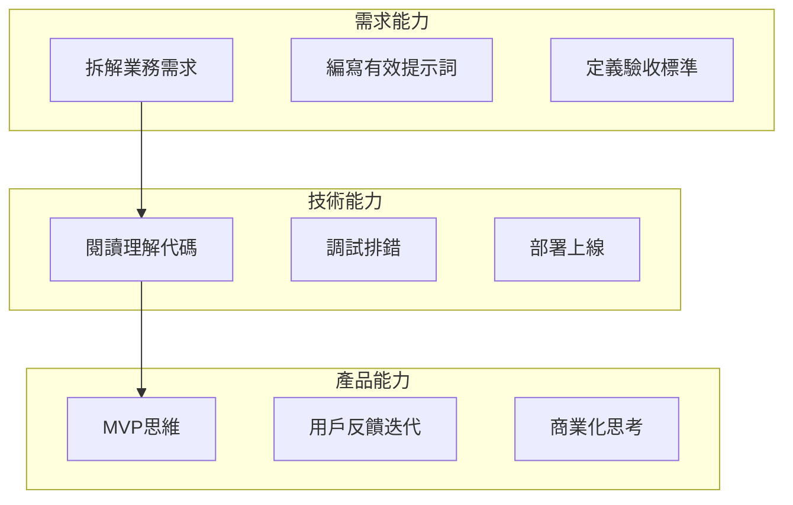
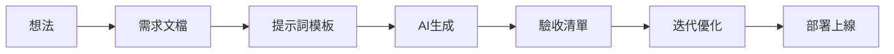

# 0.0.3 學完這門課我能做什麼

> **一句話破題**：這門課的目標是讓你能獨立完成一個可上線、可分享、有商業化潛力的 Web 應用。


## 能力目標

學完這門課，你將具備以下能力：



| 能力維度 | 具體技能 | 驗證方式 |
|---------|---------|---------|
| **需求定義** | 把模糊想法轉化爲清晰的功能描述 | 能寫出 AI 可執行的提示詞 |
| **代碼驗收** | 判斷 AI 生成的代碼是否正確 | 能發現邏輯錯誤和安全隱患 |
| **系統調試** | 定位問題並引導 AI 修復 | 能讓應用跑通全流程 |
| **產品部署** | 把本地項目部署到公網 | 獲得可分享的 URL |


## 具體產出

課程結束時，你將擁有：

### 1. 一個完整的全棧項目

```
你的項目/
├── 用戶認證系統（註冊/登錄/權限）
├── 核心業務功能（根據你的選題）
├── 數據持久化（PostgreSQL）
├── 響應式 UI（適配移動端）
└── 生產環境部署（可訪問的 URL）
```

### 2. 可複用的開發流程



### 3. 一套思維框架

| 思維模式 | 應用場景 |
|---------|---------|
| **MVP 思維** | 先做最小可用版本，再逐步擴展 |
| **驗收思維** | 先定義"什麼算做完"，再開始動手 |
| **迭代思維** | 小步快跑，持續交付 |
| **產品思維** | 從用戶需求出發，而非技術炫技 |


## 課程路徑

```mermaid
graph TB
    subgraph 第一階段：基礎認知
        A1[環境搭建] --> A2[Git基礎]
        A2 --> A3[Next.js入門]
    end
    
    subgraph 第二階段：核心技能
        B1[React組件] --> B2[數據庫操作]
        B2 --> B3[用戶認證]
        B3 --> B4[API設計]
    end
    
    subgraph 第三階段：實戰項目
        C1[需求分析] --> C2[功能開發]
        C2 --> C3[測試調試]
        C3 --> C4[部署上線]
    end
    
    A3 --> B1
    B4 --> C1
```

| 階段 | 核心內容 | 預期時長 |
|-----|---------|---------|
| 基礎認知 | 環境、工具、框架概念 | 1 周 |
| 核心技能 | 前端、後端、數據庫、認證 | 3-4 周 |
| 實戰項目 | 完整項目從 0 到上線 | 2-3 周 |


## 商業化潛力

完成課程後，你的項目可以：

| 方向 | 具體形式 | 變現方式 |
|-----|---------|---------|
| **SaaS 產品** | 面向特定用戶羣的工具 | 訂閱付費 |
| **獨立項目** | 個人作品集、博客、工具站 | 廣告、贊助 |
| **外包接單** | 幫客戶快速搭建 MVP | 項目收費 |
| **技術服務** | 幫企業做 AI 編程培訓 | 諮詢收費 |


## 覺知

> **這門課不會讓你成爲"資深程序員"**
> 
> 清醒認識：
> - 你不會精通算法和數據結構
> - 你不會成爲框架源碼專家
> - 你不會獲得大廠面試通關能力
> 
> 但你會獲得：
> - 獨立交付產品的能力
> - 與 AI 高效協作的方法
> - 把想法變成現實的執行力
> 
> 這是兩條不同的路徑，各有價值。


## 本節小結

- 課程目標：獨立完成可上線的全棧 Web 應用
- 核心能力：需求定義、代碼驗收、系統調試、產品部署
- 具體產出：一個完整項目 + 可複用流程 + 思維框架
- 商業化方向：SaaS、獨立項目、外包接單、技術服務
