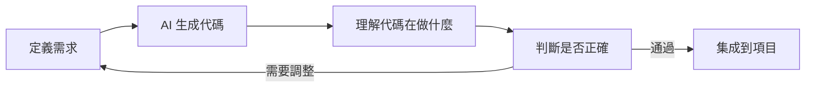

# 0.0 進階版要學什麼

在基礎版中，你已經學會了 Vibe Coding 的核心心法：用自然語言表達需求，讓 AI 幫你生成代碼。

**進階版的目標是：讓你能獨立完成一個完整的全棧項目。**

> **一句話定位**：從"能做出東西"到"能做出專業的產品"——一個人搞定從界面到數據庫到部署的全流程。

## 基礎版 vs 進階版

| 維度 | 基礎版（已完成） | 進階版（即將開始） |
|-----|----------------|------------------|
| **核心能力** | 用 AI 做出簡單項目 | 用 AI 構建完整產品 |
| **技術深度** | 點到爲止，AI 處理細節 | 理解原理，能審查 AI 輸出 |
| **項目複雜度** | 單頁應用、靜態網站 | 全棧應用、數據庫、認證 |
| **部署方式** | 一鍵部署 | 容器化、CI/CD |

## 你的角色升級

在基礎版中，你是"需求定義者"。

在進階版中，你還需要成爲"架構決策者"和"質量把關人"：

## 本章導讀

| 小節 | 核心問題 | 你將獲得 |
|-----|---------|---------|
| [0.0.1 全棧開發定義](./0.0.1-fullstack-definition.md) | 什麼是全棧？一個人能做到嗎？ | 全棧邊界的清晰認知 |
| [0.0.2 Vibe Coding vs 傳統編程](./0.0.2-vibe-coding-vs-traditional.md) | 爲什麼自然語言就能編程？ | 兩種範式的本質差異 |
| [0.0.3 課程目標](./0.0.3-goals.md) | 學完能做什麼？ | 具體的能力清單和交付物 |

## 技術棧預覽

本課程鎖定以下技術棧，所有實戰項目都將基於此：

| 層級 | 技術選型 | 選擇理由 |
|-----|---------|---------|
| 前端框架 | Next.js (App Router) | React 生態 + 全棧能力 + Vercel 原生支持 |
| 類型系統 | TypeScript | AI 生成代碼的類型安全保障 |
| 後端服務 | Supabase | 開箱即用的 PostgreSQL + Auth + Storage |
| ORM | Prisma | 類型安全的數據庫操作 |
| AI 集成 | Vercel AI SDK | 流式響應 + 多模型支持 |
| 部署 | Vercel | 零配置部署 + 邊緣網絡 |
| 容器化 | Docker + 1Panel | 自託管場景的標準方案 |

## 覺知

> **這門課不適合誰？**
> - 想要系統學習計算機科學基礎的人（這不是 CS101）
> - 追求"完全不看代碼"的人（你需要能讀懂 AI 生成的代碼）
> - 不願意動手實踐的人（Vibe Coding 的核心是迭代驗證）

## 本節小結

- 這是一門**實戰優先**的課程，用 AI 加速從想法到產品的全過程
- 你的角色是**需求定義者和結果驗收者**，而非代碼編寫者
- 技術棧已鎖定，專注於 Next.js + Supabase + Vercel 生態
