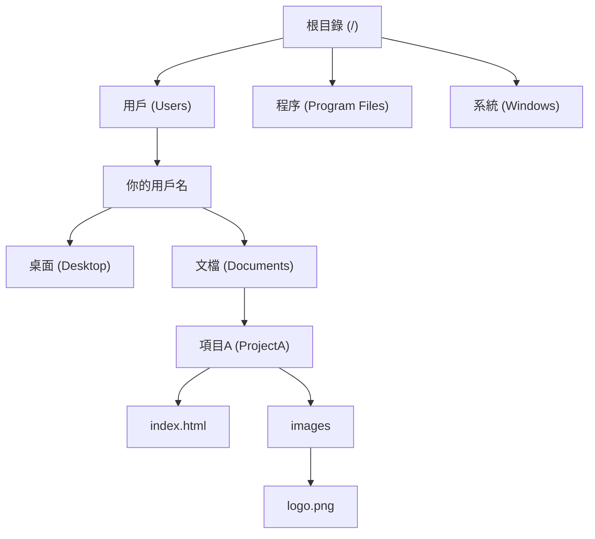

# 0.1.1 文件系統：電腦的數字圖書館

### 一句話破題

文件系統，就是操作系統用來管理和組織電腦上所有數據（文件）的一套規則和結構。你可以把它想象成一個巨大的數字圖書館，負責給每一份資料（文件）分類、貼標籤、並放在正確的書架（目錄）上，讓你能隨時找到它。

### 核心價值

作爲開發者，理解文件系統至關重要，因爲：

1.  **組織代碼**：你的所有項目代碼、圖片、配置文件，都需要在一個合理的目錄結構中安家。
2.  **資源定位**：程序運行時，需要準確地從文件系統中讀取或寫入數據。路徑一旦出錯，程序就會“迷路”。
3.  **環境隔離**：不同的項目依賴不同的工具和庫，文件系統幫助我們將它們隔離開，避免衝突。

### 核心概念解析

文件系統的核心由幾個簡單概念組成：

*   **文件 (File)**：存儲信息的基本單位，就像圖書館裏的一本書或一份文檔。每個文件都有一個文件名和擴展名（如 `index.html`, `style.css`），擴展名告訴我們文件的類型。
*   **目錄 (Directory/Folder)**：存放文件和其他目錄的“容器”，好比圖書館裏的書架或分類區域。
*   **路徑 (Path)**：一個文件或目錄在文件系統中的“地址”。
    *   **絕對路徑 (Absolute Path)**：從“圖書館大門”（根目錄）開始的完整地址，獨一無二。例如 `C:\\Users\\YourName\\Documents\\project\\index.html`。
    *   **相對路徑 (Relative Path)**：從你“當前所在位置”開始的地址。例如，如果你在 `project` 目錄下，要找 `index.html`，相對路徑就是 `./index.html`。`.` 代表當前目錄，`..` 代表上一級目錄。

#### 可視化解構

文件系統的結構就像一棵倒過來的樹。

### AI 協作指南

當你需要 AI 幫你處理文件時，清晰地表達路徑是關鍵。

*   **核心意圖**：告訴 AI 你想對**哪個位置**的**哪個文件**做什麼操作。
*   **需求定義公式**：`“請幫我 [操作] 位於 [絕對或相對路徑] 的 [文件名] 文件，內容是......”`
*   **關鍵術語**：`讀取文件 (read file)`, `寫入文件 (write file)`, `創建目錄 (create directory)`, `文件路徑 (file path)`, `絕對路徑 (absolute path)`。

**示例**：

> **Bad ❌**: “幫我把項目裏的 logo 換一下。”
> *AI 會感到困惑：哪個項目？logo 在哪裏？*
>
> **Good ✅**: “請幫我更新項目 `ProjectA` 的 logo。新的 logo 圖片路徑是 `D:\\Downloads\\new_logo.png`，請把它複製到 `C:\\Users\\YourName\\Documents\\ProjectA\\images\\` 目錄下，並覆蓋原有的 `logo.png` 文件。”

### 避坑指南

*   **路徑分隔符**：Windows 使用反斜槓 `\`，而 macOS/Linux 和網頁 URL 使用正斜槓 `/`。在編程時，爲了跨平臺兼容，通常推薦使用 `/`，大多數現代工具都能理解。
*   **相對路徑的“迷路”**：使用相對路徑時，一定要清楚你的程序當前在哪個目錄下運行，否則很容易找不到文件。

理解了文件系統，你就掌握了與計算機溝通的基礎語言之一。
