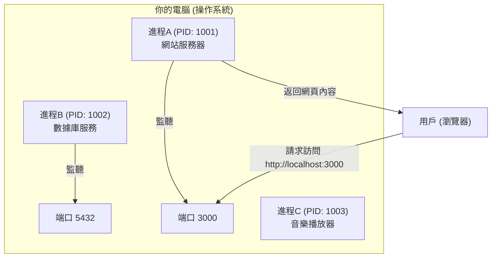

# 0.1.2 進程與端口：餐廳裏的服務員和電話分機

### 一句話破題

**進程 (Process)** 是電腦上一個正在運行的程序實例，就像餐廳裏一位正在忙碌的服務員。而 **端口 (Port)** 則是這個服務員用來與外界（其他程序或網絡）溝通的特定“電話分機號碼”。

### 核心價值

理解進程和端口，對於 Web 開發者來說是家常便飯：

1.  **運行服務**：當你啓動一個網站項目時，它就在電腦上以一個“進程”的方式運行起來。
2.  **訪問服務**：你需要在瀏覽器裏通過 `http://localhost:3000` 這樣的地址訪問你的網站，這裏的 `3000` 就是端口號。
3.  **問題排查**：最常見的錯誤之一就是“端口被佔用”（Port already in use），這意味着你想用的電話分機號已經被別的服務員佔了。

### 核心概念解析

*   **進程 (Process)**：
    *   你每打開一個應用（如瀏覽器、VS Code、音樂播放器），操作系統都會爲它創建一個或多個進程。
    *   每個進程都有一個唯一的身份標識，叫做 **PID (Process ID)**。
    *   你可以通過操作系統的任務管理器（Windows）或活動監視器（macOS）看到所有正在運行的進程。

*   **端口 (Port)**：
    *   端口是一個 16 位的數字，範圍從 0 到 65535。
    *   當一個進程需要提供網絡服務時（比如一個 Web 服務器），它會“監聽”一個特定的端口，等待外部的連接請求。
    *   一臺電腦上，**一個端口在同一時間只能被一個進程監聽**。這就是爲什麼你不能同時在 `3000` 端口上運行兩個不同的網站項目。

#### 可視化解構

想象一下你的電腦是一家大餐廳，裏面有很多服務員（進程）在同時工作。

在這個模型中：
*   網站服務器和數據庫服務都是獨立的進程，它們需要通過端口與外界溝通。
*   音樂播放器也是一個進程，但它可能不需要監聽端口來提供網絡服務。
*   瀏覽器通過訪問 `localhost:3000`，準確地找到了正在監聽 3000 端口的那個網站服務器進程。

### AI 協作指南

當你需要 AI 幫你管理服務時，清晰地指明進程和端口至關重要。

*   **核心意圖**：告訴 AI 你想對**哪個端口**上的**哪個服務**做什麼。
*   **需求定義公式**：`“請幫我 [啓動/停止/檢查] 在端口 [端口號] 上運行的服務。”`
*   **關鍵術語**：`運行 (run)`, `啓動 (start)`, `停止 (stop)`, `進程 (process)`, `端口 (port)`, `端口被佔用 (port in use)`。

**示例**：

> **Bad ❌**: “我的網站起不來了。”
> *AI 不知道是哪個網站，遇到了什麼問題。*
>
> **Good ✅**: “我在運行我的 Next.js 項目時，終端提示 `Error: listen EADDRINUSE: address already in use :::3000`。請幫我檢查一下是哪個進程佔用了 3000 端口，並告訴我如何停止它。”

### 避坑指南

*   **常用端口**：Web 開發中，`3000`, `8000`, `8080` 是非常常見的開發端口。`80` 是 HTTP 服務的默認端口，`443` 是 HTTPS 的默認端口。
*   **如何找到並停止佔用端口的進程**：這是一個非常高頻的操作。你可以直接讓 AI 給你具體的命令行指令。
    *   **Windows**: `netstat -ano | findstr :<端口號>` 找到 PID，然後 `taskkill /PID <PID> /F`。
    *   **macOS/Linux**: `lsof -i :<端口號>` 找到 PID，然後 `kill -9 <PID>`。

掌握了進程和端口，你就拿到了進入網絡應用世界的鑰匙。
