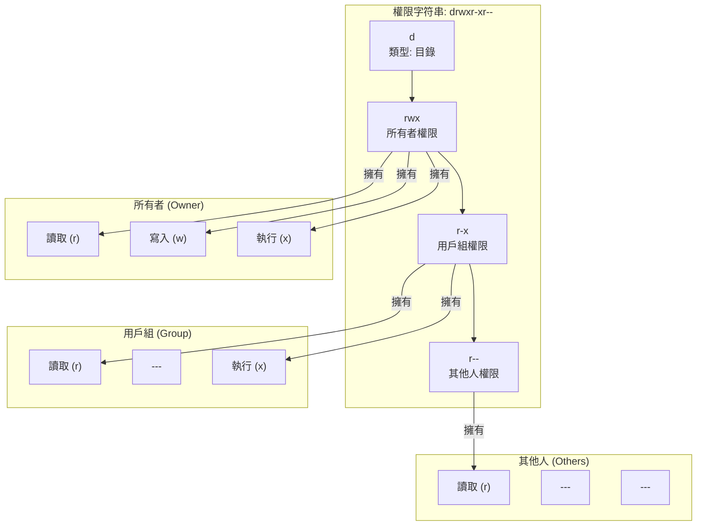

# 0.1.3 權限：誰能動我的數字資產

### 一句話破題

文件和目錄的**權限 (Permissions)**，定義了**誰**可以對它們進行**何種**操作。這就像一棟公寓大樓的門禁系統，規定了誰（用戶）擁有哪把鑰匙（權限），可以進入哪個房間（文件/目錄），以及進去後能幹什麼（讀/寫/執行）。

### 核心價值

雖然在個人電腦上感知不強，但在服務器和團隊協作中，權限是安全和穩定的基石：

1.  **保護系統**：防止普通用戶或惡意程序修改核心系統文件，導致系統崩潰。
2.  **保護數據**：確保只有授權用戶才能讀取或修改敏感數據（如數據庫文件、配置文件）。
3.  **團隊協作**：在多人項目中，明確誰有權修改代碼，誰只能查看，避免混亂。

### 核心概念解析 (以 Linux/macOS 爲例)

權限系統主要圍繞三個維度展開：

*   **三種操作**：
    *   **讀取 (Read, r)**：查看文件內容或列出目錄中的文件。
    *   **寫入 (Write, w)**：修改文件內容，或在目錄中創建/刪除文件。
    *   **執行 (Execute, x)**：運行一個文件（如果是程序或腳本），或進入一個目錄。

*   **三類用戶**：
    *   **所有者 (Owner)**：創建文件或目錄的用戶。
    *   **用戶組 (Group)**：一個用戶集合，文件可以屬於某個組。
    *   **其他人 (Others)**：除了所有者和用戶組成員之外的所有人。

當你通過命令行 `ls -l` 查看文件時，會看到類似 `drwxr-xr--` 這樣的字符串，這就是權限的表示。

*   第一個字符 `d` 表示這是一個目錄，`-` 表示是文件。
*   後面 9 個字符，每 3 個一組，分別代表**所有者**、**用戶組**、**其他人**的權限。
    *   `rwx` 表示可讀、可寫、可執行。
    *   `r-x` 表示可讀、不可寫、可執行。
    *   `r--` 表示只可讀。

#### 可視化解構

以 `drwxr-xr--` 爲例，我們可以這樣解讀：

**解讀**：這是一個目錄，其所有者擁有全部權限；用戶組的成員可以讀取和進入該目錄，但不能在裏面創建或刪除文件；而其他人只能讀取目錄內容。

### AI 協作指南

在服務器上部署應用時，經常需要 AI 幫忙設置權限。

*   **核心意圖**：告訴 AI 你想把**哪個文件/目錄**的權限，修改成**什麼樣**。
*   **需求定義公式**：`“請幫我修改 [文件/目錄路徑] 的權限，讓 [用戶類型] 擁有 [讀/寫/執行] 的權限。”`
*   **關鍵術語**：`權限 (permission)`, `修改權限 (change permission)`, `chmod`, `所有者 (owner)`, `用戶組 (group)`。

**示例**：

> **Bad ❌**: “我的腳本運行不了。”
> *原因可能有很多，不一定是權限問題。*
>
> **Good ✅**: “我上傳了一個部署腳本 `deploy.sh` 到服務器的 `/opt/scripts/` 目錄下，但是當我嘗試運行它時，系統提示 `Permission denied`。請給我 `chmod` 命令，讓這個腳本的當前所有者可以執行它。”

### 避坑指南

*   **`sudo` 的濫用**：`sudo` (Super User Do) 是一個用管理員權限執行命令的指令。當你遇到 `Permission denied` 時，**不要**下意識地就在原命令前加上 `sudo`。這就像用萬能鑰匙去開所有的門，雖然方便，但極不安全。你應該先搞清楚爲什麼需要更高權限，然後只在必要時使用。
*   **危險的 `777`**：`chmod 777 <file>` 是一個“終極武器”，它把一個文件的讀、寫、執行權限完全開放給了系統上的所有人。這在服務器上是**極其危險**的行爲，相當於把你的公寓大門敞開，任何人都可以爲所欲爲。除非你非常清楚自己在做什麼，否則永遠不要使用 `777`。

理解權限，是讓你從一個“代碼玩家”成長爲“系統工程師”的重要一步。
