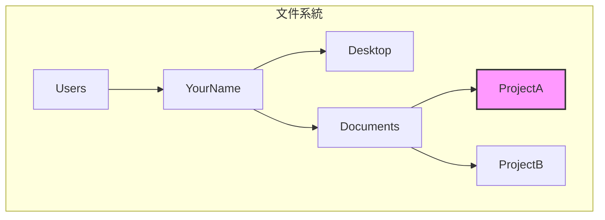

# 0.2.1 導航：在數字世界裏自由穿梭

### 一句話破題

命令行導航，就是通過幾個核心指令，讓你在文件系統的“目錄樹”中快速定位和移動，就像在遊戲地圖裏使用傳送點一樣高效。

### 核心價值

1.  **效率**：當你熟悉了路徑和指令，直接輸入命令跳轉，遠比在圖形界面中一層層點擊文件夾要快得多。
2.  **精確**：你可以直接到達任何深度的目錄，而不需要記住中間路徑的每一個細節。
3.  **自動化**：導航是所有自動化腳本的基礎。你需要先“去到”正確的地方，才能執行後續操作。

### 核心概念解析

命令行導航主要依賴兩個核心命令：`pwd` 和 `cd`，以及對路徑的理解。

*   **`pwd` (Print Working Directory)**：打印當前工作目錄。這個命令告訴你“你現在在哪裏”。
    *   Windows PowerShell 中對應的命令是 `Get-Location`，但 `pwd` 作爲別名通常也能使用。

*   **`cd` (Change Directory)**：切換目錄。這是導航的核心，後面需要跟一個路徑作爲參數。

*   **路徑 (Path)**：
    *   **絕對路徑**：從根目錄開始的完整路徑，例如 `C:\Users\YourName\Desktop` (Windows) 或 `/Users/YourName/Desktop` (macOS/Linux)。它提供了唯一的、明確的位置。
    *   **相對路徑**：相對於你當前位置的路徑。
        *   `.` (一個點)：代表**當前目錄**。
        *   `..` (兩個點)：代表**上一級目錄**。

#### 可視化解構

假設我們的文件結構如下，並且當前我們在 `ProjectA` 目錄下。

| 你的目標 | 使用的命令 (相對路徑) | 解釋 |
| --- | --- | --- |
| 查看當前位置 | `pwd` | 輸出 `/Users/YourName/Documents/ProjectA` |
| 進入 `Documents` 目錄 | `cd ..` | `..` 代表上一級，即從 `ProjectA` 回到 `Documents` |
| 從 `Documents` 進入 `ProjectB` | `cd ProjectB` | 直接進入當前目錄下的子目錄 `ProjectB` |
| 從 `ProjectB` 直接回到 `Desktop` | `cd ../../Desktop` | 連續使用 `..`，兩次返回上一級，再進入 `Desktop` |
| 任何位置去 `ProjectA` | `cd /Users/YourName/Documents/ProjectA` | 使用絕對路徑，一步到位 |

### AI 協作指南

當你需要 AI 幫你寫腳本時，清晰地描述路徑和導航意圖非常重要。

*   **核心意圖**：告訴 AI 你的**當前位置**和**目標位置**。
*   **需求定義公式**：`“我當前在 [起始路徑] 目錄下，請寫一個命令，讓我可以進入 [目標路徑] 目錄。”`
*   **關鍵術語**：`當前目錄 (current directory)`, `上一級目錄 (parent directory)`, `根目錄 (root directory)`, `cd`, `pwd`。

**示例**：

> **Bad ❌**: “怎麼去我的項目文件夾？”
> *AI 不知道你的項目文件夾在哪裏。*
>
> **Good ✅**: “我的項目路徑是 `D:\workspace\my-awesome-project`。我現在命令行的路徑是 `D:\workspace`。請給我一個 `cd` 命令進入我的項目目錄。”

### 避坑指南

*   **路徑中的空格**：如果你的目錄名包含空格（例如 `My Documents`），你需要用引號把整個路徑包起來，像這樣：`cd "My Documents"`。
*   **Windows vs macOS/Linux 的斜槓**：Windows 使用反斜槓 `\` 作爲路徑分隔符，而 macOS/Linux 使用正斜槓 `/`。不過，在現代的命令行工具（如 PowerShell）中，通常兩者都能被正確識別，但保持原生習慣是最佳實踐。
*   **Tab 自動補全**：這是命令行導航的“超級技能”！輸入路徑的前幾個字母，然後按 `Tab` 鍵，系統會自動幫你補全剩下的部分。如果存在多個匹配項，多按幾次 `Tab` 會列出所有選項。**一定要養成使用 `Tab` 的習慣，這能極大提升效率並減少拼寫錯誤。**
