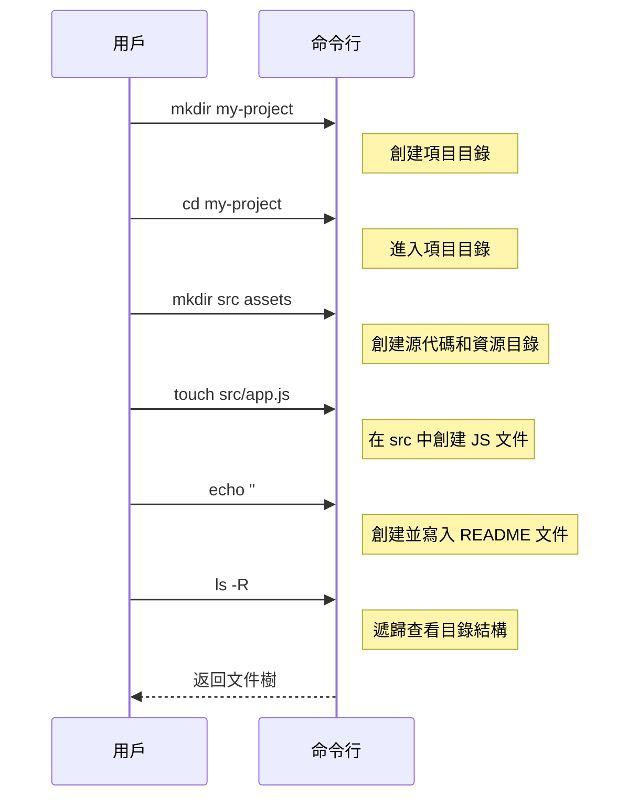

# 0.2.2 文件操作：數字世界的建築師

### 一句話破題

命令行文件操作，就是用指令來扮演“建築師”的角色，在你的數字空間裏創建（蓋樓）、查看（看圖紙）、移動（搬遷）、複製（克隆）和刪除（拆除）文件和目錄。

### 核心價值

1.  **批量處理**：可以一次性創建、移動或刪除大量文件，這是圖形界面難以企及的。
2.  **精確控制**：通過參數和選項，可以實現非常精細的操作，例如，只複製特定類型的文件。
3.  **腳本核心**：幾乎所有的自動化腳本都包含文件操作。例如，一個典型的構建腳本會先清空舊的輸出目錄，然後創建新的文件。

### 核心概念解析

掌握以下幾個核心命令，你就能完成絕大部分日常文件管理任務。注意 Windows (PowerShell) 和 macOS/Linux (Bash/Zsh) 在命令名稱上的區別。

| 任務 | PowerShell (Windows) | Bash/Zsh (macOS/Linux) | 解釋 |
| :--- | :--- | :--- | :--- |
| **列出文件** | `Get-ChildItem` (別名: `ls`, `gci`) | `ls` | 顯示當前目錄下的文件和文件夾。 |
| **創建目錄** | `New-Item -ItemType Directory <目錄名>` (別名: `mkdir`) | `mkdir <目錄名>` | 創建一個新的文件夾。 |
| **創建文件** | `New-Item <文件名>` (別名: `ni`) 或 `echo "內容" > <文件名>` | `touch <文件名>` 或 `echo "內容" > <文件名>` | 創建一個空文件或帶有內容的文件。 |
| **查看內容** | `Get-Content <文件名>` (別名: `cat`, `gc`) | `cat <文件名>` | 在命令行直接顯示文件的全部內容。 |
| **複製** | `Copy-Item <源> <目標>` (別名: `cp`, `copy`) | `cp <源> <目標>` | 複製文件或目錄。 |
| **移動/重命名** | `Move-Item <源> <目標>` (別名: `mv`, `move`) | `mv <源> <目標>` | 移動文件或目錄，或在同一目錄下移動實現重命名。 |
| **刪除** | `Remove-Item <路徑>` (別名: `rm`, `del`) | `rm <文件>` / `rm -r <目錄>` | 刪除文件或目錄。`-r` (recursive) 選項用於遞歸刪除整個目錄。 |

#### 可視化工作流

讓我們模擬一個創建項目並整理文件的過程：

這個流程清晰地展示瞭如何從無到有地構建一個項目的基本骨架。

### AI 協作指南

文件操作是 AI 最擅長生成的代碼之一，但你需要提供清晰的上下文。

*   **核心意圖**：告訴 AI 你想對**什麼文件/目錄**，執行**什麼操作**，以及操作的**源和目標**。
*   **需求定義公式**：`“請給我一個命令，將 [源路徑] 的 [文件/目錄] [複製/移動/刪除] 到 [目標路徑]。”`
*   **關鍵術語**：`創建 (create/make)`, `複製 (copy)`, `移動 (move)`, `重命名 (rename)`, `刪除 (delete/remove)`, `目錄 (directory/folder)`, `文件 (file)`。

**示例**：

> **Bad ❌**: “幫我把文件弄過去。”
> *哪個文件？弄到哪裏去？*
>
> **Good ✅**: “我有一個 `logo.png` 文件在 `~/Downloads` 目錄下，請幫我寫一個命令，把它複製到我當前項目下的 `public/images` 目錄裏。”

### 避坑指南

*   **`rm` 的危險性**：`rm` (或 `Remove-Item`) 命令是**不可逆的**！它刪除的文件不會進入回收站。在使用，特別是配合 `-r` (遞歸) 和 `-f` (強制) 選項時，一定要再三確認你所在的目錄和要刪除的目標。**誤刪系統文件是新手最容易犯的災難性錯誤之一。**
*   **覆蓋文件**：在執行 `cp` 或 `mv` 時，如果目標位置已存在同名文件，系統通常會提示你是否覆蓋。但在腳本中，可能會直接覆蓋。養成先檢查目標位置的習慣。
*   **通配符 `*`**：`*` 是一個強大的通配符，代表“任何字符”。例如，`rm *.log` 會刪除所有以 `.log` 結尾的文件。它非常高效，但也同樣危險，使用前請用 `ls *.log` 這樣的命令先預覽一下將要被操作的文件列表。
