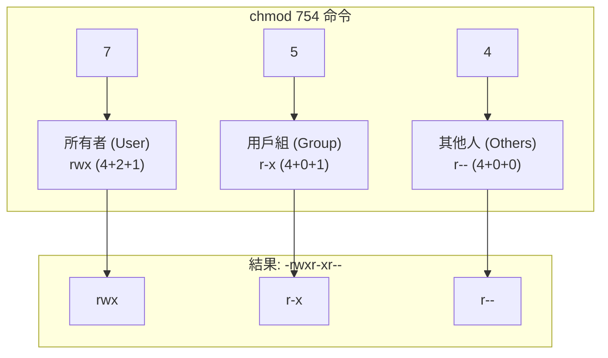

# 0.2.3 權限管理：數字資產的守護神

### 一句話破題

命令行的權限管理，主要是通過 `chmod` 命令，像“配鑰匙”一樣，精確地授予或撤銷不同用戶對文件和目錄的訪問能力。

### 核心價值

1.  **安全部署**：在服務器上部署應用時，正確設置文件權限是第一道安全防線。例如，上傳的私鑰文件必須設置爲只有所有者才能讀取。
2.  **腳本執行**：你自己編寫的腳本文件（如 `.sh` 文件），默認可能沒有執行權限。你需要手動爲它“激活”執行能力。
3.  **協作規範**：在 Git 等版本控制系統中，文件的執行權限是會被記錄的。正確設置權限可以避免團隊成員在不同操作系統上遇到不一致的行爲。

### 核心概念解析 (以 Linux/macOS 爲例)

我們在 `0.1.3` 章節已經理解了權限的 `rwx` 概念。在命令行中，我們使用 `chmod` (Change Mode) 命令來修改這些權限位。`chmod` 有兩種主要的用法：符號模式和數字模式。

*   **符號模式 (Symbolic Mode)**：更直觀，易於理解。
    *   **用戶**: `u` (user/owner), `g` (group), `o` (others), `a` (all)
    *   **操作**: `+` (添加權限), `-` (移除權限), `=` (精確設置權限)
    *   **權限**: `r` (read), `w` (write), `x` (execute)

    **示例**：
    *   `chmod u+x script.sh`：爲所有者（user）添加（+）執行權限（x）。
    *   `chmod go-w config.yml`：爲用戶組（group）和其它人（others）移除（-）寫權限（w）。
    *   `chmod a=r private.key`：爲所有人（all）精確設置（=）爲只讀權限（r）。

*   **數字模式 (Octal Mode)**：更簡潔，是專業人士和腳本中的常用方法。
    它將 `rwx` 權限用一個三位的八進制數表示：
    *   `r` = 4
    *   `w` = 2
    *   `x` = 1

    一個權限組合是這三個數字的和。例如：
    *   `rwx` = 4 + 2 + 1 = `7`
    *   `r-x` = 4 + 0 + 1 = `5`
    *   `rw-` = 4 + 2 + 0 = `6`
    *   `r--` = 4 + 0 + 0 = `4`

    `chmod` 後面跟的 3 個數字，分別對應**所有者**、**用戶組**、**其他人**的權限。

#### 可視化解構

`chmod 754 <文件名>` 這條命令到底做了什麼？

**解讀**：這條命令將文件權限設置爲：所有者可讀可寫可執行，用戶組成員可讀可執行，其他人只可讀。

### AI 協作指南

當你不確定應該使用何種權限時，可以向 AI 尋求最佳實踐。

*   **核心意圖**：描述你的**文件類型**和**使用場景**，讓 AI 給出最安全的權限建議。
*   **需求定義公式**：`“我有一個 [文件類型]，它將被用於 [使用場景]。請問我應該把它設置爲多少權限？請給我具體的 chmod 命令。”`
*   **關鍵術語**：`chmod`, `權限 (permission)`, `數字模式 (octal)`, `符號模式 (symbolic)`, `腳本 (script)`, `配置文件 (config file)`, `私鑰 (private key)`。

**示例**：

> **Bad ❌**: “我的文件權限有問題。”
> *太模糊，無法提供有效幫助。*
>
> **Good ✅**: “我正在部署一個 Node.js 應用到 Ubuntu 服務器。我有一個 `.env` 文件，裏面包含了數據庫密碼。爲了安全，我應該給這個文件設置什麼權限？請用數字模式告訴我 `chmod` 命令。”
> *AI 會告訴你，這種敏感文件通常應該設置爲 `600` 或 `400`，即只有所有者可讀寫或只讀。*

### 避坑指南

*   **目錄的執行權限**：對目錄來說，`x` (執行) 權限的意義是“**可以進入該目錄**”。如果你移除了一個目錄的 `x` 權限，那麼即便你擁有裏面所有文件的讀寫權限，你也無法 `cd` 進去，也無法訪問其中的任何文件。
*   **`chmod -R` 的威力**：`-R` (Recursive) 參數會讓 `chmod` 命令遞歸地應用到目錄下的所有文件和子目錄。這是一個非常強大的工具，但也同樣危險。例如，`chmod -R 777 /my-app` 會將你整個應用目錄都設置爲完全開放，可能導致嚴重的安全漏洞。
*   **Windows 的權限模型**：Windows 的 `icacls` 和 `Set-Acl` 命令提供了更復雜的 ACL (Access Control List) 權限模型，與 Linux/macOS 的 `rwx` 模型不同。雖然 PowerShell 提供了一些兼容性的別名，但在進行精細的權限管理時，你需要使用 Windows 原生的工具和概念。
