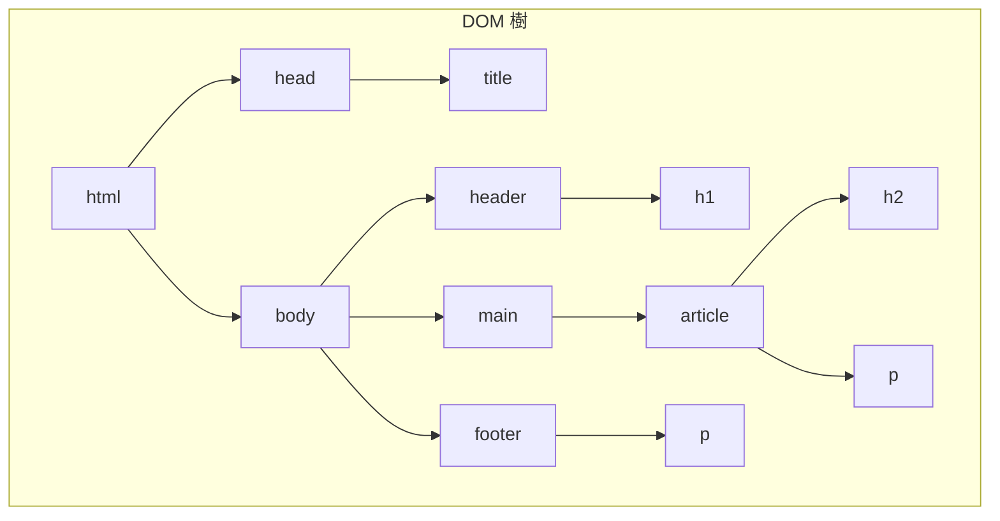

# 0.3.1 搭建網頁的骨架——HTML：結構與語義化標籤

### 一句話破題

HTML (HyperText Markup Language) 是一種**標記語言**，它通過各種**標籤 (Tag)** 來定義網頁的**結構**和**內容**，就像搭建房子的鋼筋骨架，決定了哪裏是客廳、哪裏是臥室。

### 認知重構：HTML 不是編程語言

傳統觀念認爲前端就是寫代碼，但 HTML 的本質是**描述**，而非**邏輯**。它不包含變量、循環或條件判斷。它的任務是告訴瀏覽器：“這是一個標題”、“這是一個段落”、“這是一個圖片”。

在 Vibe Coding 的世界裏，AI 極度擅長生成 HTML 結構。你的核心任務從“手動敲每一個標籤”轉變爲“**定義清晰的頁面結構和內容區塊，並選擇最合適的語義化標籤來描述它們**”。你負責設計藍圖，AI 負責砌牆。

### 本質還原：HTML 是一個樹狀結構 (DOM)

瀏覽器在讀取 HTML 文檔後，會在內存中構建一個樹狀的“文檔對象模型”(Document Object Model, DOM)。這個模型是後續 CSS 樣式和 JavaScript 交互的基礎。

一個典型的 HTML 結構如下：

```html
<!DOCTYPE html>
<html>
<head>
    <title>我的網頁</title>
</head>
<body>
    <header>
        <h1>網站標題</h1>
    </header>
    <main>
        <article>
            <h2>文章標題</h2>
            <p>這是一個段落。</p>
        </article>
    </main>
    <footer>
        <p>版權信息</p>
    </footer>
</body>
</html>
```

#### 可視化解構 (DOM 樹)

上面的 HTML 代碼可以被解析成以下的 DOM 樹：



**覺知**：當你理解了 DOM 樹，你就能明白爲什麼 CSS 的選擇器可以“層層深入”，爲什麼 JavaScript 可以“按圖索驥”地找到任何一個元素。**你審查 AI 生成的 HTML 時，核心是檢查這個樹的邏輯結構是否清晰、合理。**

### 核心價值：語義化標籤 (Semantic Tags)

同樣是展示一個標題，你可以用 `<h1>`，也可以用 `<div>` 然後通過 CSS 把它放大加粗。但前者是“語義化”的，後者不是。

**語義化標籤**，就是用最能描述其內容功能的標籤。這不僅僅是爲了好看。

*   **對機器友好 (SEO)**：搜索引擎（如 Google）的爬蟲能更好地理解你的頁面結構，知道哪裏是主標題，哪裏是導航，從而給予更高的搜索排名。
*   **對殘障人士友好 (Accessibility)**：屏幕閱讀器等輔助工具可以根據標籤的語義，爲視障用戶提供清晰的導航和內容朗讀。
*   **對 AI 友好**：你給 AI 的指令中包含語義化標籤，AI 能更準確地理解你的意圖。例如，告訴 AI “在 `<main>` 標籤裏添加一個新的 `<section>`”比“在那個 `div` 裏再加一個 `div`”要清晰得多。
*   **對未來的你友好**：幾個月後回頭看代碼，清晰的語義化結構能讓你瞬間回憶起每個部分的功能。

**常用語義化標籤**：

*   `<header>`: 頁面或區塊的頭部。
*   `<nav>`: 導航鏈接區域。
*   `<main>`: 頁面的核心內容，每個頁面只應有一個。
*   `<article>`: 獨立的、完整的內容塊，如一篇博客、一則新聞。
*   `<section>`: 主題性的內容區塊。
*   `<aside>`: 側邊欄，與主要內容相關性較低的內容。
*   `<footer>`: 頁面或區塊的底部。

### AI 協作指南

*   **核心意圖**：向 AI 清晰地描述你想要的**頁面佈局**和**內容區塊**，並指定使用**語義化標籤**。
*   **需求定義公式**：`“請幫我生成一個標準的網頁佈局，包含 <header>、<main> 和 <footer>。在 <main> 區域，我需要兩個 <article>，每個 <article> 包含一個 <h2> 標題和三個 <p> 段落。”`
*   **關鍵術語**：`佈局 (layout)`, `語義化 (semantic)`, `<header>`, `<main>`, `<footer>`, `<article>`, `<section>`。

**交互策略**：

1.  **先要結構，再要內容**：先讓 AI 生成頁面的整體 HTML 骨架。
2.  **確認骨架**：檢查 AI 給出的骨架是否符合你的預期，語義化標籤是否使用得當。
3.  **填充細節**：然後指令 AI：“現在，請幫我在第一個 `<article>` 裏填充關於‘Vibe Coding’的介紹文字。”

通過這種方式，你始終掌控着頁面的宏觀結構，而把繁瑣的內容填充和細節標籤生成工作交給了 AI。
