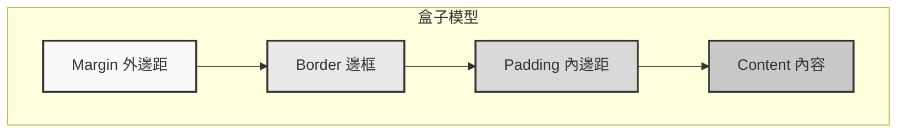
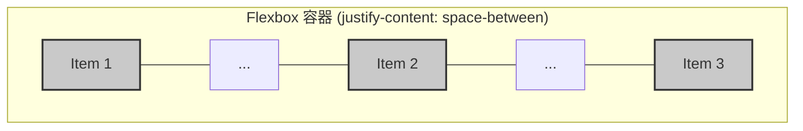

# 0.3.2 給網頁穿上衣服——CSS：樣式與佈局基礎

## 認知重構：從“畫筆”到“規則集”

傳統觀念裏，CSS 像是一支畫筆，哪裏不好看就塗一下。這種思維在面對複雜頁面時會迅速崩潰，導致樣式混亂、難以維護，最終變成“樣式屎山”。

**現代前端開發的認知：CSS 不是畫筆，而是一套“規則集” (Rule Set)。** 你不再是那個滿頭大汗的裝修工人，而是一位優雅的建築設計師，你負責定義規則，瀏覽器會根據你的規則自動、精準地完成渲染。

你只需要告訴瀏覽器：“所有 class 爲 `card` 的 `div` 元素，都應該有一個灰色的邊框和 16px 的內邊距。” 無論頁面上有 1 個還是 100 個這樣的卡片，瀏覽器都會忠實地執行這條規則。

這種思維的轉變，是從“命令式”到“聲明式”的躍遷，也是高效、可維護樣式系統的基石。

## 本質還原：CSS 的兩大支柱——“盒子模型”與“佈局”

所有複雜的 CSS 效果，都可以拆解爲兩個最基本的概念：

1.  **盒子模型 (Box Model)**：萬物皆盒。網頁上的每一個元素，無論是一段文字、一張圖片還是一個按鈕，都被瀏覽器視爲一個矩形的“盒子”。你對元素應用的所有樣式，本質上都是在調整這個盒子的屬性。
2.  **佈局 (Layout)**：盒子與盒子之間的關係。是垂直排列，是水平分佈，還是複雜的網格結構？佈局就是定義這些盒子如何在一維或二維空間中自洽共存的規則。

### 可視化解構 1：盒子模型

每個 HTML 元素都是一個由內到外的矩形盒子，它由四部分組成：

*   **Content (內容)**: 盒子的核心，顯示文本、圖片等。
*   **Padding (內邊距)**: 包裹在內容區域外部的透明區域。
*   **Border (邊框)**: 包裹內邊距的線條。
*   **Margin (外邊距)**: 包裹邊框的透明區域，用於控制盒子與其他盒子的距離。



**覺知**：當 AI 生成的樣式出現尺寸或間距問題時，你的第一反應應該是打開瀏覽器的開發者工具，檢查對應元素的盒子模型。是 `padding` 太大，還是 `margin` 計算錯誤？通過審查盒子模型，90% 的樣式問題都能被快速定位。

### 可視化解構 2：現代佈局的基石——Flexbox

忘記那些陳舊的 `float` 和 `position` 吧。對於現代 Web 開發而言，**Flexbox** 是解決一維佈局問題的最佳實踐。它像一條傳送帶，你可以輕鬆控制傳送帶上的物品（盒子）是靠左、靠右、居中，還是平均分配空間。

假設我們有一個容器（父元素），裏面有三個項目（子元素）。

```html
<div class="container">
  <div class="item">1</div>
  <div class="item">2</div>
  <div class="item">3</div>
</div>
```

```css
.container {
  display: flex; /* 開啓 Flexbox 佈局 */
  justify-content: space-between; /* 子元素之間平均分配空間 */
}
```

**效果**：



**覺知**：當你需要讓一組元素水平或垂直對齊時，直接告訴 AI：“使用 Flexbox 佈局，讓子元素垂直居中並水平兩端對齊”。AI 應該立刻生成 `display: flex; align-items: center; justify-content: space-between;` 這樣的代碼。如果它還在用 `position: absolute` 配合 `top: 50%` 和 `transform: translateY(-50%)` 這種“古法”居中，你要立刻意識到這可能不是當前場景的最優解。

## AI 協作指南：從“給我一個按鈕”到“定義一個按鈕規範”

與 AI 協作寫 CSS，最忌諱的是碎片化、命令式的溝通。

*   **低效溝通**：“把這個按鈕變大一點，顏色改成藍色。”
*   **高效溝通**：“爲我們的應用定義一套按鈕規範。主按鈕（primary）背景色是品牌藍，次要按鈕（secondary）是灰色邊框。所有按鈕都應該有 4px 的圓角和 8px 16px 的內邊距。”

### 需求定義公式

**組件描述 + 視覺狀態 + 佈局行爲**

*   **示例**：“創建一個卡片組件 (`.card`)。默認狀態下有柔和的陰影和圓角。當鼠標懸停 (`:hover`) 時，陰影加深。在移動端視圖下，卡片寬度佔滿屏幕；在桌面端，一行最多顯示三個卡片。”

### 關鍵術語

*   **選擇器 (Selector)**: `h1`, `.class`, `#id`, `[attribute]`
*   **屬性 (Property)**: `color`, `font-size`, `margin`
*   **值 (Value)**: `red`, `16px`, `auto`
*   **僞類 (Pseudo-class)**: `:hover`, `:focus`, `:nth-child`
*   **響應式設計 (Responsive Design)**: `@media (max-width: 768px)`

### 交互策略

1.  **先結構，後樣式**：先讓 AI 生成 HTML 結構，確認無誤後，再讓它爲其編寫 CSS。
2.  **組件化定義**：圍繞“組件”進行溝通，而不是“頁面”。告訴 AI 你要寫一個“導航欄”，而不是“頁面頂部的藍色條”。
3.  **提供設計系統/規範**：如果你有顏色、字體、間距等設計規範，直接餵給 AI。它能更快地生成符合你品牌風格的代碼。
4.  **多用 `class`，少用 `id`**：`class` 是可複用的規則，`id` 是唯一的特例。優先使用 `class` 能讓你的 CSS 更加模塊化和可維護。

通過這種方式，你將引導 AI 生成結構清晰、易於擴展的 CSS 代碼，而不是一堆難以維護的“補丁”。

