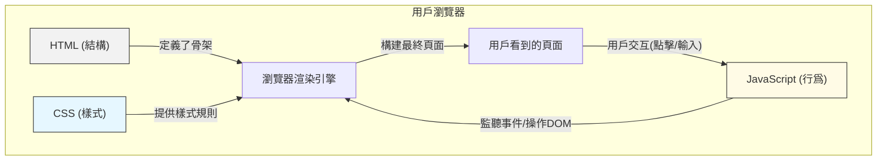

# 0.3.4 爲什麼骨架、衣服和動作要分開——三者協作：分離關注點的設計思想

## 認知重構：從“大雜燴”到“各司其職”

初學者最容易犯的錯誤，就是把 HTML, CSS, 和 JavaScript 攪和在一起，寫出“大雜燴”式的代碼。比如，在 HTML 標籤裏直接寫 `style` 屬性，或者用 `onclick` 屬性執行 JavaScript 代碼。

這種做法在小規模的練習中看似方便，但在真實項目中，它是一場災難的開始。代碼會變得極難閱讀、維護和擴展。想象一下，要修改一個按鈕的顏色，你可能需要在幾十個 HTML 文件中手動搜索和替換，而不是隻改動一個 CSS 文件的一行代碼。

**正確的認知：HTML, CSS, 和 JavaScript 是一個團隊，但團隊成員應該各司其職，而不是互相干涉。** 這種思想，就是軟件工程中至關重要的**關注點分離 (Separation of Concerns, SoC)**。

*   **HTML (結構層)**: 只負責定義頁面的內容和結構。它像建築的鋼筋骨架，決定了哪裏是客廳，哪裏是臥室。
*   **CSS (表現層)**: 只負責定義頁面的樣式和佈局。它像建築的室內設計，決定了牆壁刷什麼顏色的漆，傢俱如何擺放。
*   **JavaScript (行爲層)**: 只負責定義頁面的交互和邏輯。它像建築的水電系統，讓燈能亮，水能流。

## 本質還原：一種可持續維護的契約

關注點分離的本質，是在這三層之間建立一種清晰的、可持續維護的“契約”。

*   **CSS 通過“選擇器”與 HTML 簽訂契約**。CSS 說：“我不管你 HTML 結構怎麼變，只要你有一個 class 是 `primary-button` 的元素，我就會把它渲染成藍色。”
*   **JavaScript 通過“選擇器”和“事件”與 HTML 簽訂契約**。JavaScript 說：“我不管你長什麼樣，只要頁面裏有一個 ID 是 `login-form` 的表單，並且它被提交 (submit) 了，我就會負責處理登錄邏輯。”

這種基於“契約”的協作模式，使得三層可以獨立地進行修改和擴展，而不會輕易地破壞彼此的功能。

## 可視化解構：三層協作模型

這張圖清晰地展示了：
1.  HTML, CSS, JS 作爲獨立的模塊被瀏覽器加載。
2.  瀏覽器渲染引擎將它們“組合”起來，生成用戶最終看到的頁面。
3.  用戶的交互行爲（如點擊）會觸發 JavaScript，JavaScript 再去操作 DOM（即改變 HTML 結構或通過修改 class 來間接改變 CSS），從而更新視圖，形成一個完整的交互閉環。

## 覺知：如何識破“壞代碼”

當你 Review AI 生成的代碼時，要像一個經驗豐富的架構師一樣，對違反“關注點分離”原則的“壞味道”保持警惕：

*   **HTML 中的 `style` 屬性**: ` 
...
 `
    *   **爲什麼是壞味道？** 這將樣式死死地焊在了結構上。如果未來需要統一修改所有段落的字體大小，這將是一場噩夢。
    *   **正確做法**: 在 CSS 文件中定義一個類 ` .error-text { color: red; font-size: 14px; } `，然後在 HTML 中使用 ` 
...
 `。

*   **HTML 中的 `on*` 事件屬性**: ` <button onclick="myFunction()">Click me</button> `
    *   **爲什麼是壞味道？** 這將行爲與結構混合。使得 JavaScript 代碼散落在各個 HTML 文件中，難以管理和調試。
    *   **正確做法**: 在獨立的 JS 文件中，通過 `document.getElementById('my-button').addEventListener('click', myFunction);` 來綁定事件。

*   **JavaScript 中直接操作 `style`**: ` element.style.color = 'blue'; element.style.backgroundColor = 'white'; `
    *   **爲什麼是壞味道？** 當需要修改的樣式很多時，這會讓 JS 代碼變得臃腫且混亂，把表現層的邏輯帶入了行爲層。
    *   **正確做法**: 在 CSS 中預先定義一個類 ` .is-active { color: blue; background-color: white; } `，然後在 JS 中只做一件事：` element.classList.add('is-active'); `。讓 JS 專注於“切換狀態”，而不是關心“狀態的具體樣式”。

## AI 協作指南

### 核心意圖

向 AI 強調你希望它生成**“結構、樣式、行爲分離”**的代碼。

### 需求定義公式

**“給我創建一個[組件]，請將 HTML, CSS, 和 JavaScript 分別放在獨立的代碼塊中。使用 class 作爲 CSS 和 JavaScript 的連接點。”**

*   **示例**：“我需要一個可摺疊的手風琴組件。請爲我提供三部分代碼：HTML 結構（使用 `div` 和 `button`），CSS 樣式（定義展開和摺疊兩種狀態的 class），以及 JavaScript 邏輯（通過切換 class 來控制展開和摺疊，而不是直接操作 style）。”

### 交互策略

1.  **強制分離**：明確要求 AI “不要使用內聯樣式 (inline style)” 和 “不要使用 on-event 屬性”。
2.  **基於狀態切換進行溝通**：多使用“切換 class”、“添加/移除 class”這樣的指令，引導 AI 通過改變狀態（class）來驅動視圖變化。
3.  **分步索取**：你可以先讓 AI 生成 HTML 結構，然後基於這個結構，再讓它分別生成 CSS 和 JavaScript。這能讓你更好地控制每一部分代碼的質量。

掌握了“關注點分離”，你就掌握了編寫可維護、可擴展前端代碼的鑰匙。這是從入門到專業的必經之路，也是與 AI 高效協作，產出高質量代碼的基礎。

