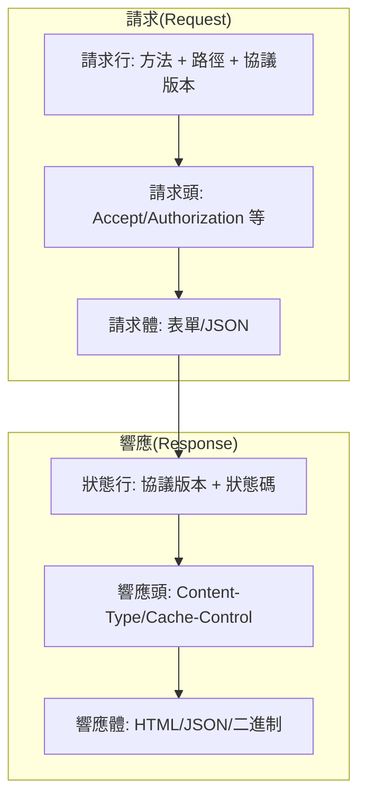
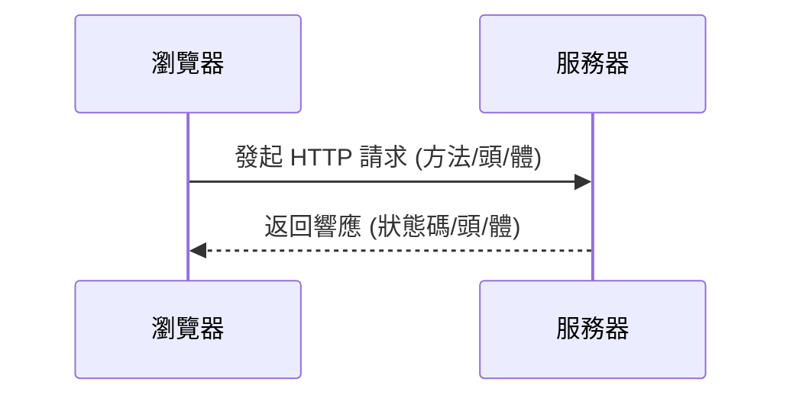

# 0.3.5.1 瀏覽器在說什麼——HTTP 協議基礎：請求/響應/狀態碼

## 一句話破題

HTTP 是瀏覽器與服務器“對話”的統一格式：**客戶端發請求 (Request)，服務器迴響應 (Response)**，雙方依據固定的語法交流。

## 核心價值

- 統一語義：方法 (GET/POST/PUT/DELETE/PATCH) 與狀態碼 (2xx/3xx/4xx/5xx) 讓溝通有章可循。
- 松耦合：客戶端與服務器只需約定接口與交換格式（如 JSON），便可獨立演進。
- 可觀測：請求與響應易於記錄與分析，支持可靠的調試與監控。

## 本質還原：請求與響應的結構

### 方法的語義與冪等性

- `GET`：讀取資源。應無副作用、冪等。
- `POST`：創建或觸發動作。通常非冪等。
- `PUT`：整體更新資源。冪等。
- `PATCH`：部分更新資源。通常非冪等。
- `DELETE`：刪除資源。冪等（重複刪除不應失敗）。

### 常見狀態碼

- `200` 成功；`201` 已創建；`204` 無內容
- `301/302` 重定向；`304` 命中緩存
- `400` 請求錯誤；`401` 未認證；`403` 未授權；`404` 未找到
- `500` 服務器錯誤；`502` 網關錯誤；`503` 服務不可用

## 可視化交互：一次完整的請求-響應

## 覺知：Review 代碼時該看哪裏

- 方法與語義是否匹配？寫入操作卻用 `GET` 是錯誤設計。
- 狀態碼是否正確？不要把業務錯誤也返回 `200`。
- 頭信息是否合理？`Content-Type`/`Accept` 是否與實際內容一致。
- 冪等性是否被破壞？重複調用的影響是否明確。

## AI 協作指南

- 核心意圖：讓 AI 幫你“設計規範的接口”或“診斷某個請求爲何失敗”。
- 需求定義公式：
  - “爲 `/api/users` 設計 REST 接口：支持分頁查詢 (GET)、創建 (POST)、整體更新 (PUT)、刪除 (DELETE)，返回 JSON。”
  - “我訪問 `https://api.example.com/users` 返回 `403`，請給我在 PowerShell 下排查的命令。”
- 關鍵術語：`方法`, `狀態碼`, `請求頭`, `響應頭`, `冪等性`, `緩存`。
- Windows PowerShell 常用命令：
  - `Invoke-WebRequest -Method GET -Uri https://api.example.com/users -UseBasicParsing`
  - `Invoke-RestMethod -Method POST -Uri https://api.example.com/users -Body '{"name":"Alice"}' -ContentType 'application/json'`
  - `Test-NetConnection -ComputerName api.example.com -Port 443`

## 避坑指南

- 不要用 `GET` 傳敏感信息；避免把令牌放在查詢字符串。
- 返回體與 `Content-Type` 必須匹配；JSON 一律用 `application/json`。
- 失敗場景請返回明確的錯誤碼與錯誤信息，便於客戶端處理。
