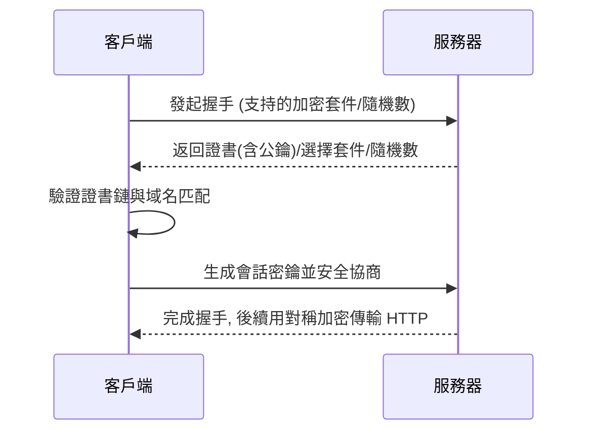

# 0.3.5.2 爲什麼網址會有把鎖——HTTPS 與安全：SSL/TLS 證書配置

## 一句話破題

HTTPS = HTTP + TLS。它通過加密、校驗與證書，讓你的數據在互聯網上**保密**、**不被篡改**、**對方身份可信**。

## 核心價值

- 機密性：防止竊聽（中間人無法讀懂內容）。
- 完整性：防止篡改（內容被改會被發現）。
- 身份認證：客戶端能確認服務器確實是“它自己”（證書鏈與域名匹配）。

## 本質還原：TLS 握手的簡化視圖

### 證書與信任

- 證書由受信任的 CA 頒發，包含公鑰與域名信息。
- 瀏覽器驗證證書鏈（中間證書 → 根證書），並檢查域名是否匹配。
- 生產環境應啓用 HSTS (`Strict-Transport-Security`) 強制全站 HTTPS。

## 覺知：Review 配置時該看哪裏

- 證書域名是否與站點完全匹配（含子域與通配符）。
- 證書是否過期，鏈是否完整，是否啓用現代加密套件。
- 是否存在“混合內容”（HTTPS 頁面引用了 HTTP 資源）。
- 反向代理處的 TLS 終止配置是否正確（Nginx/Cloudflare 等）。

## AI 協作指南

- 核心意圖：讓 AI 幫你“配置證書”或“診斷 HTTPS 訪問異常”。
- 需求定義公式：
  - “我在 Nginx 前面啓用了 TLS 終止，請生成完整的證書鏈配置，並開啓 HSTS 與重定向到 HTTPS。”
  - “訪問 `https://api.example.com` 報證書錯誤，請逐步檢查證書域名、有效期與鏈。”
- Windows PowerShell 常用命令：
  - `Test-NetConnection -ComputerName api.example.com -Port 443`
  - `Invoke-WebRequest -Uri https://api.example.com -UseBasicParsing`

## 避坑指南

- 證書只覆蓋申請的域名；`www.example.com` 與 `api.example.com` 需要分別覆蓋或使用通配符。
- 別在生產環境提供 `http://` 入口；強制跳轉到 HTTPS 並啓用 HSTS。
- 避免在前端代碼裏硬編碼敏感信息；所有數據傳輸都走 HTTPS。
