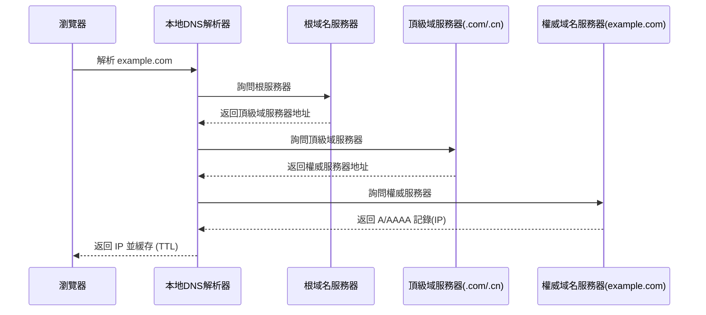

# 0.3.5.3 https://www.baidu.com/search?q=www.baidu.com 是什麼——域名與 DNS：域名解析與配置

## 一句話破題

DNS 就是互聯網的“電話簿”：把好記的**域名**翻譯成難記的**IP 地址**，讓你的瀏覽器知道該去找哪臺機器。

## 核心概念

- 記錄類型：`A`(IPv4)、`AAAA`(IPv6)、`CNAME`(別名)、`MX`(郵件)、`TXT`(文本/驗證)、`NS`(域名服務器)。
- TTL（生存時間）：緩存多久。TTL 越低越即時，越高越省資源但更新慢。
- 遞歸解析：本地解析器逐級詢問根 → 頂級域 → 權威服務器，最終得到 IP。

## 解析流程可視化

## 覺知：配置與排錯的關注點

- CNAME 與 A 不要相互循環；CNAME 不能與其他記錄同名並存。
- 記錄值是否正確（IPv4/IPv6）；是否遺漏 `www` 與根域名的分別配置。
- DNS 變更的傳播需要時間；不同運營商的解析生效速度不一。

## AI 協作指南

- 核心意圖：讓 AI 幫你“設計記錄集”或“定位解析失敗原因”。
- 需求定義公式：
  - “爲 `example.com` 配置 `A` 與 `AAAA` 記錄，`www` 使用 CNAME 指向根域名。”
  - “`api.example.com` 無法訪問，請逐步檢查記錄是否存在、TTL 是否過低、權威 DNS 是否可達。”
- Windows PowerShell 常用命令：
  - `Resolve-DnsName example.com`
  - `nslookup example.com`
  - `ipconfig /flushdns`

## 避坑指南

- 不要用過短的 TTL 在高流量系統中頻繁更新，容易導致解析壓力過高。
- CDN/代理場景下注意源站與邊緣節點的 IP 區分；避免直接暴露源站。
