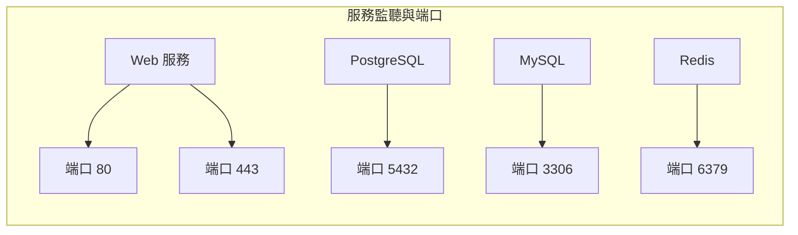

# 0.3.5.4 電腦上的門牌號——端口與服務：常用端口與服務映射

## 一句話破題

端口就是一臺電腦上的“門牌號”。不同服務監聽不同端口，比如網頁服務常見 `80/443`，數據庫常見 `5432/3306`。

## 核心概念

- 端口範圍：`0-65535`，其中 `0-1023` 爲知名端口（需管理員權限），`1024-49151` 爲註冊端口，`49152-65535` 爲臨時端口（客戶端連接時隨機分配）。
- 一端口一進程：同一時刻一個端口只能被一個進程佔用（同協議）。
- 常見映射：
  - `80` HTTP，`443` HTTPS
  - `22` SSH
  - `53` DNS
  - `5432` PostgreSQL，`3306` MySQL，`6379` Redis

## 可視化：服務與端口的關係

## 覺知：排查端口占用與衝突

- 在 Windows PowerShell 中：
  - 查看端口占用：`Get-NetTCPConnection | Where-Object { $_.LocalPort -eq 3000 }`
  - 通過 PID 查進程：`Get-Process -Id <PID>`
  - 經典方式：`netstat -ano | findstr ":3000"`
- 啓動失敗，多半是端口被佔用或權限不夠；改端口或釋放佔用。

## AI 協作指南

- 核心意圖：讓 AI 幫你“定位端口衝突”或“規劃服務端口映射”。
- 需求定義公式：
  - “本地 `3000` 端口被佔用，請給我在 PowerShell 下的排查命令，並建議修改端口的方案。”
  - “爲 Web/API/DB 規劃端口，遵循知名端口與安全策略。”
- 關鍵術語：`端口範圍`, `臨時端口`, `監聽`, `PID`, `端口衝突`。

## 避坑指南

- 不要在生產環境使用隨機端口暴露服務；規範端口並在防火牆中明確開放。
- 避免多個服務搶同一端口；引入反向代理統一入口更容易管理。
