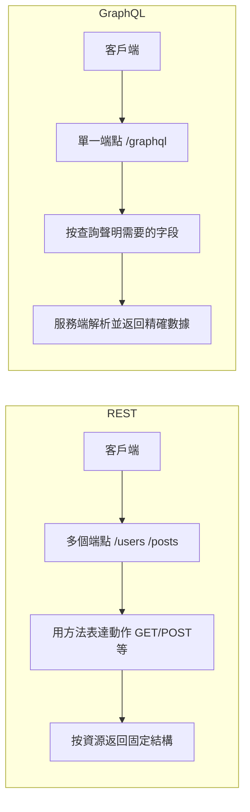

# 0.3.5.5 程序間的通用語言——API 設計基礎：RESTful 與 GraphQL 概念

## 認知重構：從“接口”到“契約”

API 不只是“一個地址加點數據”，而是**客戶端與服務端的協作契約**：雙方約定資源結構、交互方式與錯誤語義。主流風格有兩種：REST 與 GraphQL。

## 本質還原：REST 與 GraphQL 的核心差異



### REST 要點

- 以“資源”爲中心：`/users`, `/posts/{id}`。
- 方法表達語義：讀用 `GET`，寫用 `POST/PUT/PATCH/DELETE`。
- 狀態碼錶達結果：`200/201/204/4xx/5xx`。
- 支持緩存：`ETag`/`Cache-Control`。
- 分頁、篩選與排序：`?page=1&pageSize=20&sort=createdAt`。

### GraphQL 要點

- 單一端點，按查詢語句返回所需字段，避免“過多或過少的數據”。
- 強類型 Schema 定義數據結構與關係。
- 由 Resolver 實現字段級的數據獲取。
- 支持聚合多個後端源，前端一次拿到所需數據。

## 落地與實戰：最小閉環示例

### 需求 (Mini-PRD)

- 獲取用戶列表與其文章數。
- 前端希望一次請求拿到用戶 `id/name` 與 `postCount`。

### REST 方案

- 端點：`GET /users` 返回用戶數組；`GET /posts?userId=<id>` 獲取該用戶的文章，再在客戶端彙總。
- 優點：簡單直觀；緩存與監控成熟。
- 缺點：可能需要多次請求；前端需要彙總邏輯。

### GraphQL 方案

- 查詢：

```graphql
query {
  users {
    id
    name
    postCount
  }
}
```

- 優點：一次拿齊，需要什麼拿什麼。
- 缺點：服務端需要維護 Schema/Resolver；監控與緩存策略需專門設計。

## 驗收清單

- REST：
  - 方法與語義一致；狀態碼與錯誤體規範；分頁參數與默認值明確。
  - 返回的 `Content-Type` 與內容一致；支持合理的緩存策略。
- GraphQL：
  - Schema 邊界清晰（必填/可選）；錯誤結構一致；複雜查詢有速率限制。
  - Resolver 無 N+1 問題（必要時加入數據加載器）。

## AI 協作指南

- 核心意圖：讓 AI 按“契約”生成接口與驗證腳本。
- 需求定義公式：
  - “爲用戶資源設計 REST 接口，返回分頁數據，並且提供錯誤示例與狀態碼說明。”
  - “請提供一個 GraphQL Schema 與對應 Resolver 的雛形，用於查詢 `users{id,name,postCount}`。”
- 關鍵術語：`資源(REST)`, `狀態碼`, `ETag`, `Schema`, `Resolver`, `N+1`。
- Windows PowerShell 調試：
  - REST：`Invoke-RestMethod -Method GET -Uri https://api.example.com/users?page=1&pageSize=10`
  - GraphQL：
    ```powershell
    $body = @{ query = "query { users { id name } }" } | ConvertTo-Json
    Invoke-RestMethod -Method POST -Uri https://api.example.com/graphql -Body $body -ContentType 'application/json'
    ```

## 決策建議

- 後端資源清晰、緩存友好、監控成熟的場景選 REST；
- 前端組合數據、減少往返、字段可裁剪的場景選 GraphQL；
- 大多數產品可採用“REST 爲主，關鍵聚合場景引入 GraphQL”的混合策略。
