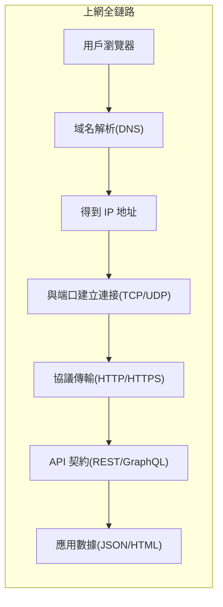

# 0.3.5 你的電腦如何上網——網絡基礎：HTTP/HTTPS/域名/端口/API 概念

## 一句話破題

上網的全鏈路可以概括爲：**域名解析到 IP → 通過端口建立連接 → 用 HTTP/HTTPS 交換數據 → 以 API 作爲程序間的協作契約**。

## 章節導覽

- **HTTP 協議**：瀏覽器與服務器的“對話格式”，包含方法、頭、體與狀態碼。
- **HTTPS 與證書**：在 HTTP 外面套一層“加密與身份驗證”的保護殼，保障隱私與完整性。
- **DNS 域名解析**：把人類可讀的域名翻譯成機器可讀的 IP 地址。
- **端口與服務**：一臺機器上的“門牌號”，不同服務監聽不同端口。
- **API 風格**：REST 與 GraphQL，定義程序間如何協作與傳輸數據。

## 可視化總覽

## AI 協作指南

- 核心意圖：讓 AI 幫你“定位網絡故障點”或“設計合理的接口契約”。
- 需求定義公式：
  - “請幫我診斷訪問 `example.com` 失敗的原因，依次檢查 DNS 解析、端口連通性與 HTTPS 證書。”
  - “請爲用戶列表提供一個 REST API，返回分頁數據，包含總數與當前頁。”
- 關鍵術語：`DNS`, `端口連通性`, `HTTP 方法/狀態碼`, `HTTPS 證書`, `REST`, `GraphQL`。
- 在 Windows PowerShell 中的常用檢查命令：
  - `Resolve-DnsName example.com`
  - `Test-NetConnection -ComputerName example.com -Port 443`
  - `Invoke-WebRequest -Uri https://example.com -UseBasicParsing`
  - `Get-NetTCPConnection | Where-Object { $_.LocalPort -eq 3000 }`

## 避坑指南

- 把業務錯誤一律返回 `200` 是反模式，應使用恰當的狀態碼（如 `400/401/403/404/500`）。
- 生產環境必須啓用 HTTPS，避免明文傳輸與中間人攻擊；同時注意“混合內容”問題。
- DNS 變更有傳播延遲，TTL 過低會導致頻繁查詢，過高會導致更新滯後。
- 端口衝突會導致服務啓動失敗，先查佔用再啓動：`Get-NetTCPConnection -LocalPort <端口>`。
