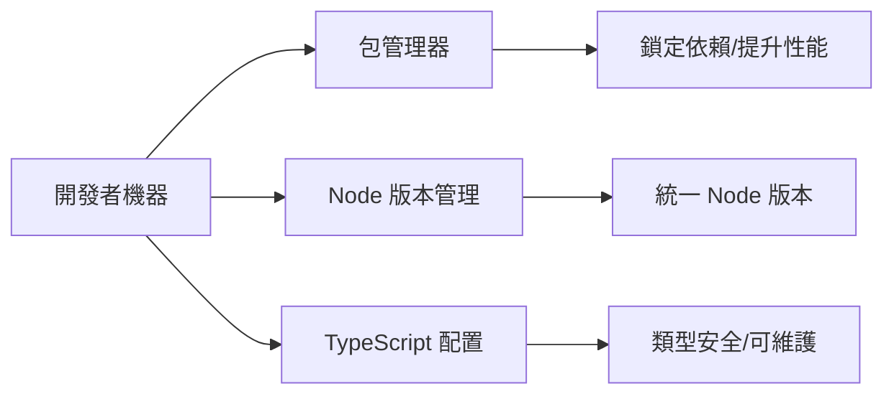

# 0.4 搭建你的編程工作室——開發環境配置：Node.js、包管理器與工具鏈

## 一句話破題

穩定的開發環境 = 合適的 Node 版本 + 高效的包管理器 + 嚴謹的 TypeScript 配置。先跑通最小閉環，再優化性能與團隊協作。

## 章節導覽

- 包管理器選擇：性能/磁盤佔用/一致性對比，`npm` vs `pnpm` vs `yarn`。
- Node 版本管理：跨平臺 `nvm`/`nvm-windows`，`.nvmrc` 項目級鎖定與環境變量配置。
- TypeScript 配置：`tsconfig.json` 嚴格模式與路徑別名最佳實踐。

## 總覽可視化

## AI 協作指南

- 核心意圖：讓 AI 幫你“搭環境”和“制定規範”，而不是零碎地安裝依賴。
- 需求定義公式：
  - “在 Windows PowerShell 下，使用 `nvm-windows` 安裝並切換到 Node LTS 版本，生成 `.nvmrc` 與 `tsconfig.json` 嚴格模式配置。”
  - “對現有項目的包管理器進行遷移到 `pnpm`，並提供緩存與 registry 優化命令。”
- 關鍵術語：`nvm-windows`, `.nvmrc`, `NODE_ENV`, `registry`, `tsconfig`, `strict`。

## 避坑指南

- 全局 Node 與項目 Node 不一致導致構建失敗；使用 `.nvmrc` 鎖定版本並在 CI 中強制檢查。
- 包管理器混用會破壞鎖文件；團隊統一選擇一個，並清理緩存與鎖文件後再遷移。
- TypeScript 未開啓嚴格模式造成隱形錯誤；務必開啓 `strict` 與 `noImplicitAny`。
