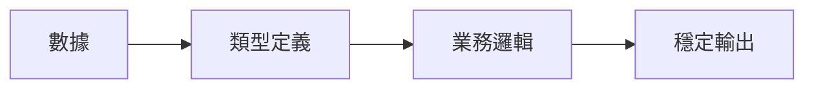

# 0.5.1 動態與靜態到底在說什麼——JavaScript/TypeScript 思維轉換：從動態到靜態類型

## 認知重構：從“數據隨用隨變”到“先定類型再用”

JavaScript 的動態類型讓開發很自由，但自由伴隨不確定；TypeScript 用靜態類型爲數據“立約”，把風險前置到編譯期。



## 基礎類型

```ts
const s: string = 'hello'
const n: number = 42
const b: boolean = true
const arr: number[] = [1, 2, 3]
const obj: { id: string; name: string } = { id: 'u1', name: 'Alice' }
```

## 接口與類型別名：interface vs type

- interface：更適合描述**對象形狀**與**可擴展接口**。
- type：更通用，支持聯合與交叉、條件類型等更復雜的建模。

```ts
interface User {
  id: string
  name: string
}

type Id = string | number
type UserLite = Pick<User, 'id' | 'name'>
```

## 聯合類型與交叉類型：| vs &

```ts
type Admin = { role: 'admin'; permissions: string[] }
type Member = { role: 'member'; teamId: string }

type UserRole = Admin | Member
type WithTimestamp = { createdAt: Date }
type AdminWithTimestamp = Admin & WithTimestamp
```

## 類型縮小：類型守衛與斷言

```ts
function formatId(id: string | number): string {
  if (typeof id === 'string') {
    return id.toUpperCase()
  }
  return id.toString()
}

function getBadge(u: Admin | Member): string {
  if ('permissions' in u) {
    return 'ADMIN'
  }
  return 'MEMBER'
}

function ensureArray(input: unknown): string {
  if (Array.isArray(input)) {
    return input.join(',')
  }
  return String(input)
}
```

斷言只在你能保證類型正確時使用；優先通過守衛收窄類型，再進行斷言。

## unknown vs any：類型安全的權衡

- `any` 放棄類型檢查，風險不可控；**禁用**。
- `unknown` 需要先收窄再使用，安全且靈活。

```ts
function parse(data: unknown): string {
  if (typeof data === 'string') {
    return data
  }
  if (typeof data === 'number') {
    return data.toString()
  }
  return JSON.stringify(data)
}
```

## 嚴格模式配置與最佳實踐

```json
{
  "compilerOptions": {
    "strict": true,
    "noImplicitAny": true,
    "noImplicitReturns": true
  }
}
```

## AI 協作指南

- 核心意圖：讓 AI 先產出**類型與函數簽名**，再補實現；以契約驅動代碼生成。
- 需求定義公式：
  - “定義用戶與角色的類型，寫一個函數輸入 `Admin | Member` 返回 `string` 的徽章文本，禁止使用 `any`。”
- 關鍵術語：`interface`, `type`, `union`, `intersection`, `narrowing`, `unknown`。

## 避坑指南

- 任何不確定類型都不要用 `any`；用 `unknown` 並收窄。
- 斷言不是規避錯誤的手段；優先守衛。
- 保持簽名穩定；變更籤名需同步更新調用方。
