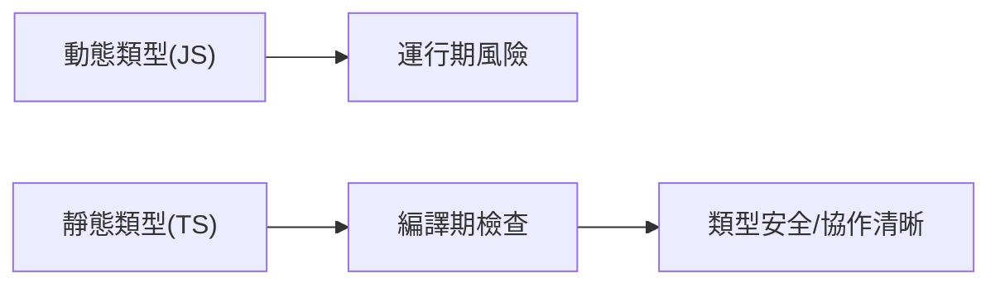

# 0.5 從隨心所欲到規行矩步——JS → TS 思維轉換

## 一句話破題

TypeScript 的價值不在“語法更復雜”，而在於把“運行時報錯”提前到“編譯期”。它讓協作像籤合同一樣明確，減少猜測與隱性 bug。

## 章節導覽

- 動態與靜態的核心差異：數據先有類型，再寫邏輯。
- 基礎類型與複合類型：從 `string/number/boolean` 到 `array/object`。
- 接口與類型別名：`interface` vs `type` 的適用場景。
- 聯合與交叉：`|` 與 `&` 的建模方式。
- 類型縮小：類型守衛與斷言的工程用法。
- unknown vs any：安全邊界與折中方案。
- 嚴格模式與團隊規範：`strict/noImplicitAny/noImplicitReturns` 等。

## 可視化總覽

## AI 協作指南

- 核心意圖：讓 AI 按“契約”生成類型與函數簽名，再填充實現。
- 需求定義公式：
  - “給我爲用戶列表寫一個類型定義與分頁函數的簽名，要求返回值包含分頁信息與總數。”
- 關鍵術語：`interface`, `type`, `union`, `intersection`, `narrowing`, `unknown`。

## 避坑指南

- 禁止使用 `any`；不確定類型時用 `unknown` 並收窄。
- 斷言不是“消滅錯誤”的工具；先做類型守衛再斷言。
- 別在實現中偷換返回類型；函數簽名就是契約。
