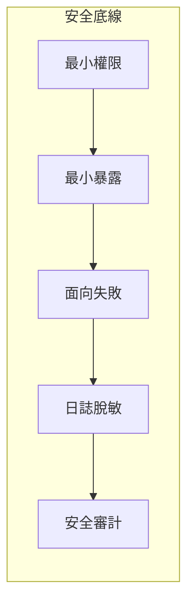

# 0.6 別讓你的網站裸奔——開發安全底線

## 一句話破題

安全不是堆功能，而是建立底線：**最小權限、最小暴露、面向失敗、日誌脫敏與定期審計**。先守底線，再談高級能力。

## 章節導覽

- 安全設計原則：像保安一樣思考，建立最小化與防禦性策略。
- 環境變量與密鑰管理：把祕密放在正確的地方，並制定輪換機制。

## 總覽可視化

## AI 協作指南

- 核心意圖：讓 AI 幫你“按原則設計方案”，而非零碎修補。
- 需求定義公式：
  - “爲後臺管理系統設計最小權限模型、接口暴露策略與日誌脫敏方案，輸出驗收清單。”
- 關鍵術語：`最小權限`, `最小暴露`, `異常處理`, `日誌脫敏`, `安全審計`。

## Windows PowerShell 常用操作

- 查看環境變量：`Get-ChildItem Env:`
- 設置會話變量：`$env:API_KEY = '***'`
- 持久化變量：`setx API_KEY '***'`

## 避坑指南

- 把密鑰硬編碼進代碼或日誌是高危行爲；使用環境變量與密鑰管理服務。
- 接口不要過度返回數據；遵循“所需即所返”。
- 異常時默認拒絕而非默認放行；記錄但不暴露內部細節。
