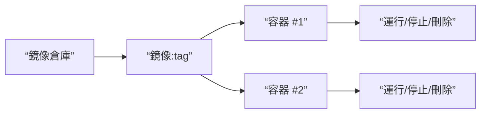

# 0.7.1 模具與標準零件——鏡像與容器：構建/運行/生命週期管理

## 一句話破題

鏡像是隻讀“模具”，容器是運行中的“標準零件”。先有鏡像，後有容器；容器的生命週期可控：創建、啓動、停止、刪除。

## 本質還原：鏡像與容器的關係



## Windows PowerShell 常用命令

```powershell
Get-Command docker
docker pull node:18-alpine
docker run -d --name app -p 3000:3000 node:18-alpine
docker ps -a
docker logs -f app
docker stop app
docker rm app
docker rmi node:18-alpine
```

## 構建你的鏡像

`Dockerfile`

```Dockerfile
FROM node:18-alpine
WORKDIR /app
COPY package.json package-lock.json /app/
RUN npm ci
COPY . /app
EXPOSE 3000
CMD ["npm","start"]
```

構建與運行：

```powershell
docker build -t myapp:latest .
docker run -d --name myapp -p 3000:3000 myapp:latest
```

## 覺知：面向失敗的生命週期管理

- 容器異常退出時，先看日誌再重啓：`docker logs -f <容器名>`。
- 端口衝突導致啓動失敗，先查佔用：`Get-NetTCPConnection | Where-Object { $_.LocalPort -eq 3000 }`。
- 保持“鏡像不可變”，變更通過重建鏡像與重新部署完成。

## AI 協作指南

- 核心意圖：讓 AI 輸出從 Dockerfile 到運行命令的完整閉環。
- 需求定義公式：
  - “爲一個監聽 `3000` 端口的 Node 應用生成 `Dockerfile` 與運行命令，使用 `node:18-alpine`，並提供查看日誌與排障命令。”
