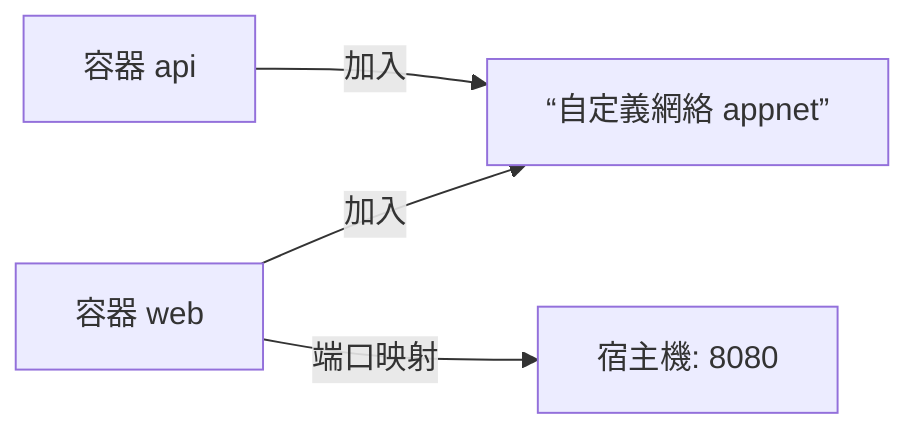

# 0.7.3 集裝箱之間如何對話——網絡與端口

## 一句話破題

Docker 通過“網絡”讓容器互聯，通過“端口映射”把服務暴露到宿主機。默認 `bridge` 網絡已夠用，複雜場景用自定義網絡。

## 網絡類型速覽

- `bridge`：默認容器網絡，容器間可互相通信。
- `host`：與宿主機共享網絡棧（Linux 專用）。
- `none`：不配置網絡。

## 端口映射與服務暴露

```powershell
docker run -d --name web -p 8080:80 nginx:alpine
```

訪問：`http://localhost:8080`

## 自定義網絡與服務發現

```powershell
docker network create appnet
docker run -d --name api --network appnet myapi:latest
docker run -d --name web --network appnet -p 8080:80 myweb:latest
```

在同一網絡內，容器可通過“容器名”互相訪問，如 `http://api:3000`。

## 網絡可視化



## Windows PowerShell 常用命令

- 列出網絡：`docker network ls`
- 檢查網絡：`docker network inspect appnet`
- 斷開/連接：`docker network disconnect appnet web`、`docker network connect appnet web`

## AI 協作指南

- 核心意圖：讓 AI 設計“網絡拓撲與端口策略”。
- 需求定義公式：
  - “爲 web/api 兩個服務創建自定義網絡與端口映射，web 通過容器名訪問 api，並給出 PowerShell 驗證命令。”
