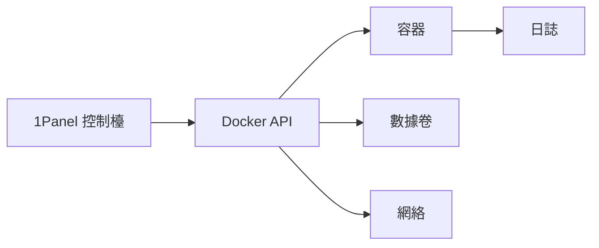

# 0.7.5 可視化的集裝箱港口——1Panel 核心理念：運行環境 = 預配置 Docker

## 核心理念

1Panel 將“Docker 應用”做成可視化的管理與編排：鏡像、容器、網絡、卷、環境變量與日誌，在一個控制檯裏完成創建、更新與運維。

## 能力速覽

- 應用市場：一鍵創建常見應用（數據庫、緩存、Web 環境）。
- 鏡像與容器管理：拉取、更新、啓動、停止、重啓、刪除。
- 環境變量與端口：以表單方式配置，避免命令複雜度。
- 數據卷與備份：掛載路徑、快照與定期備份。
- 網絡：自定義網絡與服務暴露策略。
- 日誌與監控：查看容器日誌與資源佔用。

## 工作流可視化

## 落地與實戰：創建一個應用

- 選擇應用 → 配置鏡像版本與端口映射 → 設置環境變量 → 掛載數據卷 → 創建。
- 驗證：查看容器狀態、日誌與端口可訪問性。

## 驗收清單

- 端口：服務對外暴露的端口明確且無衝突。
- 環境變量：敏感信息來源安全，遵循最小暴露。
- 數據卷：持久化路徑清晰，定期備份策略到位。
- 日誌：日誌轉儲與保留週期清晰，脫敏合規。

## AI 協作指南

- 核心意圖：讓 AI 輸出“1Panel 下的容器化配置方案”。
- 需求定義公式：
  - “在 1Panel 中創建一個 `myapp`，指定鏡像版本、端口映射、環境變量與數據卷掛載，輸出驗收清單。”

## 避坑指南

- 不要在生產暴露多餘端口；只開放必要端口並加防火牆策略。
- 數據卷路徑規範化；避免掛載到臨時目錄導致數據丟失。
- 鏡像更新後需驗證兼容性；先在測試環境演練再發布。
