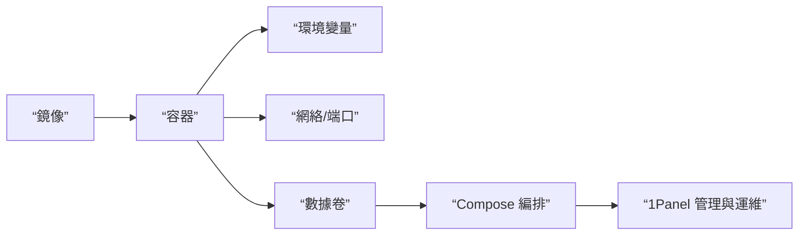

# 0.7 把程序裝進集裝箱——Docker 核心概念

## 一句話破題

Docker 用“鏡像”定義運行環境，用“容器”執行你的程序；再用“環境變量、網絡、數據卷與 Compose”把它變成可編排、可複用的工程能力。

## 章節導覽

- 鏡像與容器：構建、運行與生命週期管理。
- 環境變量配置：安全注入配置與密鑰。
- 網絡與端口：容器間通信與服務暴露。
- 數據卷與 Compose：持久化與多服務編排。
- 1Panel：用圖形化面板管理 Docker 應用。

## 總覽圖

## AI 協作指南

- 核心意圖：讓 AI 輸出“完整的容器化方案”，而不是零碎命令。
- 需求定義公式：
  - “爲一個 Node.js 應用生成 Dockerfile 與運行命令，包含端口映射、環境變量與數據卷，並提供 Compose 版本。”
- 關鍵術語：`image`, `container`, `ENV`, `-p`, `volume`, `docker-compose`, `1Panel`。

## Windows PowerShell 常用命令

- 檢查 Docker：`Get-Command docker`
- 查看：`docker ps -a`
- 日誌：`docker logs -f <容器名>`
- 進入容器：`docker exec -it <容器名> sh`
