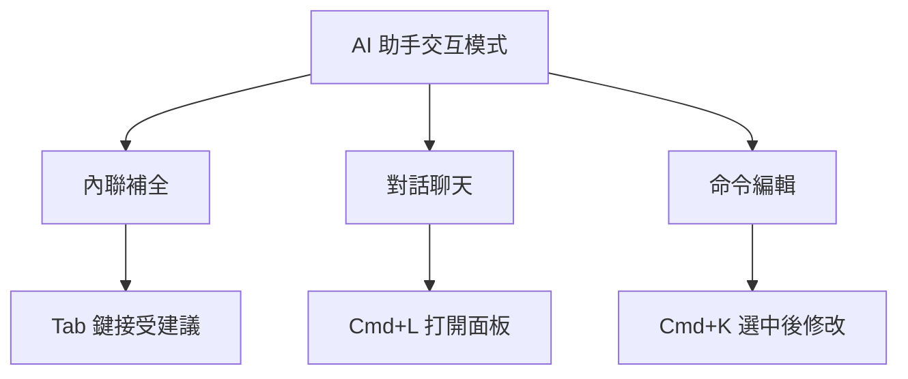

# 1.1.2 給你的 IDE 裝上大腦——AI 助手集成：Trae/Cursor 配置

### 一句話破題

AI 助手是你的編程搭檔——它能理解你的意圖、生成代碼、解釋錯誤，甚至幫你重構整個模塊。配置好它，就像給你的 IDE 裝上了一顆會思考的大腦。

### 核心價值

在 Vibe Coding 中，AI 助手不是"輔助工具"，而是"核心生產力"。你需要學會的不是"如何寫代碼"，而是"如何讓 AI 幫你寫出正確的代碼"。

### Cursor 內置 AI 配置

如果你選擇了 Cursor，AI 已經內置好了，只需要簡單配置：

**步驟 1：選擇模型**

打開 Cursor 設置（Cmd/Ctrl + ,），找到 `Models` 選項：

| 模型 | 特點 | 適用場景 |
|------|------|----------|
| **Claude 3.5 Sonnet** | 代碼能力強，理解力佳 | 複雜邏輯、代碼生成 |
| **GPT-4o** | 綜合能力均衡 | 日常編程、問答 |
| **cursor-small** | 速度快，成本低 | 簡單補全 |

**推薦配置**：日常使用 Claude 3.5 Sonnet，簡單補全用 cursor-small。

**步驟 2：配置 API Key（可選）**

Cursor 免費版有調用限額。如果你有自己的 OpenAI 或 Anthropic API Key，可以在設置中添加，解鎖無限制使用。

### VS Code + AI 插件方案

如果你選擇 VS Code，需要安裝 AI 插件：

**方案 A：GitHub Copilot**

```
1. 在擴展商店搜索 "GitHub Copilot"
2. 安裝後登錄 GitHub 賬號
3. 需要付費訂閱（學生免費）
```

**方案 B：Trae（國內可用）**

```
1. 訪問 trae.ai 下載 Trae 編輯器
2. 或在 VS Code 中安裝 Trae 插件
3. 國內網絡環境友好
```

### AI 助手的三種交互模式

無論使用哪個工具，AI 助手都有三種核心交互方式：



1. **內聯補全**：你打字時，AI 自動預測後續代碼，按 Tab 接受
2. **對話聊天**：像聊天一樣討論代碼問題，AI 會結合項目上下文回答
3. **命令編輯**：選中一段代碼，用自然語言描述修改需求

### 驗證配置成功

打開任意代碼文件，嘗試：

1. 輸入 `// 創建一個函數，計算兩個數的和`，看 AI 是否自動補全
2. 按 `Cmd/Ctrl + L`，輸入"解釋這段代碼的作用"，看是否有回覆

如果以上兩步都正常工作，恭喜你，AI 助手配置成功！

### 避坑指南

- **網絡問題**：大部分 AI 服務需要科學上網，或者選擇國內可用的方案（如 Trae）
- **額度限制**：免費版通常有調用次數限制，重要項目建議升級付費版或使用自己的 API Key
- **隱私考量**：代碼會上傳到雲端處理，敏感項目需注意合規性
