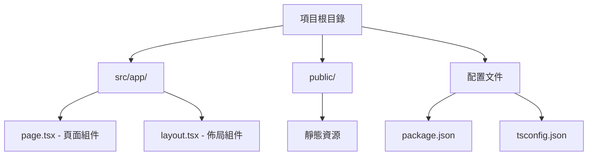

# 1.1.3 一鍵生成項目骨架——Next.js 項目初始化：create-next-app 詳解

### 一句話破題

`create-next-app` 是 Next.js 官方提供的腳手架工具，一條命令就能生成一個開箱即用的全棧項目結構。

### 核心價值

爲什麼不從零開始配置？因爲現代前端項目的配置項多達上百個：TypeScript、ESLint、Tailwind CSS、路徑別名、構建優化……從零配置不僅耗時，還容易出錯。`create-next-app` 幫你把這些"髒活累活"都做完了。

### 前置條件

確保你的電腦已經安裝了：

- **Node.js**：版本 18.17 或更高（運行 `node -v` 檢查）
- **包管理器**：推薦 pnpm（運行 `pnpm -v` 檢查）

如果沒有安裝，請先完成 Bootcamp 0.4 章節的環境配置。

### 核心命令

打開終端，運行以下命令：

```bash
pnpm create next-app@latest my-first-app
```

系統會詢問一系列配置選項，**推薦選擇**：

| 選項 | 推薦值 | 說明 |
|------|--------|------|
| TypeScript | **Yes** | 類型安全，減少 bug |
| ESLint | **Yes** | 代碼規範檢查 |
| Tailwind CSS | **Yes** | 原子化 CSS 框架 |
| `src/` directory | **Yes** | 更清晰的目錄結構 |
| App Router | **Yes** | Next.js 16+ 推薦路由方案 |
| Import alias | **@/*** | 路徑別名，避免 `../../` |

### 生成的項目結構

命令執行完成後，進入項目目錄：

```bash
cd my-first-app
```

你會看到如下目錄結構：

```
my-first-app/
├── src/
│   └── app/              # App Router 核心目錄
│       ├── layout.tsx    # 全局佈局
│       ├── page.tsx      # 首頁
│       └── globals.css   # 全局樣式
├── public/               # 靜態資源
├── package.json          # 項目配置
├── tsconfig.json         # TypeScript 配置
├── tailwind.config.ts    # Tailwind 配置
└── next.config.mjs       # Next.js 配置
```



### 關鍵文件解讀

**`src/app/page.tsx`** - 這是你的首頁：

```tsx
export default function Home() {
  return (
    <main>
      <h1>Hello World</h1>
    </main>
  );
}
```

**`src/app/layout.tsx`** - 這是全局佈局：

```tsx
export default function RootLayout({
  children,
}: {
  children: React.ReactNode;
}) {
  return (
    <html lang="zh">
      <body>{children}</body>
    </html>
  );
}
```

### AI 協作指南

當你需要 AI 幫你修改項目結構時：

- **核心意圖**：說明你想添加什麼頁面或功能
- **關鍵術語**：`App Router`, `page.tsx`, `layout.tsx`, `Server Component`
- **示例 Prompt**："幫我在 src/app 下創建一個 about 頁面，顯示'關於我們'的標題"

### 避坑指南

- **Node.js 版本**：Next.js 16 要求 Node.js 18.17+，版本過低會報錯
- **pnpm 問題**：如果 pnpm 命令找不到，先運行 `npm install -g pnpm`
- **網絡超時**：國內網絡可能下載慢，可以配置 npm 鏡像：`pnpm config set registry https://registry.npmmirror.com`
