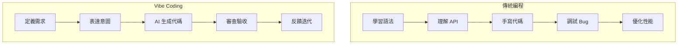

# 1.2.1 從編碼員到指揮官——AI 輔助編程的核心思維轉變

### 認知重構

在傳統編程中，你是"施工工人"——親手敲下每一行代碼，親自解決每一個 bug。在 Vibe Coding 中，你是"項目總設計師"——你的任務是提供清晰的藍圖，讓 AI 這支高效的施工隊幫你把想法變成現實。

**核心差異不在於"會不會寫代碼"，而在於"能不能清晰地定義需求"。**

### 兩種模式的本質對比



| 維度 | 傳統編程 | Vibe Coding |
|------|----------|-------------|
| **核心技能** | 語法、算法、API | 需求定義、溝通、審查 |
| **主要輸入** | 精確的代碼 | 自然語言提示 |
| **關注焦點** | 實現細節 | 預期結果 |
| **調試方式** | 斷點、日誌 | 對話反饋 |
| **學習曲線** | 陡峭 | 相對平緩 |

### 指揮官的三個核心職責

#### 1. 戰略規劃：定義"做什麼"

在動手之前，先想清楚：

- 這個功能要解決什麼問題？
- 用戶會如何使用它？
- 成功的標準是什麼？

**示例**：與其直接讓 AI "寫一個登錄頁面"，不如先定義：

```
登錄功能需求：
- 支持郵箱+密碼登錄
- 需要表單驗證（郵箱格式、密碼長度）
- 登錄失敗顯示錯誤提示
- 登錄成功跳轉到首頁
```

#### 2. 戰術指揮：表達"怎麼做"

把需求拆解成 AI 能執行的任務：

- 任務要足夠小，一次只做一件事
- 提供必要的上下文（用什麼技術棧、有什麼約束）
- 給出參考示例（如果有的話）

#### 3. 質量把控：驗收"做得對不對"

AI 不是神，它會犯錯。你需要：

- 檢查代碼邏輯是否正確
- 驗證邊界情況是否處理
- 確認代碼風格是否符合項目規範

### 常見的思維誤區

**誤區 1："AI 能自動理解我的想法"**

AI 只能理解你表達出來的內容。如果你的需求模糊，AI 的產出也會模糊。

**誤區 2："AI 寫的代碼可以直接用"**

AI 生成的代碼需要審查。它可能有邏輯錯誤、安全漏洞，或者不符合你的項目規範。

**誤區 3："Vibe Coding 不需要懂代碼"**

你不需要會寫代碼，但需要能看懂代碼。否則你無法判斷 AI 的產出是否正確。

### 覺知：如何識別 AI 的"胡說八道"

當 AI 生成代碼時，重點檢查：

1. **依賴是否存在**：AI 有時會"發明"不存在的庫或 API
2. **邏輯是否完整**：檢查邊界情況、錯誤處理
3. **是否符合最新版本**：AI 的知識可能過時
4. **安全性**：敏感信息是否暴露、是否有注入風險

### 從今天開始的行動

1. **寫代碼之前先寫需求**：用自然語言描述你要做的事
2. **一次只做一件事**：把大任務拆成小任務
3. **每次都審查**：不要盲目接受 AI 的產出
4. **持續反饋**：告訴 AI 哪裏對、哪裏不對
