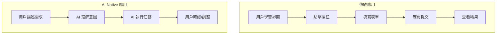

# 1.2.2 讓 AI 聽懂人話——AI Native 應用特點：自然語言交互與智能化工作流

### 本質還原

AI Native 應用與傳統應用的核心區別：**交互方式從"點擊操作"變成了"自然語言對話"**。

用戶不再需要學習複雜的操作流程，只需用日常語言描述需求，AI 就能理解並執行。這不僅是界面的變化，更是人機交互範式的根本轉變。

### 傳統應用 vs AI Native 應用



| 維度 | 傳統應用 | AI Native 應用 |
|------|----------|----------------|
| **主要輸入** | 點擊、表單 | 自然語言 |
| **學習成本** | 需要學習操作 | 會說話就會用 |
| **靈活性** | 固定功能 | 理解意圖，靈活響應 |
| **個性化** | 預設選項 | 根據上下文適配 |

### AI Native 應用的三大特徵

#### 1. 自然語言作爲主要界面

傳統應用需要設計大量按鈕、菜單、表單來覆蓋各種功能。AI Native 應用只需要一個對話框：

```
傳統方式：點擊"文件" → "導出" → 選擇格式 → 設置參數 → 確認

AI Native：告訴 AI "把這個文檔導出成 PDF，頁邊距設爲 2cm"
```

#### 2. 上下文感知與記憶

AI 能記住對話歷史，理解上下文：

```
用戶：幫我寫一個用戶註冊的 API
AI：[生成代碼]

用戶：加上郵箱驗證
AI：[理解是在上一個 API 的基礎上添加郵箱驗證功能]
```

#### 3. 智能化工作流

AI 不僅執行單個任務，還能串聯多個步驟：

```
用戶：幫我做一個博客系統

AI 可能會：
1. 設計數據庫結構
2. 創建 API 接口
3. 生成前端頁面
4. 配置路由
5. 添加認證功能
```

### 這對開發者意味着什麼？

#### 1. 產品設計思維的變化

不再是"設計功能菜單"，而是"定義 AI 能理解的意圖"：

- **傳統**：這個頁面需要哪些按鈕？
- **AI Native**：用戶可能會提出什麼需求？AI 如何理解並響應？

#### 2. 交互設計的簡化

界面可以更簡潔，因爲複雜的操作都可以通過對話完成：

- **傳統**：5 層菜單 + 20 個表單字段
- **AI Native**：一個聊天框 + 確認/取消按鈕

#### 3. 功能的"湧現"

AI 可能會產生設計者沒有預設的功能，這既是機會也是挑戰：

- **機會**：用戶可以獲得更靈活的服務
- **挑戰**：需要設置邊界，防止 AI 做不該做的事

### 構建 AI Native 應用的關鍵要素

1. **清晰的意圖識別**：AI 需要準確理解用戶想要什麼
2. **合理的能力邊界**：明確 AI 能做什麼、不能做什麼
3. **優雅的降級方案**：當 AI 無法理解時，如何引導用戶
4. **持續的上下文管理**：如何維護對話歷史，何時清除

### 實踐啓示

在學習本課程的過程中，你使用的 AI 助手（Cursor/Claude/GPT）就是典型的 AI Native 工具。留意你與它們的交互方式：

- 你是如何表達需求的？
- AI 是如何理解你的意圖的？
- 當 AI 理解錯誤時，你是如何糾正的？

這些經驗將幫助你在未來設計和構建 AI Native 應用。
