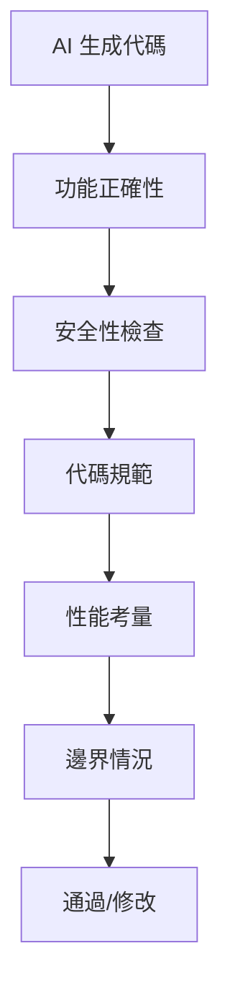

# 1.2.4 AI 寫的代碼靠譜嗎——代碼審查：人機協作的質量保證

### 一句話破題

AI 寫的代碼不能直接用——它需要人類審查。代碼審查不是不信任 AI，而是人機協作的必要環節。

### 爲什麼必須審查 AI 的代碼？

AI 模型有以下固有侷限：

1. **知識截止日期**：AI 的訓練數據有時間限制，可能不瞭解最新的 API 或最佳實踐
2. **缺乏項目上下文**：AI 不瞭解你項目的具體約定、歷史決策和業務邏輯
3. **幻覺問題**：AI 有時會"發明"不存在的函數、庫或 API
4. **安全盲區**：AI 可能忽略安全問題，如敏感信息暴露、注入攻擊等

### 代碼審查檢查清單



#### 1. 功能正確性

- [ ] 代碼是否實現了預期功能？
- [ ] 邏輯流程是否正確？
- [ ] 返回值和類型是否正確？

#### 2. 安全性檢查

- [ ] 是否暴露了敏感信息（API Key、密碼）？
- [ ] 是否有 SQL 注入風險？
- [ ] 是否有 XSS 風險？
- [ ] 用戶輸入是否經過驗證？

#### 3. 代碼規範

- [ ] 命名是否符合項目約定？
- [ ] 代碼風格是否一致？
- [ ] 是否有適當的註釋？

#### 4. 性能考量

- [ ] 是否有不必要的重複計算？
- [ ] 是否有 N+1 查詢問題？
- [ ] 是否有內存泄漏風險？

#### 5. 邊界情況

- [ ] 空值/空數組如何處理？
- [ ] 超大數據量如何處理？
- [ ] 網絡錯誤如何處理？

### AI 常見的"胡說八道"

#### 問題 1：編造不存在的 API

```tsx
// AI 可能會寫出這樣的代碼
import { useServerAction } from 'next/server'; // ❌ 這個 API 不存在！
```

**解決方法**：遇到不熟悉的 API，先去官方文檔確認是否存在。

#### 問題 2：使用過時的語法

```tsx
// AI 可能使用舊版 Next.js 的寫法
export async function getServerSideProps() { // ❌ App Router 不再使用這個
  // ...
}
```

**解決方法**：明確告訴 AI 你使用的版本，如"我用的是 Next.js 16 App Router"。

#### 問題 3：忽略錯誤處理

```tsx
// AI 可能忽略錯誤處理
async function fetchUser(id: string) {
  const response = await fetch(`/api/users/${id}`);
  return response.json(); // ❌ 沒有處理請求失敗的情況
}
```

**正確做法**：

```tsx
async function fetchUser(id: string) {
  const response = await fetch(`/api/users/${id}`);
  if (!response.ok) {
    throw new Error(`Failed to fetch user: ${response.status}`);
  }
  return response.json();
}
```

### 審查的最佳實踐

#### 1. 先運行，再審查

不要只看代碼，先跑起來看效果。很多問題只有在運行時纔會暴露。

#### 2. 質疑每一個依賴

AI 引入的新依賴，先確認：
- 這個庫真的存在嗎？
- 有必要引入嗎？
- 有沒有安全問題？

#### 3. 關注關鍵路徑

不需要逐行審查所有代碼，但核心邏輯（認證、支付、數據處理）必須仔細檢查。

#### 4. 利用 AI 進行交叉審查

你可以讓 AI 審查它自己生成的代碼：

```
請審查以下代碼，找出潛在的問題：
- 安全漏洞
- 性能問題
- 邏輯錯誤
- 邊界情況未處理

[粘貼代碼]
```

### 建立審查習慣

| 階段 | 審查重點 |
|------|----------|
| **生成後立即** | 快速瀏覽，檢查明顯錯誤 |
| **運行測試後** | 驗證功能正確性 |
| **提交前** | 完整的代碼審查清單 |
| **合併前** | 團隊 Code Review |

### 驗收清單模板

在每次讓 AI 生成代碼後，使用這個清單：

```markdown
## 代碼審查清單

### 基礎檢查
- [ ] 代碼能正常運行
- [ ] 實現了預期功能
- [ ] 沒有 TypeScript 類型錯誤

### 安全檢查
- [ ] 無敏感信息暴露
- [ ] 用戶輸入有驗證
- [ ] API 調用有權限控制

### 質量檢查
- [ ] 命名清晰合理
- [ ] 有必要的錯誤處理
- [ ] 邊界情況已覆蓋
```
