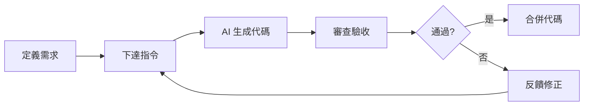

# 1.2 你不是一個人在戰鬥——Vibe Coding 心法：從"寫代碼"到"指揮 AI 寫代碼"

### 認知重構

傳統編程的核心能力是"寫代碼"——你需要記住語法、理解 API、手搓每一行邏輯。而 Vibe Coding 的核心能力是"指揮 AI 寫代碼"——你需要清晰地定義需求、有效地溝通意圖、準確地驗收結果。

**這是一次角色的根本性轉變：從"施工工人"變成"項目總設計師"。**

### 本節目標

學完本節後，你將建立以下核心能力：

1. **思維轉變**：從編碼員到指揮官的身份認知
2. **提示工程**：如何與 AI 有效溝通
3. **代碼審查**：如何驗收 AI 的產出
4. **工具選擇**：不同場景下選擇合適的 AI 模型

### Vibe Coding 的核心循環

這個循環的關鍵點：

- **定義需求**：你需要非常清楚自己想要什麼（這比寫代碼更難）
- **下達指令**：用 AI 能理解的方式表達需求
- **審查驗收**：判斷 AI 的產出是否符合預期
- **反饋修正**：如果不對，告訴 AI 哪裏不對、怎麼改

### 子章節導航

| 章節 | 主題 | 核心問題 |
|------|------|----------|
| 1.2.1 | 從編碼員到指揮官 | 如何轉變思維？ |
| 1.2.2 | AI Native 應用特點 | AI 時代的應用有何不同？ |
| 1.2.3 | 提示工程基礎 | 如何與 AI 有效溝通？ |
| 1.2.4 | 代碼審查 | 如何驗收 AI 的代碼？ |
| 1.2.5 | 模型選擇指南 | 什麼場景用什麼工具？ |

### 心法口訣

> **想清楚**：先明確你要什麼，再開口
> **說明白**：用結構化的語言表達需求
> **看仔細**：AI 的代碼不是寫完就能用
> **改到位**：反饋要具體，不要泛泛而談
