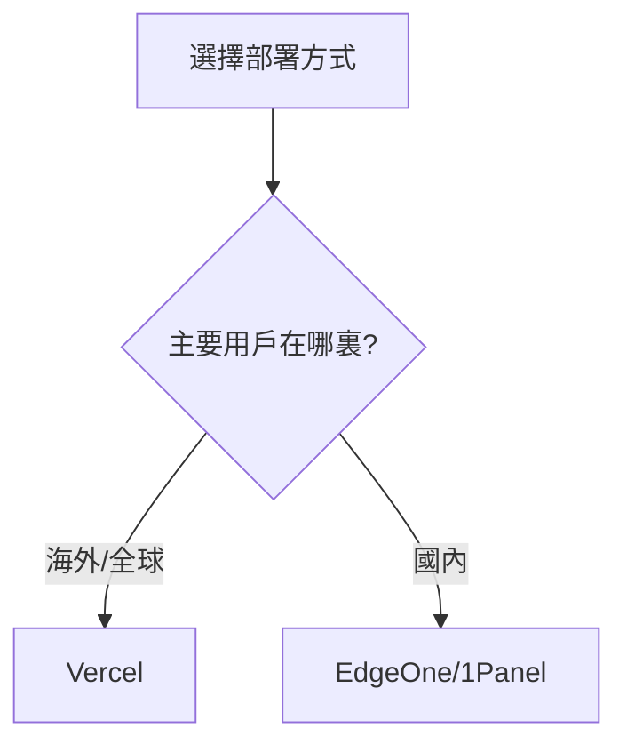

# 1.3 讓全世界看到你的作品——最小上線實戰與 Vercel/EdgeOne 部署

### 一句話破題

部署是把代碼變成產品的最後一步——讓你的作品擁有一個全世界都能訪問的 URL。

### 爲什麼要儘早部署？

很多初學者的誤區是"等功能做完了再部署"。但在 Vibe Coding 理念下，我們提倡**儘早部署、持續部署**：

1. **驗證環境**：本地能跑不代表生產環境能跑，越早發現問題越好
2. **獲得反饋**：讓用戶（哪怕只是你自己）儘早體驗，獲得真實反饋
3. **建立信心**：看到自己的作品在線運行，是極大的成就感
4. **形成閉環**：從需求到上線的完整閉環，纔是真正的"全棧"

### 部署方式選擇



| 方式 | 適用場景 | 優點 | 缺點 |
|------|----------|------|------|
| **Vercel** | 海外用戶爲主 | 零配置、免費、與 Next.js 深度集成 | 國內訪問較慢 |
| **EdgeOne** | 國內用戶爲主 | 國內 CDN 加速、訪問快 | 需要備案（使用國內域名時） |
| **1Panel** | 自建服務器 | 完全可控、靈活配置 | 需要服務器運維知識 |

### Vercel 部署（推薦新手）

Vercel 是 Next.js 的官方部署平臺，對 Next.js 應用有最好的支持。

#### 部署步驟

**步驟 1：將代碼推送到 GitHub**

```bash
# 初始化 Git 倉庫（如果還沒有）
git init
git add .
git commit -m "Initial commit"

# 創建 GitHub 倉庫後，關聯並推送
git remote add origin https://github.com/你的用戶名/你的倉庫.git
git push -u origin main
```

**步驟 2：連接 Vercel**

1. 訪問 [vercel.com](https://vercel.com) 並登錄（可用 GitHub 賬號）
2. 點擊 "Add New..." → "Project"
3. 選擇你剛纔推送的 GitHub 倉庫
4. Vercel 會自動檢測 Next.js 項目，直接點擊 "Deploy"

**步驟 3：等待部署完成**

通常 1-2 分鐘後，你就會獲得一個 `.vercel.app` 域名，可以直接訪問你的應用！

#### 環境變量配置

如果你的應用需要環境變量（如數據庫連接字符串）：

1. 在 Vercel 項目設置中找到 "Environment Variables"
2. 添加你需要的環境變量
3. 重新部署

### EdgeOne 部署（國內用戶）

騰訊雲 EdgeOne 提供了邊緣計算和 CDN 加速能力，特別適合面向國內用戶的應用。

#### 核心優勢

- **國內訪問快**：利用騰訊雲的 CDN 節點
- **邊緣函數**：支持在邊緣節點運行代碼
- **安全防護**：內置 DDoS 防護和 WAF

#### 部署方式

EdgeOne 支持多種接入方式，對於 Next.js 應用，推薦：

1. **靜態導出 + CDN**：適合純靜態站點
2. **邊緣函數**：適合需要 SSR 的應用

具體配置請參考 1.5.6 章節的詳細說明。

### 持續部署

無論使用哪個平臺，都支持**持續部署**：


每次你 `git push` 到 main 分支，部署平臺會自動拉取最新代碼並重新部署。這意味着：

- 不需要手動部署
- 代碼提交即上線
- 可以快速迭代

### 驗證部署成功

部署完成後，檢查：

1. **訪問首頁**：確認頁面正常顯示
2. **測試功能**：點擊各個鏈接和按鈕
3. **檢查控制檯**：打開瀏覽器開發者工具，確認沒有錯誤

### 常見問題

**Q: 部署後頁面白屏？**

1. 查看 Vercel/EdgeOne 的部署日誌
2. 檢查是否有構建錯誤
3. 確認環境變量配置正確

**Q: 國內訪問 Vercel 很慢？**

考慮使用 EdgeOne 或配置自定義域名 + CDN。

**Q: 如何綁定自己的域名？**

在部署平臺的域名設置中添加自定義域名，然後在域名服務商處添加 DNS 解析記錄。

### 里程碑達成

完成本節後，你的應用已經：

- [x] 有了一個公開可訪問的 URL
- [x] 實現了代碼提交即部署
- [x] 可以分享給任何人

**下一步**：學習如何建立高效的 AI 協作工作流，讓開發過程更加順暢。
