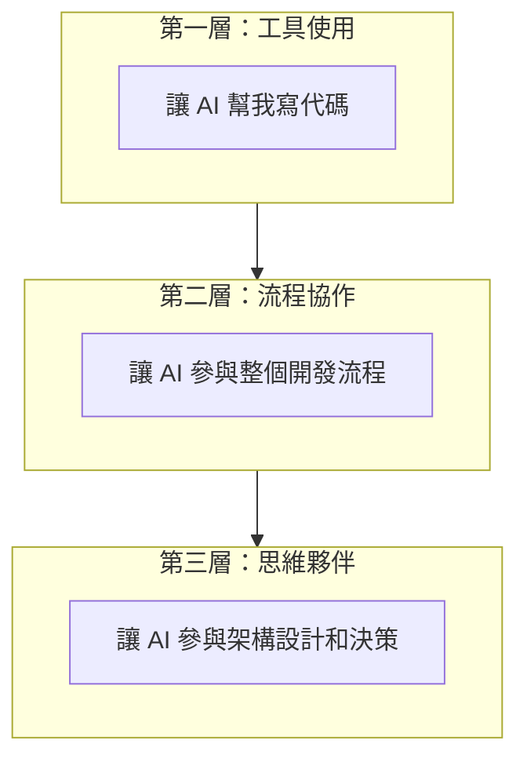
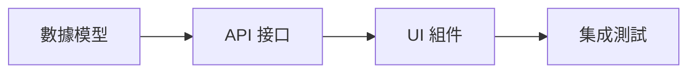

# 1.4 如何讓 AI 成爲真·隊友——AI 協作工作流實戰與最佳實踐

### 認知重構

AI 不是"代替你寫代碼的工具"，而是"與你協作的隊友"。高效的人機協作，需要建立一套可複用的工作流。

### AI 協作的三個層次



| 層次 | 特點 | 典型場景 |
|------|------|----------|
| **工具使用** | 單點調用，用完即棄 | "幫我寫個函數" |
| **流程協作** | 持續對話，上下文連貫 | "我們一起實現這個功能" |
| **思維夥伴** | 參與決策，提供建議 | "這個架構方案你怎麼看？" |

### 高效工作流模板

#### 階段 1：需求定義

在開始編碼之前，先與 AI 一起梳理需求：

```
我需要實現 [功能名稱]。

背景：
[簡要描述爲什麼需要這個功能]

用戶故事：
作爲 [用戶角色]，我希望 [做某事]，以便 [獲得某種價值]

驗收標準：
1. [標準 1]
2. [標準 2]
3. [標準 3]

請幫我分析這個需求，看看有沒有遺漏的點。
```

#### 階段 2：方案設計

讓 AI 參與技術方案的設計：

```
基於上面的需求，請幫我設計技術方案。

技術棧：Next.js 16 + TypeScript + Tailwind CSS + Prisma

請考慮：
1. 數據結構設計
2. API 接口設計
3. 組件拆分
4. 邊界情況處理
```

#### 階段 3：分步實現

按照方案，分步讓 AI 生成代碼：



**關鍵原則**：每一步都確認 OK 再進入下一步。

#### 階段 4：審查優化

完成實現後，讓 AI 幫你審查：

```
請審查以下代碼，檢查：
1. 邏輯是否正確
2. 是否有安全問題
3. 是否有性能問題
4. 代碼是否符合最佳實踐

[粘貼代碼]
```

### 上下文管理策略

AI 的記憶有限，需要主動管理上下文：

#### 1. 項目規則文件

在項目根目錄創建 `.cursorrules` 或 `CLAUDE.md`：

```markdown
# 項目規則

## 技術棧
- Next.js 16 (App Router)
- TypeScript (嚴格模式)
- Tailwind CSS
- Prisma + PostgreSQL

## 代碼規範
- 使用函數組件，不使用 class 組件
- 優先使用 Server Components
- 文件名使用 kebab-case
- 組件名使用 PascalCase

## 目錄結構
- src/app - 頁面和路由
- src/components - 可複用組件
- src/lib - 工具函數
- src/types - 類型定義
```

#### 2. 任務開始時同步上下文

每次開始新任務，先提供必要的背景：

```
我正在開發一個 [項目類型] 項目。

當前任務：[任務描述]

相關文件：
- [文件 1 路徑及作用]
- [文件 2 路徑及作用]

現在我需要...
```

#### 3. 定期總結進度

長對話後，請 AI 總結：

```
請總結一下我們這次對話完成了什麼：
1. 實現了哪些功能
2. 還有什麼待辦事項
3. 需要注意的問題
```

### 協作工作流檢查清單

在每個開發任務中，按照以下流程進行：

```markdown
## 任務：[任務名稱]

### 1. 需求定義
- [ ] 明確功能目標
- [ ] 定義驗收標準
- [ ] 識別邊界情況

### 2. 方案設計
- [ ] 確定數據結構
- [ ] 設計 API 接口
- [ ] 規劃組件結構

### 3. 分步實現
- [ ] 實現數據層
- [ ] 實現接口層
- [ ] 實現 UI 層
- [ ] 處理錯誤情況

### 4. 審查驗收
- [ ] 代碼審查通過
- [ ] 功能測試通過
- [ ] 邊界情況覆蓋
```

### 常見協作模式

#### 模式 1：結對編程

像真人結對編程一樣，即時討論：

```
我現在要實現 [功能]，先寫一個基礎版本...

[粘貼你寫的代碼]

你看這樣寫對不對？有沒有更好的寫法？
```

#### 模式 2：代碼評審

讓 AI 扮演 Code Reviewer：

```
請以嚴格的 Code Reviewer 角色審查以下代碼：

[粘貼代碼]

請指出：
- 潛在的 bug
- 可以優化的地方
- 不符合最佳實踐的寫法
```

#### 模式 3：橡皮鴨調試

當你卡住時，向 AI 解釋你的問題：

```
我遇到了一個問題，讓我解釋一下...

現象：[描述問題現象]
我的理解：[你認爲應該是什麼樣]
已嘗試：[你已經嘗試的方法]

能幫我分析一下可能的原因嗎？
```

### 避坑指南

1. **不要完全依賴 AI**：AI 是助手，不是替代品。最終決策權在你
2. **不要一口氣要太多**：大任務拆成小任務，逐步完成
3. **及時糾正錯誤**：發現 AI 走偏了，立即指出
4. **保存有價值的對話**：好的解決方案和提示詞值得保存複用

### 本章小結

高效的 AI 協作需要：

1. **建立流程**：需求 → 設計 → 實現 → 審查
2. **管理上下文**：項目規則 + 任務背景 + 定期總結
3. **靈活切換模式**：結對編程 / 代碼評審 / 問題討論
4. **保持主導權**：AI 是隊友，但你是項目負責人
