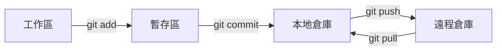
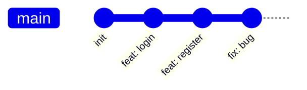
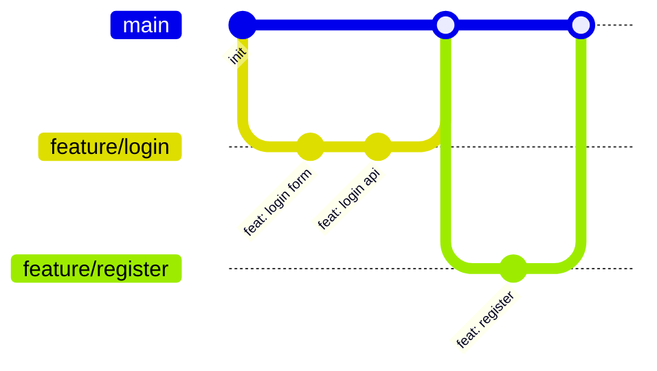

# 1.5.2 團隊協作如何不打架——Git 工作流：分支策略與協作規範

### 一句話破題

Git 是代碼的"時光機"——它記錄每一次改動，讓你能隨時回到任何歷史版本，更能讓多人同時協作而不互相干擾。

### 核心概念



| 概念 | 說明 |
|------|------|
| **工作區** | 你正在編輯的文件 |
| **暫存區** | 準備提交的改動 |
| **本地倉庫** | 已提交的歷史記錄 |
| **遠程倉庫** | GitHub 上的代碼庫 |

### 基礎命令速查

```bash
# 查看狀態
git status

# 添加文件到暫存區
git add .                    # 添加所有文件
git add src/components/      # 添加指定目錄

# 提交
git commit -m "feat: 添加用戶登錄功能"

# 推送到遠程
git push origin main

# 拉取遠程更新
git pull origin main

# 查看歷史
git log --oneline

# 回退版本
git reset --soft HEAD~1      # 回退一個版本，保留改動
git reset --hard HEAD~1      # 回退一個版本，丟棄改動
```

### 分支策略

#### 單人開發

對於個人項目，簡單的策略就夠了：



直接在 `main` 分支開發即可。

#### 團隊開發

團隊項目推薦 **GitHub Flow**：



**核心規則**：

1. `main` 分支始終保持可部署狀態
2. 新功能從 `main` 創建 feature 分支
3. 完成後通過 Pull Request 合併回 `main`
4. 合併前需要 Code Review

### 提交規範

使用 **Conventional Commits** 規範：

```
<type>(<scope>): <description>

[可選的正文]

[可選的腳註]
```

**常用類型**：

| 類型 | 說明 | 示例 |
|------|------|------|
| `feat` | 新功能 | `feat: 添加用戶登錄` |
| `fix` | 修復 bug | `fix: 修復登錄按鈕無響應` |
| `docs` | 文檔更新 | `docs: 更新 README` |
| `style` | 代碼格式 | `style: 格式化代碼` |
| `refactor` | 重構 | `refactor: 優化登錄邏輯` |
| `test` | 測試相關 | `test: 添加登錄測試` |
| `chore` | 構建/工具 | `chore: 更新依賴` |

### 常見操作場景

#### 場景 1：開發新功能

```bash
# 1. 確保 main 是最新的
git checkout main
git pull origin main

# 2. 創建功能分支
git checkout -b feature/user-profile

# 3. 開發並提交
git add .
git commit -m "feat: 添加用戶資料頁面"

# 4. 推送分支
git push -u origin feature/user-profile

# 5. 在 GitHub 上創建 Pull Request
```

#### 場景 2：修復緊急 bug

```bash
# 1. 從 main 創建修復分支
git checkout main
git pull origin main
git checkout -b fix/login-error

# 2. 修復並提交
git add .
git commit -m "fix: 修復登錄時的空指針錯誤"

# 3. 推送並創建 PR
git push -u origin fix/login-error
```

#### 場景 3：處理合併衝突

```bash
# 1. 拉取最新的 main
git checkout main
git pull origin main

# 2. 切回功能分支併合並 main
git checkout feature/user-profile
git merge main

# 3. 手動解決衝突（編輯器會標記衝突位置）
# 4. 標記衝突已解決
git add .
git commit -m "merge: resolve conflicts with main"
```

### .gitignore 配置

確保敏感文件不被提交：

```gitignore
# 依賴
node_modules/

# 構建產物
.next/
out/
dist/

# 環境變量
.env
.env.local
.env.*.local

# IDE
.vscode/
.idea/

# 系統文件
.DS_Store
Thumbs.db

# 日誌
*.log
```

### 避坑指南

- **提交前檢查**：`git status` 和 `git diff` 確認改動
- **小步提交**：每個提交只做一件事，方便回滾
- **寫好提交信息**：未來的你會感謝現在的你
- **不要提交敏感信息**：API Key、密碼等必須在 .gitignore 中排除
- **衝突不要慌**：先理解衝突原因，再手動解決
