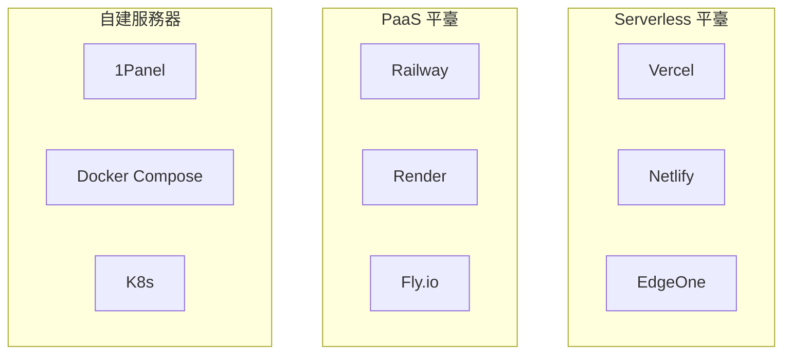
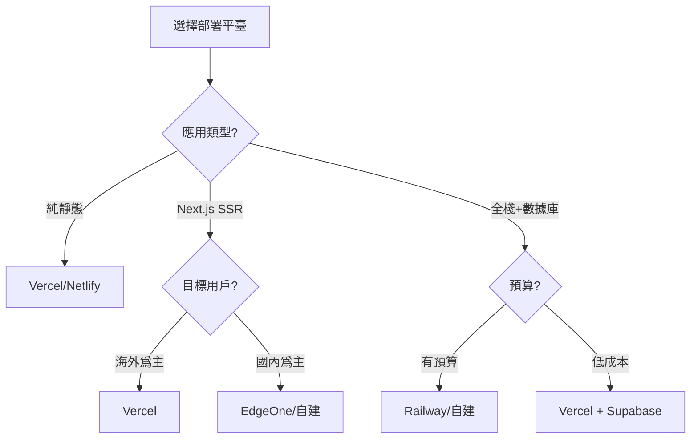

# 1.5.4 項目最終落戶在哪——部署平臺：容器化與雲服務選擇

### 一句話破題

部署平臺決定了你的應用如何運行在互聯網上——選擇合適的平臺，能讓運維變得輕鬆，成本可控。

### 部署方式全景圖



### 平臺對比

| 平臺 | 類型 | 適合場景 | 免費額度 | 國內訪問 |
|------|------|----------|----------|----------|
| **Vercel** | Serverless | 前端/SSR | 慷慨 | 較慢 |
| **Netlify** | Serverless | 靜態站點 | 慷慨 | 較慢 |
| **EdgeOne** | CDN + 邊緣 | 國內用戶 | 有 | 快 |
| **Railway** | PaaS | 全棧應用 | $5/月 | 慢 |
| **1Panel** | 自建 | 完全可控 | 服務器費 | 取決於服務器 |

### 選擇決策樹



### 容器化基礎

無論選擇哪個平臺，理解 Docker 都很重要：

```dockerfile
# 典型的 Next.js Dockerfile
FROM node:20-alpine AS base

# 依賴階段
FROM base AS deps
WORKDIR /app
COPY package.json pnpm-lock.yaml ./
RUN corepack enable pnpm && pnpm install --frozen-lockfile

# 構建階段
FROM base AS builder
WORKDIR /app
COPY --from=deps /app/node_modules ./node_modules
COPY . .
RUN corepack enable pnpm && pnpm build

# 運行階段
FROM base AS runner
WORKDIR /app
ENV NODE_ENV=production

COPY --from=builder /app/public ./public
COPY --from=builder /app/.next/standalone ./
COPY --from=builder /app/.next/static ./.next/static

EXPOSE 3000
CMD ["node", "server.js"]
```

### 本課程推薦策略

| 階段 | 推薦方案 | 原因 |
|------|----------|------|
| **學習階段** | Vercel | 零配置，快速上手 |
| **個人項目** | Vercel + Supabase | 免費額度足夠 |
| **國內用戶** | EdgeOne 或 1Panel | 訪問速度快 |
| **生產項目** | 自建服務器 + 1Panel | 完全可控，成本可預測 |

### 成本考量

| 方案 | 初期成本 | 擴展成本 | 適合規模 |
|------|----------|----------|----------|
| **Vercel 免費版** | 0 | 按量計費 | 小型項目 |
| **Vercel Pro** | $20/月 | 按量計費 | 中型項目 |
| **自建服務器** | 服務器費用 | 固定 | 任意規模 |

### 避坑指南

- **Vercel 免費版限制**：Serverless 函數執行時間限制 10 秒
- **冷啓動問題**：Serverless 函數首次調用可能較慢
- **數據本地化**：某些行業要求數據存儲在國內
- **備案要求**：使用國內服務器和域名需要 ICP 備案
