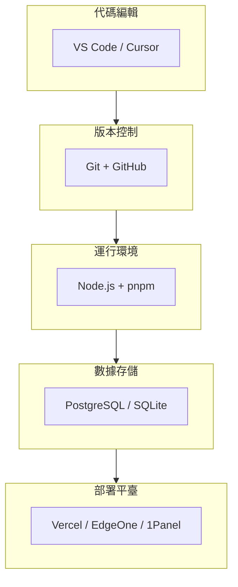

# 1.5 全副武裝你的開發環境——工具鏈與環境：IDE/Git/Node.js/數據庫/部署平臺

### 一句話破題

開發環境是你的"工作臺"——工具選對了、配置好了，開發效率能提升數倍。

### 工具鏈全景圖



### 本節覆蓋內容

| 章節 | 主題 | 核心內容 |
|------|------|----------|
| 1.5.1 | IDE 配置 | VS Code 插件推薦與配置 |
| 1.5.2 | Git 工作流 | 分支策略與協作規範 |
| 1.5.3 | 數據庫選擇 | PostgreSQL vs MySQL vs SQLite |
| 1.5.4 | 部署平臺 | 容器化與雲服務選擇 |
| 1.5.5 | Vercel | Next.js 最佳部署平臺 |
| 1.5.6 | 騰訊雲 EO | 國內訪問優化方案 |

### 推薦技術棧

本課程統一使用以下技術棧，確保學習過程中的一致性：

| 類別 | 推薦工具 | 備選方案 |
|------|----------|----------|
| **編輯器** | Cursor | VS Code |
| **版本控制** | Git + GitHub | GitLab |
| **運行時** | Node.js 20 LTS | Node.js 18 LTS |
| **包管理器** | pnpm | npm / yarn |
| **數據庫** | PostgreSQL | SQLite（開發環境） |
| **ORM** | Prisma | - |
| **部署** | Vercel | EdgeOne / 1Panel |

### 爲什麼選擇這些工具？

1. **Cursor**：AI 原生 IDE，與課程的 Vibe Coding 理念高度契合
2. **pnpm**：更快的安裝速度，更節省磁盤空間
3. **PostgreSQL**：功能強大，與 Prisma 配合良好
4. **Vercel**：與 Next.js 深度集成，零配置部署

### 環境檢查清單

在開始後續學習之前，確認你的環境滿足：

```bash
# 檢查 Node.js 版本
node -v  # 應該 >= 18.17

# 檢查 pnpm
pnpm -v  # 應該已安裝

# 檢查 Git
git --version  # 應該已安裝

# 檢查編輯器
# Cursor 或 VS Code 已安裝並配置好 AI 助手
```

### 接下來的學習路徑

如果你是完全新手，建議按順序學習每個子章節。如果你已經有開發經驗，可以跳過熟悉的部分，重點關注：

- **1.5.2 Git 工作流**：團隊協作的基礎
- **1.5.5 Vercel**：快速部署你的 Next.js 應用
