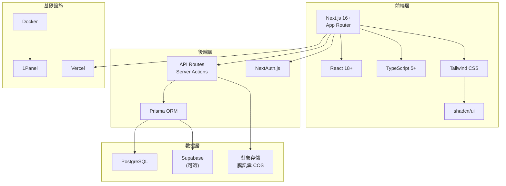

# 2.0 選對工具，事半功倍——技術棧全景

## 爲什麼技術選型如此重要？

在 Vibe Coding 時代，技術選型的核心標準發生了根本性轉變：

**傳統開發**：選擇你最熟悉的技術棧。

**Vibe Coding**：選擇 AI 最擅長的技術棧。

AI 模型的訓練數據決定了它對某些技術棧的理解更深入、代碼生成質量更高。選擇一個 AI 友好的技術棧，意味着：

- AI 生成的代碼更符合最佳實踐
- 遇到問題時 AI 能給出更準確的解決方案
- 社區資源豐富，AI 的"知識庫"更完善

## 本課程技術棧全景



## 版本鎖定策略

### 爲什麼要鎖定版本？

在團隊協作和 AI 輔助開發中，版本不一致是最常見的"玄學問題"來源。明確鎖定版本能夠：

1. **保證可復現性**：今天能跑的代碼，明天也一定能跑
2. **減少 AI 困惑**：AI 知道你用的是哪個版本的 API
3. **降低協作成本**：團隊成員環境一致

### 核心依賴版本

```json
{
  "dependencies": {
    "next": "^14.2.0",
    "react": "^18.3.0",
    "react-dom": "^18.3.0",
    "typescript": "^5.4.0",
    "@prisma/client": "^5.14.0",
    "next-auth": "^4.24.0",
    "tailwindcss": "^3.4.0"
  },
  "devDependencies": {
    "prisma": "^5.14.0",
    "@types/node": "^20.0.0",
    "@types/react": "^18.3.0"
  }
}
```

### 版本號語義：SemVer

理解語義化版本號（Semantic Versioning）是管理依賴的基礎：

```
主版本.次版本.修訂版本
  ^        ^        ^
  |        |        +-- 修復 Bug，向後兼容
  |        +----------- 新功能，向後兼容
  +-------------------- 破壞性更新，可能不兼容
```

**package.json 中的版本範圍**：

| 符號 | 含義 | 示例 |
|------|------|------|
| `^1.2.3` | 允許次版本和修訂版本更新 | 匹配 `1.x.x` |
| `~1.2.3` | 只允許修訂版本更新 | 匹配 `1.2.x` |
| `1.2.3` | 精確鎖定 | 只匹配 `1.2.3` |

::: tip 最佳實踐
對於核心框架（Next.js、React），建議使用 `^` 鎖定主版本；對於可能有兼容性問題的庫，使用 `~` 或精確版本。
:::

## 爲什麼選擇這套技術棧？

### Next.js：全棧框架的最優解

| 特性 | 價值 |
|------|------|
| App Router | 基於文件系統的路由，直觀易懂 |
| RSC | 服務器組件，減少客戶端 JS 體積 |
| Server Actions | 直接在組件中調用服務端邏輯 |
| 內置優化 | 圖片、字體、腳本自動優化 |

### TypeScript：AI 的最佳搭檔

TypeScript 不僅是類型安全的保障，更是與 AI 協作的橋樑：

- **類型即文檔**：AI 通過類型定義理解你的意圖
- **自動補全**：類型系統讓 AI 生成更精準的代碼
- **重構安全**：類型檢查讓 AI 的大規模修改更可靠

### Prisma：類型安全的數據庫操作

```typescript
// Prisma 自動生成的類型，讓 AI 知道你的數據結構
const user = await prisma.user.findUnique({
  where: { id: userId },
  include: { posts: true }  // AI 知道這會返回帶 posts 的 User
})
```

## AI 協作指南

當你需要讓 AI 幫你做技術選型決策時，可以這樣提問：

> **核心意圖**：讓 AI 理解你的項目約束，給出技術建議

**關鍵術語**：`Next.js App Router`、`TypeScript`、`Prisma`、`Server Components`、`Server Actions`

**交互策略**：
1. 先描述項目的核心需求和規模
2. 說明你的部署環境限制
3. 讓 AI 基於本課程技術棧給出具體配置建議

::: warning 避坑提示
不要讓 AI 隨意推薦技術棧。明確告訴它："基於 Next.js 16 App Router + TypeScript + Prisma 技術棧"，避免 AI 推薦過時或不兼容的方案。
:::
