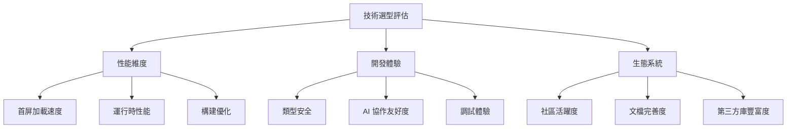
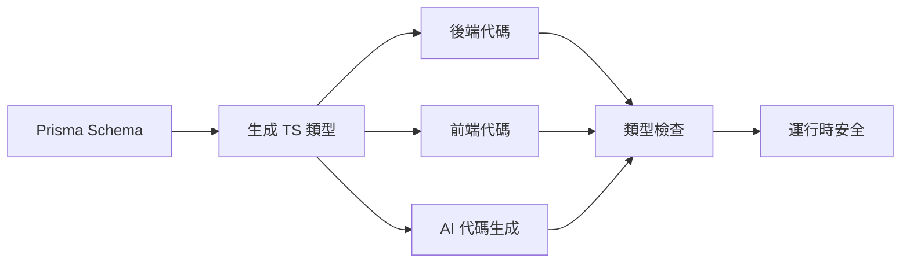

# 2.1.1 選它們圖什麼——技術棧選擇理由

## 認知重構：技術選型的三個維度

傳統的技術選型往往只關注"這個技術能不能實現我的需求"。而在 Vibe Coding 時代，我們需要從三個維度來評估：



## 性能維度：爲什麼選 Next.js

### 首屏性能對比

| 方案 | 首屏時間 | SEO | 服務器壓力 |
|------|----------|-----|------------|
| 純 React SPA | 慢 | 差 | 低 |
| Next.js SSR | 快 | 好 | 中 |
| Next.js SSG | 極快 | 好 | 極低 |
| Next.js RSC | 快 | 好 | 低 |

### Next.js 的性能優勢

1. **自動代碼分割**：每個頁面只加載必需的 JS
2. **圖片優化**：`next/image` 自動壓縮、懶加載、響應式
3. **字體優化**：`next/font` 零布局偏移
4. **預取機制**：`<Link>` 自動預取可見鏈接

```typescript
// Next.js 的圖片優化是開箱即用的
import Image from 'next/image'

export function Avatar({ src, alt }: { src: string; alt: string }) {
  return (
    <Image
      src={src}
      alt={alt}
      width={100}
      height={100}
      // 自動：WebP 格式、響應式 srcset、懶加載
    />
  )
}
```

## 開發體驗：爲什麼選 TypeScript

### 類型安全的價值鏈



### TypeScript 讓 AI 更懂你

```typescript
// 有了類型定義，AI 知道你需要什麼
interface CreatePostInput {
  title: string
  content: string
  authorId: string
  tags?: string[]
}

// AI 生成的代碼會自動匹配這個類型
async function createPost(input: CreatePostInput) {
  // AI 知道 input 有哪些字段，會正確使用
}
```

**沒有類型**時，AI 可能生成：
```javascript
// AI 不知道 data 有什麼字段，容易出錯
function createPost(data) {
  // data.titel ← 拼寫錯誤，運行時才發現
}
```

## 生態系統：爲什麼選這套組合

### 生態成熟度對比

| 技術 | npm 周下載量 | GitHub Stars | 年齡 |
|------|-------------|--------------|------|
| Next.js | 600萬+ | 120k+ | 7年+ |
| Prisma | 200萬+ | 35k+ | 5年+ |
| Tailwind | 800萬+ | 80k+ | 6年+ |

### 爲什麼這些數字很重要？

- **周下載量高** → 問題更容易被發現和修復
- **Stars 多** → 社區支持好，教程資源豐富
- **年齡久** → 經過生產驗證，API 穩定

### 關鍵依賴的選擇標準

::: tip 選擇第三方庫的黃金法則
1. **npm 周下載量 > 10萬**：說明有足夠多人在用
2. **最近一次更新 < 3個月**：說明還在積極維護
3. **有 TypeScript 類型定義**：AI 協作必備
4. **issues 響應及時**：出問題能找到人
:::

## 覺知：Review AI 代碼時的檢查點

當 AI 幫你寫代碼時，需要重點檢查以下幾點：

### 1. 依賴版本

```json
// AI 可能生成過時的版本
{
  "dependencies": {
    "next": "^13.0.0"  // ❌ 應該用 14.x
  }
}
```

### 2. 導入路徑

```typescript
// AI 可能混淆 App Router 和 Pages Router
import { useRouter } from 'next/router'     // ❌ Pages Router
import { useRouter } from 'next/navigation'  // ✅ App Router
```

### 3. 組件類型

```typescript
// AI 可能在服務器組件中使用客戶端 Hook
export default function Page() {
  const [state, setState] = useState()  // ❌ 服務器組件不能用 useState
}
```

## 本節小結

選擇 Next.js + TypeScript + Prisma 的核心理由：

| 維度 | 核心價值 |
|------|----------|
| **性能** | 開箱即用的優化，無需手動配置 |
| **開發體驗** | 類型安全貫穿全棧，AI 協作高效 |
| **生態** | 社區活躍，問題有解，資源豐富 |
