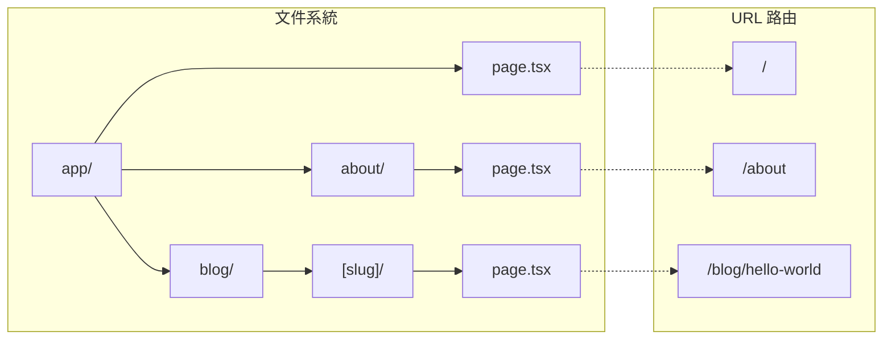
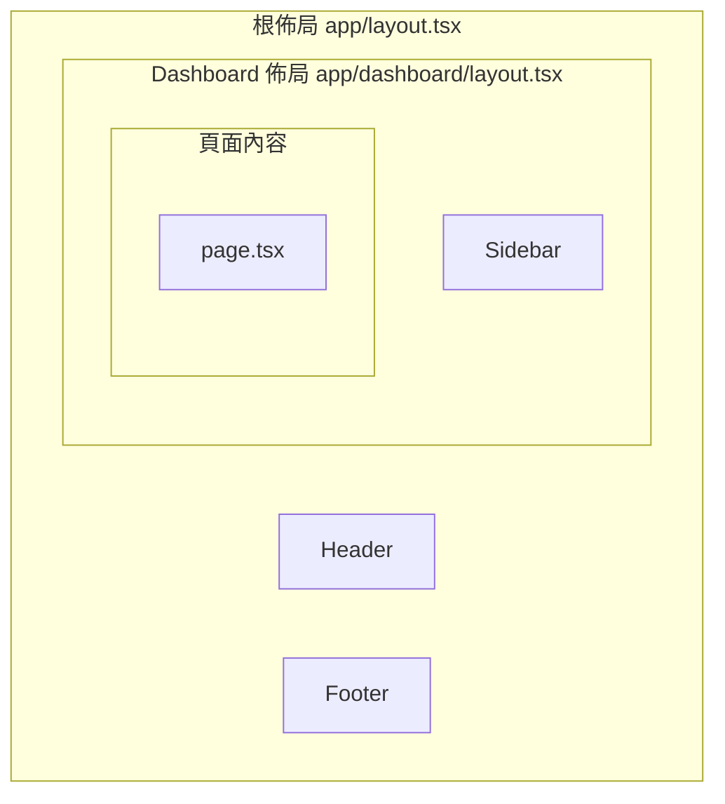

# 2.1.2 文件目錄就是網頁路由——App Router 架構

## 本質還原

App Router 的本質是**文件系統到 URL 的映射**。創建一個文件夾，就是創建一個路由段；在文件夾中放入 `page.tsx`，這個路由就能被訪問。

```
傳統路由：在代碼中配置 URL → 組件的映射
App Router：文件夾結構 = URL 結構
```

## 可視化解構：目錄結構與 URL



## 核心約定文件

App Router 中的每個文件夾可以包含以下約定文件：

| 文件名 | 作用 | 是否必需 |
|--------|------|----------|
| `page.tsx` | 路由的 UI 內容 | 路由可訪問則必需 |
| `layout.tsx` | 共享佈局，子路由複用 | 可選 |
| `loading.tsx` | 加載狀態 UI | 可選 |
| `error.tsx` | 錯誤處理 UI | 可選 |
| `not-found.tsx` | 404 頁面 | 可選 |
| `route.ts` | API 端點 | 與 page.tsx 互斥 |

### 最小目錄結構

```
app/
├── layout.tsx      # 根佈局（必需）
├── page.tsx        # 首頁
├── globals.css     # 全局樣式
└── about/
    └── page.tsx    # /about 頁面
```

## 嵌套佈局：最強大的特性

佈局是 App Router 最強大的特性之一。它允許你在不同層級共享 UI，且**切換路由時佈局不會重新渲染**。



### 佈局代碼示例

```typescript
// app/layout.tsx - 根佈局
export default function RootLayout({
  children,
}: {
  children: React.ReactNode
}) {
  return (
    <html lang="zh">
      <body>
        <Header />
        {children}  {/* 子路由內容插入這裏 */}
        <Footer />
      </body>
    </html>
  )
}

// app/dashboard/layout.tsx - Dashboard 佈局
export default function DashboardLayout({
  children,
}: {
  children: React.ReactNode
}) {
  return (
    <div className="flex">
      <Sidebar />
      <main className="flex-1">{children}</main>
    </div>
  )
}
```

## 動態路由

使用方括號 `[]` 創建動態路由段：

| 語法 | 示例文件 | 匹配 URL |
|------|----------|----------|
| `[slug]` | `blog/[slug]/page.tsx` | `/blog/hello` |
| `[...slug]` | `docs/[...slug]/page.tsx` | `/docs/a/b/c` |
| `[[...slug]]` | `shop/[[...slug]]/page.tsx` | `/shop` 或 `/shop/a/b` |

```typescript
// app/blog/[slug]/page.tsx
export default function BlogPost({
  params,
}: {
  params: { slug: string }
}) {
  return <h1>文章: {params.slug}</h1>
}
```

## 路由組：組織而不影響 URL

使用圓括號 `()` 創建路由組，用於組織代碼但不影響 URL：

```
app/
├── (marketing)/        # 不會出現在 URL 中
│   ├── layout.tsx      # marketing 頁面共享的佈局
│   ├── about/
│   │   └── page.tsx    # URL: /about
│   └── contact/
│       └── page.tsx    # URL: /contact
└── (shop)/             # 不會出現在 URL 中
    ├── layout.tsx      # shop 頁面共享的佈局
    └── products/
        └── page.tsx    # URL: /products
```

## 覺知：Review AI 代碼時的檢查點

### 1. page.tsx 位置正確嗎？

```
app/
├── dashboard/
│   └── settings/
│       └── page.tsx    # ✅ /dashboard/settings
│
├── dashboard/
│   └── settings.tsx    # ❌ 這不是頁面，是普通組件
```

### 2. layout.tsx 用對了嗎？

```typescript
// ❌ 錯誤：layout 不應該有狀態
export default function Layout({ children }) {
  const [user, setUser] = useState()  // 不要這樣做
  return <div>{children}</div>
}

// ✅ 正確：狀態應該在 Client Component 中
export default function Layout({ children }) {
  return (
    <div>
      <UserProvider>  {/* 用 Context Provider */}
        {children}
      </UserProvider>
    </div>
  )
}
```

### 3. 動態路由參數類型正確嗎？

```typescript
// AI 可能忘記給 params 加類型
export default function Page({ params }) {  // ❌ 缺少類型
  // ...
}

export default function Page({ 
  params 
}: { 
  params: { slug: string }  // ✅ 明確類型
}) {
  // ...
}
```

## 本節小結

App Router 的核心理念：**約定優於配置**。

| 概念 | 作用 |
|------|------|
| **文件系統路由** | 文件夾結構 = URL 結構 |
| **嵌套佈局** | UI 複用，切換不重渲染 |
| **約定文件** | page/layout/loading/error |
| **動態路由** | `[param]` 語法 |
| **路由組** | `(group)` 組織代碼 |
