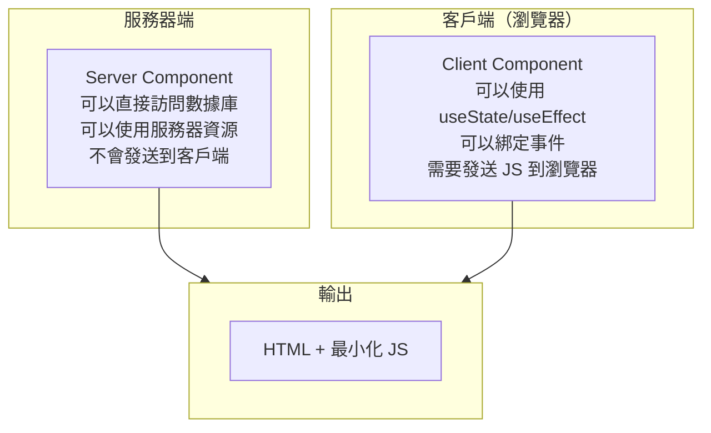
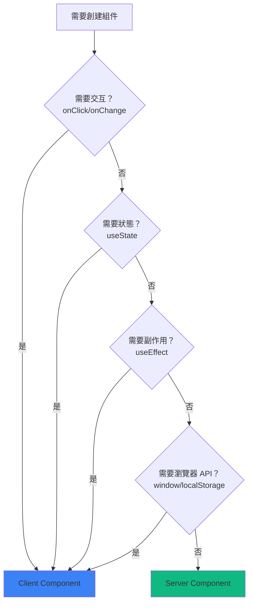
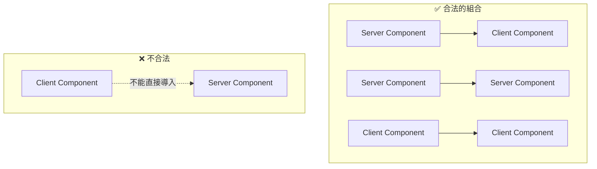

# 2.1.3 前後端代碼寫一起？——RSC 渲染策略

## 認知重構

傳統的 React 應用中，所有組件都在瀏覽器中運行。而 React Server Components（RSC）打破了這個邊界：

```
傳統 React：所有組件 → 打包 → 發送到瀏覽器 → 瀏覽器執行
RSC：服務器組件在服務器執行 → 只發送渲染結果 → 客戶端組件在瀏覽器執行
```

## 本質還原



## 服務器組件 vs 客戶端組件

| 特性 | Server Component | Client Component |
|------|------------------|------------------|
| **運行環境** | 服務器 | 瀏覽器 |
| **訪問數據庫** | ✅ 可以 | ❌ 不能 |
| **使用 Hooks** | ❌ 不能用 useState/useEffect | ✅ 可以 |
| **事件處理** | ❌ 不能 onClick | ✅ 可以 |
| **打包大小** | 不計入 | 計入 JS Bundle |
| **默認行爲** | App Router 默認 | 需要 `'use client'` |

## 何時使用哪種組件？



### 簡單口訣

- **需要點擊、輸入、動畫** → Client Component
- **只是展示數據** → Server Component
- **拿不準** → 先寫成 Server Component，需要交互再改

## 代碼示例

### Server Component（默認）

```typescript
// app/posts/page.tsx
// 默認就是 Server Component，不需要任何聲明

import { prisma } from '@/lib/prisma'

export default async function PostsPage() {
  // ✅ 可以直接訪問數據庫
  const posts = await prisma.post.findMany()
  
  return (
    <ul>
      {posts.map(post => (
        <li key={post.id}>{post.title}</li>
      ))}
    </ul>
  )
}
```

### Client Component

```typescript
// components/like-button.tsx
'use client'  // ← 必須在文件頂部聲明

import { useState } from 'react'

export function LikeButton({ postId }: { postId: string }) {
  // ✅ 可以使用 useState
  const [liked, setLiked] = useState(false)
  
  // ✅ 可以綁定事件
  return (
    <button onClick={() => setLiked(!liked)}>
      {liked ? '❤️' : '🤍'}
    </button>
  )
}
```

### 混合使用

```typescript
// app/posts/[id]/page.tsx - Server Component
import { prisma } from '@/lib/prisma'
import { LikeButton } from '@/components/like-button'

export default async function PostPage({ 
  params 
}: { 
  params: { id: string } 
}) {
  // 服務器端獲取數據
  const post = await prisma.post.findUnique({
    where: { id: params.id }
  })
  
  return (
    <article>
      <h1>{post.title}</h1>
      <p>{post.content}</p>
      {/* 客戶端組件嵌入服務器組件 */}
      <LikeButton postId={post.id} />
    </article>
  )
}
```

## 組件邊界規則



### 關鍵規則

1. **Server → Client**：✅ 服務器組件可以導入客戶端組件
2. **Server → Server**：✅ 服務器組件可以導入服務器組件
3. **Client → Client**：✅ 客戶端組件可以導入客戶端組件
4. **Client → Server**：❌ 客戶端組件不能直接導入服務器組件

### 如果客戶端組件需要包含服務器組件？

使用 `children` 模式：

```typescript
// ✅ 正確做法
// client-wrapper.tsx
'use client'
export function ClientWrapper({ children }: { children: React.ReactNode }) {
  return <div onClick={() => {}}>{children}</div>
}

// page.tsx (Server Component)
import { ClientWrapper } from './client-wrapper'
import { ServerComponent } from './server-component'

export default function Page() {
  return (
    <ClientWrapper>
      <ServerComponent />  {/* 通過 children 傳入 */}
    </ClientWrapper>
  )
}
```

## 覺知：Review AI 代碼時的檢查點

### 1. `'use client'` 位置

```typescript
// ❌ 錯誤：不在文件頂部
import { useState } from 'react'
'use client'  // 這樣無效

// ✅ 正確：必須在最頂部
'use client'
import { useState } from 'react'
```

### 2. 服務器組件中使用了客戶端 API

```typescript
// ❌ AI 可能生成這樣的代碼
export default function Page() {
  const [data, setData] = useState()  // 服務器組件不能用 useState
  
  useEffect(() => {  // 服務器組件不能用 useEffect
    // ...
  }, [])
}
```

### 3. 數據獲取位置

```typescript
// ❌ 在客戶端組件中獲取（不必要的）
'use client'
export function PostList() {
  const [posts, setPosts] = useState([])
  useEffect(() => {
    fetch('/api/posts').then(...)  // 多一次網絡請求
  }, [])
}

// ✅ 在服務器組件中直接獲取
export default async function PostList() {
  const posts = await prisma.post.findMany()  // 直接訪問數據庫
  return <ul>...</ul>
}
```

## 本節小結

RSC 的核心價值：**在正確的地方運行正確的代碼**。

| 場景 | 選擇 | 原因 |
|------|------|------|
| 數據展示 | Server Component | 減少 JS Bundle，直接訪問數據 |
| 表單交互 | Client Component | 需要狀態和事件 |
| 靜態 UI | Server Component | 零客戶端 JS |
| 動畫效果 | Client Component | 需要瀏覽器 API |
