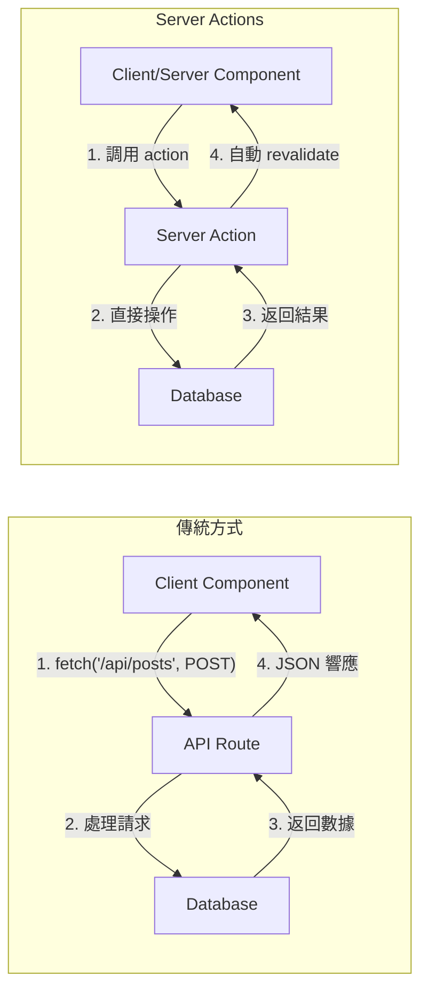
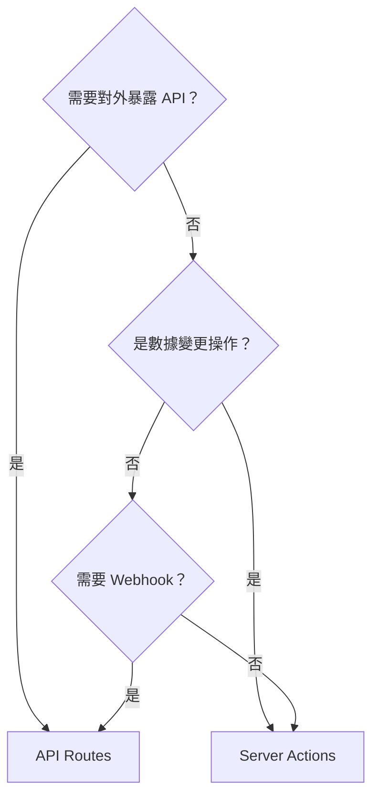

# 2.1.4 在前端直接調後端——Server Actions

## 認知重構

傳統的數據變更流程：
```
用戶點擊 → 前端發 fetch 請求 → 後端 API 處理 → 返回結果 → 前端更新 UI
```

Server Actions 的流程：
```
用戶點擊 → 直接調用服務器函數 → 服務器處理 → 自動更新 UI
```

**本質**：Server Actions 是在組件中直接調用的服務器端函數，無需手動創建 API 端點。

## 可視化解構



## 定義 Server Action

### 方式一：內聯定義（服務器組件中）

```typescript
// app/posts/page.tsx - Server Component
export default function PostsPage() {
  async function createPost(formData: FormData) {
    'use server'  // ← 標記爲 Server Action
    
    const title = formData.get('title') as string
    await prisma.post.create({ data: { title } })
    revalidatePath('/posts')  // 刷新頁面數據
  }
  
  return (
    <form action={createPost}>
      <input name="title" />
      <button type="submit">創建</button>
    </form>
  )
}
```

### 方式二：獨立文件（推薦）

```typescript
// app/actions/posts.ts
'use server'  // ← 文件頂部聲明，整個文件都是 Server Actions

import { prisma } from '@/lib/prisma'
import { revalidatePath } from 'next/cache'

export async function createPost(formData: FormData) {
  const title = formData.get('title') as string
  
  await prisma.post.create({
    data: { title }
  })
  
  revalidatePath('/posts')
}

export async function deletePost(id: string) {
  await prisma.post.delete({ where: { id } })
  revalidatePath('/posts')
}
```

## 在組件中使用

### 在 Server Component 中（form action）

```typescript
// app/posts/new/page.tsx
import { createPost } from '@/app/actions/posts'

export default function NewPostPage() {
  return (
    <form action={createPost}>
      <input name="title" placeholder="標題" />
      <textarea name="content" placeholder="內容" />
      <button type="submit">發佈</button>
    </form>
  )
}
```

### 在 Client Component 中

```typescript
// components/delete-button.tsx
'use client'

import { deletePost } from '@/app/actions/posts'
import { useTransition } from 'react'

export function DeleteButton({ postId }: { postId: string }) {
  const [isPending, startTransition] = useTransition()
  
  return (
    <button
      disabled={isPending}
      onClick={() => {
        startTransition(() => {
          deletePost(postId)
        })
      }}
    >
      {isPending ? '刪除中...' : '刪除'}
    </button>
  )
}
```

## Server Actions vs API Routes

| 特性 | Server Actions | API Routes |
|------|----------------|------------|
| **適用場景** | 數據變更（CRUD） | 對外 API、Webhook |
| **調用方式** | 直接函數調用 | HTTP 請求 |
| **類型安全** | ✅ 自動推斷 | 需手動定義 |
| **複用性** | 應用內部 | 可對外暴露 |
| **漸進增強** | ✅ 無 JS 也能工作 | 需要 JS |

### 何時用 Server Actions？



## 錯誤處理

```typescript
// app/actions/posts.ts
'use server'

import { z } from 'zod'

const PostSchema = z.object({
  title: z.string().min(1, '標題不能爲空'),
  content: z.string().min(10, '內容至少 10 個字符')
})

export async function createPost(formData: FormData) {
  // 1. 驗證輸入
  const validatedFields = PostSchema.safeParse({
    title: formData.get('title'),
    content: formData.get('content')
  })
  
  if (!validatedFields.success) {
    return {
      errors: validatedFields.error.flatten().fieldErrors
    }
  }
  
  // 2. 執行操作
  try {
    await prisma.post.create({
      data: validatedFields.data
    })
  } catch (error) {
    return { errors: { _form: ['創建失敗，請重試'] } }
  }
  
  // 3. 刷新緩存並重定向
  revalidatePath('/posts')
  redirect('/posts')
}
```

## 覺知：Review AI 代碼時的檢查點

### 1. `'use server'` 位置

```typescript
// ❌ 錯誤：放在函數外部但不在文件頂部
export async function myAction() {
  'use server'  // 如果不是文件頂部，必須在函數體內
}

// ✅ 正確：文件頂部
'use server'
export async function myAction() {}

// ✅ 正確：函數體內
export async function myAction() {
  'use server'
  // ...
}
```

### 2. 參數序列化問題

```typescript
// ❌ Server Actions 的參數必須可序列化
async function badAction(callback: () => void) {
  'use server'
  callback()  // 函數不能作爲參數傳遞
}

// ✅ 只傳遞可序列化的數據
async function goodAction(id: string, data: { name: string }) {
  'use server'
  // ...
}
```

### 3. 忘記 revalidate

```typescript
// ❌ 數據變更後沒有刷新緩存
async function createPost(formData: FormData) {
  'use server'
  await prisma.post.create({ ... })
  // 忘記 revalidatePath，頁面數據不會更新
}

// ✅ 記得刷新相關路徑的緩存
async function createPost(formData: FormData) {
  'use server'
  await prisma.post.create({ ... })
  revalidatePath('/posts')
}
```

## 本節小結

Server Actions 的核心價值：**消除前後端的邊界，讓數據變更像調用函數一樣簡單**。

| 場景 | 推薦方案 |
|------|----------|
| 表單提交 | Server Actions + form action |
| 按鈕操作 | Server Actions + useTransition |
| 對外 API | API Routes |
| 第三方集成 | API Routes |
