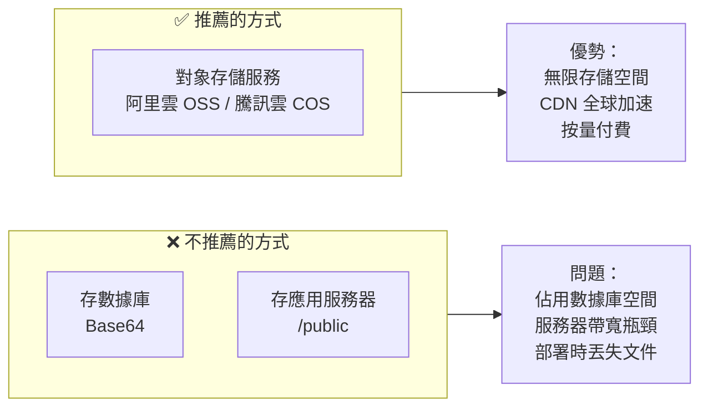
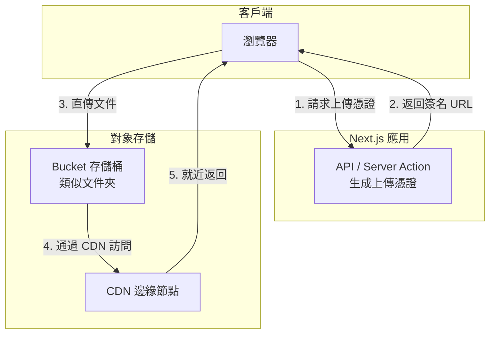
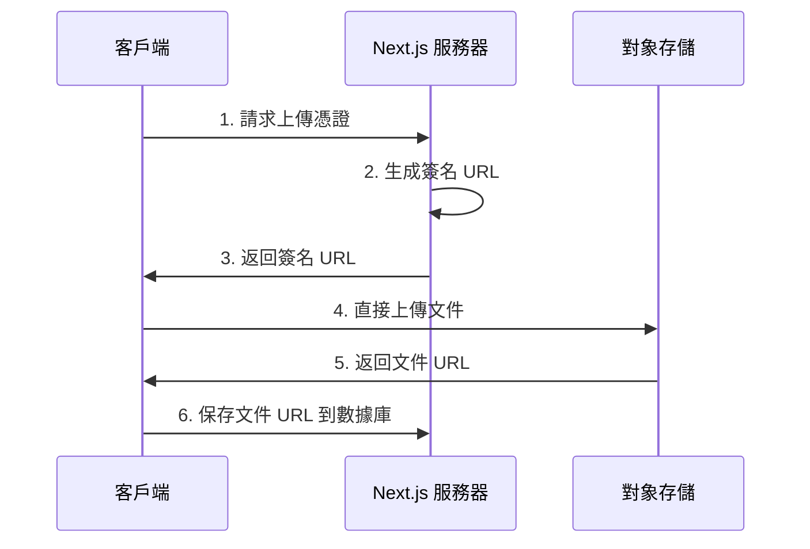

# 2.1.5 圖片和文件放哪裏最快——OSS 對象存儲

## 一句話破題

圖片、視頻等靜態文件不應該存在數據庫裏，也不應該存在應用服務器上。對象存儲服務是專門爲此設計的——便宜、快速、可擴展。

## 爲什麼需要對象存儲？



| 存儲方式 | 成本 | 性能 | 可擴展性 | 推薦度 |
|----------|------|------|----------|--------|
| 數據庫 | 極高 | 差 | 差 | ❌ |
| 應用服務器 | 中 | 中 | 差 | ❌ |
| 對象存儲 | 低 | 極好 | 無限 | ✅ |

## 核心概念

### 對象存儲的基本架構



### 關鍵術語

| 術語 | 說明 |
|------|------|
| **Bucket** | 存儲桶，相當於頂級文件夾 |
| **Object** | 對象，即存儲的文件 |
| **Key** | 對象的唯一標識，相當於文件路徑 |
| **簽名 URL** | 帶有時效性的安全訪問鏈接 |
| **CDN** | 內容分發網絡，就近訪問 |

## 文件上傳流程

### 前端直傳（推薦）



**優勢**：
- 文件不經過應用服務器，節省帶寬
- 上傳速度更快
- 服務器壓力小

### 代碼示例

```typescript
// app/api/upload/route.ts
import { NextResponse } from 'next/server'
import COS from 'cos-nodejs-sdk-v5'

const cos = new COS({
  SecretId: process.env.COS_SECRET_ID!,
  SecretKey: process.env.COS_SECRET_KEY!,
})

export async function POST(request: Request) {
  const { filename, contentType } = await request.json()
  
  // 生成唯一的文件路徑
  const key = `uploads/${Date.now()}-${filename}`
  
  // 生成預簽名 URL
  const signedUrl = cos.getObjectUrl({
    Bucket: process.env.COS_BUCKET!,
    Region: process.env.COS_REGION!,
    Key: key,
    Method: 'PUT',
    Sign: true,
    Expires: 3600,  // 1小時有效
  })
  
  return NextResponse.json({
    uploadUrl: signedUrl,
    fileUrl: `https://${process.env.COS_BUCKET}.cos.${process.env.COS_REGION}.myqcloud.com/${key}`
  })
}
```

```typescript
// components/file-upload.tsx
'use client'

export function FileUpload() {
  async function handleUpload(file: File) {
    // 1. 獲取上傳憑證
    const res = await fetch('/api/upload', {
      method: 'POST',
      body: JSON.stringify({
        filename: file.name,
        contentType: file.type
      })
    })
    const { uploadUrl, fileUrl } = await res.json()
    
    // 2. 直接上傳到 OSS
    await fetch(uploadUrl, {
      method: 'PUT',
      body: file,
      headers: { 'Content-Type': file.type }
    })
    
    // 3. 返回文件 URL
    return fileUrl
  }
  
  return (
    <input 
      type="file" 
      onChange={(e) => {
        const file = e.target.files?.[0]
        if (file) handleUpload(file)
      }}
    />
  )
}
```

## 圖片優化策略

### 結合 Next.js Image 組件

```typescript
// next.config.js
module.exports = {
  images: {
    remotePatterns: [
      {
        protocol: 'https',
        hostname: '*.cos.ap-shanghai.myqcloud.com',
      },
    ],
  },
}

// 使用
import Image from 'next/image'

export function Avatar({ url }: { url: string }) {
  return (
    <Image
      src={url}  // OSS URL
      alt="頭像"
      width={100}
      height={100}
      // Next.js 會自動優化：WebP 格式、響應式、懶加載
    />
  )
}
```

### OSS 圖片處理

大多數 OSS 服務都支持 URL 參數進行圖片處理：

```typescript
// 原圖
const url = 'https://bucket.cos.region.myqcloud.com/image.jpg'

// 縮略圖（寬度 200px）
const thumbnail = `${url}?imageMogr2/thumbnail/200x`

// 裁剪爲正方形
const square = `${url}?imageMogr2/crop/200x200/gravity/center`

// 轉換格式
const webp = `${url}?imageMogr2/format/webp`
```

## 安全考慮

### 1. 不要暴露密鑰

```typescript
// ❌ 危險：前端直接使用密鑰
const cos = new COS({
  SecretId: 'AKID...',  // 絕對不要這樣做
  SecretKey: 'xxx...',
})

// ✅ 安全：服務端生成臨時憑證
// 前端只拿到有時效的簽名 URL
```

### 2. 限制上傳類型和大小

```typescript
// app/api/upload/route.ts
export async function POST(request: Request) {
  const { filename, contentType, size } = await request.json()
  
  // 驗證文件類型
  const allowedTypes = ['image/jpeg', 'image/png', 'image/webp']
  if (!allowedTypes.includes(contentType)) {
    return NextResponse.json(
      { error: '不支持的文件類型' },
      { status: 400 }
    )
  }
  
  // 驗證文件大小（10MB）
  if (size > 10 * 1024 * 1024) {
    return NextResponse.json(
      { error: '文件太大' },
      { status: 400 }
    )
  }
  
  // ... 生成簽名 URL
}
```

### 3. 使用私有讀寫

```
Bucket 權限設置：
- 公有讀：任何人可訪問，適合公開資源
- 私有讀寫：需要簽名才能訪問，適合敏感文件
```

## 常見 OSS 服務商

| 服務商 | 產品名 | 特點 |
|--------|--------|------|
| 騰訊雲 | COS | 國內訪問快，與微信生態集成好 |
| 阿里雲 | OSS | 功能最全，生態最完善 |
| AWS | S3 | 國際標準，海外訪問好 |
| Cloudflare | R2 | 免出站流量費，性價比高 |

## 本節小結

對象存儲的核心價值：**專業的事交給專業的服務**。

| 場景 | 方案 |
|------|------|
| 用戶上傳圖片 | 前端直傳 OSS |
| 靜態資源 | OSS + CDN |
| 敏感文件 | 私有 Bucket + 簽名 URL |
| 圖片處理 | OSS 內置處理 / Next.js Image |
