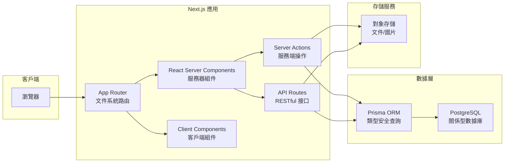

# 2.1 爲什麼我們選這套裝備——架構全景

## 一句話破題

Next.js + TypeScript + Prisma + OSS 是 2024-2025 年全棧開發的"黃金組合"——它們不是最新潮的，但卻是 AI 最擅長、生態最完善、生產驗證最充分的技術棧。

## 架構全景圖

## 各層職責速覽

| 層級 | 技術 | 核心職責 |
|------|------|----------|
| **路由層** | App Router | URL 映射、佈局嵌套、加載狀態 |
| **視圖層** | RSC + Client Components | UI 渲染、交互處理 |
| **操作層** | Server Actions | 表單處理、數據變更 |
| **接口層** | API Routes | 對外 API、第三方集成 |
| **數據層** | Prisma + PostgreSQL | 數據持久化、事務處理 |
| **存儲層** | OSS | 文件存儲、CDN 分發 |

## 爲什麼是這套組合？

### 1. AI 友好度最高

這套技術棧在 AI 訓練數據中佔比極高，意味着：

- AI 生成的代碼更符合最佳實踐
- 遇到問題時能得到更準確的解決方案
- 代碼審查時 AI 能發現更多潛在問題

### 2. 開發體驗統一

傳統全棧開發需要在前後端之間頻繁切換上下文。而這套技術棧：

- **一種語言**：全棧 TypeScript
- **一個項目**：前後端代碼共存
- **一套類型**：Prisma 生成的類型前後端共享

### 3. 生產驗證充分

| 技術 | 使用者 |
|------|--------|
| Next.js | Vercel、Netflix、TikTok、Notion |
| Prisma | Hashicorp、Miro、Mercedes-Benz |
| PostgreSQL | Instagram、Spotify、Reddit |

## 本節小結

選擇技術棧的核心原則：**不選最新的，選最穩的；不選最酷的，選 AI 最懂的。**

接下來我們將深入探討這套架構的每個核心組件：

- 2.1.1 技術棧選擇理由
- 2.1.2 App Router 架構
- 2.1.3 RSC 渲染策略
- 2.1.4 Server Actions
- 2.1.5 OSS 對象存儲
