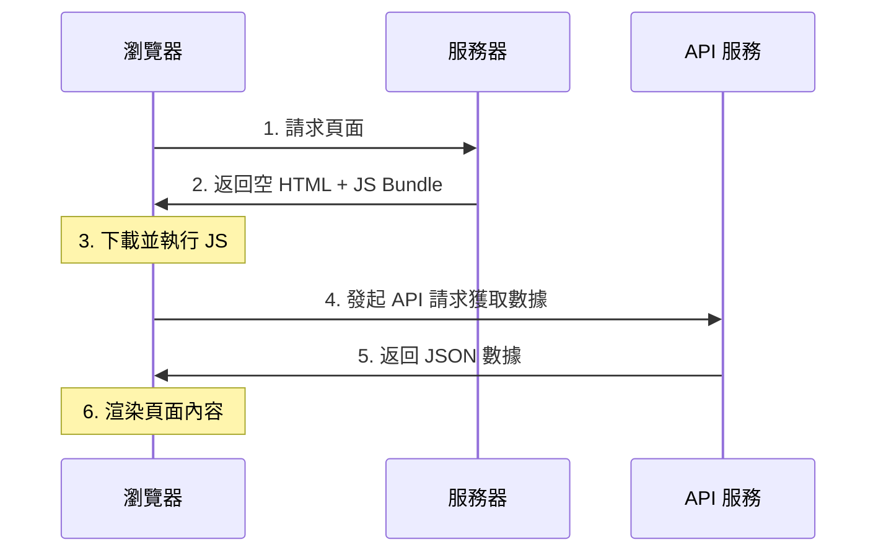

# 2.2.1 用戶瀏覽器自己渲染——CSR 客戶端渲染

## 一句話破題

CSR 是將渲染工作交給用戶瀏覽器完成——服務器只返回一個空殼 HTML 和一堆 JavaScript，真正的頁面內容由 JS 在瀏覽器中動態生成。

## 工作原理



### 服務器返回的 HTML

```html
<!DOCTYPE html>
<html>
<head>
  <title>My App</title>
</head>
<body>
  <div id="root"></div>  <!-- 空的容器 -->
  <script src="/bundle.js"></script>  <!-- JS 負責填充內容 -->
</body>
</html>
```

## CSR 的優缺點

| 優點 | 缺點 |
|------|------|
| 服務器壓力小 | 首屏加載慢 |
| 頁面切換流暢（SPA） | SEO 極差 |
| 前後端完全分離 | 依賴 JavaScript |
| 交互體驗好 | 首次內容繪製延遲 |

## 適用場景

### ✅ 適合 CSR 的場景

- **後臺管理系統**：不需要 SEO，用戶會停留較長時間
- **Dashboard**：數據即時性要求高，需要頻繁更新
- **SaaS 應用**：登錄後的功能區，SEO 無意義
- **內部工具**：公司內網應用

### ❌ 不適合 CSR 的場景

- **營銷落地頁**：首屏速度直接影響轉化率
- **博客/文檔**：SEO 是核心需求
- **電商商品頁**：需要被搜索引擎收錄

## 在 Next.js 中實現 CSR

### 方式一：使用 `'use client'` + useEffect

```typescript
// components/user-dashboard.tsx
'use client'

import { useState, useEffect } from 'react'

export function UserDashboard() {
  const [data, setData] = useState(null)
  const [loading, setLoading] = useState(true)
  
  useEffect(() => {
    fetch('/api/dashboard')
      .then(res => res.json())
      .then(data => {
        setData(data)
        setLoading(false)
      })
  }, [])
  
  if (loading) return <div>加載中...</div>
  
  return (
    <div>
      <h1>歡迎，{data.userName}</h1>
      {/* 其他內容 */}
    </div>
  )
}
```

### 方式二：使用 SWR / React Query

```typescript
// components/user-dashboard.tsx
'use client'

import useSWR from 'swr'

const fetcher = (url: string) => fetch(url).then(res => res.json())

export function UserDashboard() {
  const { data, error, isLoading } = useSWR('/api/dashboard', fetcher)
  
  if (isLoading) return <div>加載中...</div>
  if (error) return <div>加載失敗</div>
  
  return (
    <div>
      <h1>歡迎，{data.userName}</h1>
    </div>
  )
}
```

## 性能優化策略

### 1. 代碼分割

```typescript
// 動態導入，按需加載
import dynamic from 'next/dynamic'

const HeavyComponent = dynamic(() => import('./heavy-component'), {
  loading: () => <p>加載中...</p>,
  ssr: false  // 禁用服務器端渲染
})
```

### 2. 骨架屏

```typescript
function DashboardSkeleton() {
  return (
    <div className="animate-pulse">
      <div className="h-8 bg-gray-200 rounded w-1/4 mb-4" />
      <div className="h-4 bg-gray-200 rounded w-full mb-2" />
      <div className="h-4 bg-gray-200 rounded w-3/4" />
    </div>
  )
}
```

### 3. 數據預取

```typescript
// 在用戶可能訪問前，提前獲取數據
function Navigation() {
  const prefetchDashboard = () => {
    // 鼠標懸停時預取
    fetch('/api/dashboard')
  }
  
  return (
    <Link 
      href="/dashboard"
      onMouseEnter={prefetchDashboard}
    >
      Dashboard
    </Link>
  )
}
```

## 覺知：CSR 的常見陷阱

### 1. 閃爍問題

```typescript
// ❌ 會導致閃爍：服務端渲染空內容，客戶端再填充
export default function Page() {
  const [data, setData] = useState(null)
  // ...
  return data ? <Content /> : null
}

// ✅ 提供加載狀態
export default function Page() {
  const [data, setData] = useState(null)
  const [loading, setLoading] = useState(true)
  // ...
  return loading ? <Skeleton /> : <Content />
}
```

### 2. Hydration 錯誤

```typescript
// ❌ 服務端和客戶端渲染結果不一致
export default function Page() {
  return <div>{new Date().toLocaleString()}</div>  // 時間會不同
}

// ✅ 只在客戶端渲染時間
'use client'
export default function Page() {
  const [time, setTime] = useState<string>()
  useEffect(() => {
    setTime(new Date().toLocaleString())
  }, [])
  return <div>{time}</div>
}
```

## 本節小結

CSR 的核心特點：**犧牲首屏速度和 SEO，換取交互體驗和服務器減壓**。

| 場景 | 是否適合 CSR |
|------|-------------|
| 後臺管理 | ✅ 最佳選擇 |
| SaaS 應用 | ✅ 適合 |
| 營銷頁面 | ❌ 不適合 |
| 博客內容 | ❌ 不適合 |
