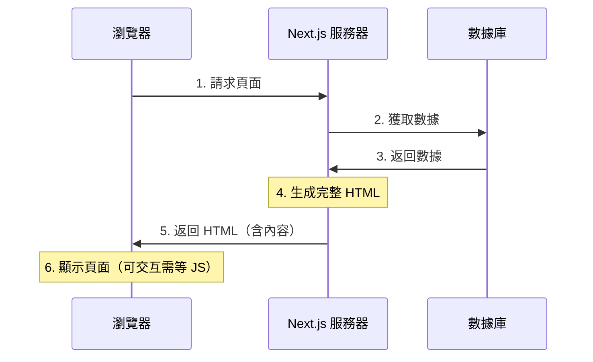

# 2.2.2 服務器渲染好再發——SSR 服務器端渲染

## 一句話破題

SSR 是在每次用戶請求時，服務器即時獲取數據、生成完整的 HTML，再發送給瀏覽器——用戶看到的第一眼就是完整內容。

## 工作原理



## SSR 的優缺點

| 優點 | 缺點 |
|------|------|
| SEO 友好 | 服務器壓力大 |
| 首屏內容快 | 每次請求都要渲染 |
| 數據即時 | TTFB 較慢 |
| 社交分享友好 | 無法利用 CDN 緩存 |

## 在 Next.js 中實現 SSR

### 方式一：使用動態函數（自動 SSR）

```typescript
// app/search/page.tsx
// 使用了 searchParams，自動變爲 SSR
export default async function SearchPage({
  searchParams,
}: {
  searchParams: { q?: string }
}) {
  const results = await searchProducts(searchParams.q)
  
  return (
    <div>
      <h1>搜索：{searchParams.q}</h1>
      <ProductList products={results} />
    </div>
  )
}
```

### 方式二：顯式聲明動態渲染

```typescript
// app/dashboard/page.tsx
export const dynamic = 'force-dynamic'  // 強制 SSR

export default async function DashboardPage() {
  const stats = await getRealtimeStats()
  
  return <Dashboard stats={stats} />
}
```

### 觸發 SSR 的條件

Next.js 會在以下情況自動使用 SSR：

| 使用的 API | 說明 |
|------------|------|
| `cookies()` | 讀取 Cookie |
| `headers()` | 讀取請求頭 |
| `searchParams` | URL 查詢參數 |
| `fetch` 無緩存 | `cache: 'no-store'` |

```typescript
import { cookies, headers } from 'next/headers'

export default async function Page() {
  const cookieStore = cookies()  // 觸發 SSR
  const headersList = headers()  // 觸發 SSR
  
  // 或者
  const data = await fetch('...', { 
    cache: 'no-store'  // 觸發 SSR
  })
}
```

## 適用場景

### ✅ 適合 SSR 的場景

- **搜索結果頁**：內容由用戶輸入決定
- **用戶個人主頁**：需要 SEO，數據因用戶而異
- **即時數據頁**：股票、天氣等需要最新數據
- **需要認證的頁面**：根據用戶身份顯示不同內容

### ❌ 不適合 SSR 的場景

- **靜態內容**：用 SSG 更高效
- **極高併發**：服務器扛不住
- **內容變化不頻繁**：用 ISR 更好

## 性能優化

### 1. 流式渲染

```typescript
// app/posts/page.tsx
import { Suspense } from 'react'

export default function PostsPage() {
  return (
    <div>
      <h1>文章列表</h1>
      <Suspense fallback={<PostsSkeleton />}>
        <PostsList />  {/* 異步組件，流式傳輸 */}
      </Suspense>
    </div>
  )
}

async function PostsList() {
  const posts = await getPosts()  // 慢查詢
  return <ul>{posts.map(...)}</ul>
}
```

### 2. 並行數據獲取

```typescript
// ❌ 串行獲取（慢）
const user = await getUser()
const posts = await getPosts()

// ✅ 並行獲取（快）
const [user, posts] = await Promise.all([
  getUser(),
  getPosts()
])
```

## 覺知：SSR 常見問題

### 1. 無限重渲染

```typescript
// ❌ 每次渲染都不同，導致緩存失效
export default async function Page() {
  const data = await fetch('...', {
    headers: { 'x-timestamp': Date.now().toString() }  // 每次不同
  })
}

// ✅ 使用穩定的請求參數
export default async function Page() {
  const data = await fetch('...', {
    next: { revalidate: 60 }  // 60 秒緩存
  })
}
```

### 2. 忘記處理錯誤

```typescript
// ✅ 添加錯誤邊界
// app/search/error.tsx
'use client'

export default function Error({
  error,
  reset,
}: {
  error: Error
  reset: () => void
}) {
  return (
    <div>
      <h2>搜索出錯了</h2>
      <button onClick={reset}>重試</button>
    </div>
  )
}
```

## 本節小結

SSR 的核心價值：**即時數據 + SEO 友好**。

| 場景 | 是否適合 SSR |
|------|-------------|
| 搜索頁 | ✅ 最佳選擇 |
| 用戶主頁 | ✅ 適合 |
| 文檔頁 | ❌ 用 SSG |
| Dashboard | ⚠️ 看情況 |
