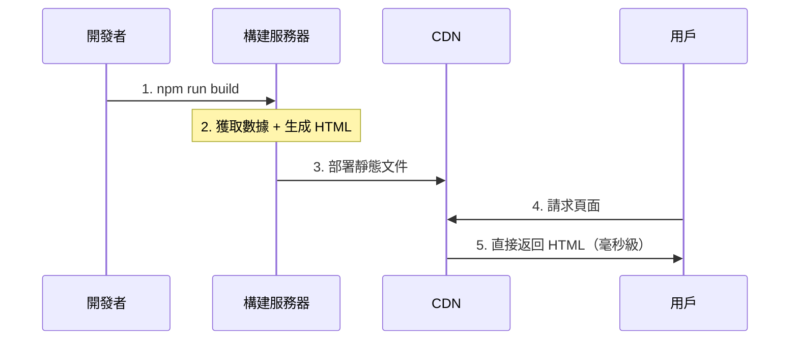

# 2.2.3 提前渲染好所有頁面——SSG 靜態站點生成

## 一句話破題

SSG 是在構建階段（`npm run build`）就把所有頁面渲染成靜態 HTML 文件，部署後直接從 CDN 返回——速度極快，服務器零壓力。

## 工作原理



## SSG 的優缺點

| 優點 | 缺點 |
|------|------|
| 極快（CDN 直返） | 構建時間長 |
| 服務器零壓力 | 內容更新需重新部署 |
| SEO 友好 | 不適合動態內容 |
| 高可用性 | 頁面多則構建慢 |

## 在 Next.js 中實現 SSG

### 基礎用法（默認行爲）

```typescript
// app/about/page.tsx
// 沒有動態數據，默認就是 SSG
export default function AboutPage() {
  return <h1>關於我們</h1>
}
```

### 帶數據的 SSG

```typescript
// app/posts/page.tsx
async function getPosts() {
  const res = await fetch('https://api.example.com/posts', {
    next: { revalidate: false }  // 構建時獲取，不再更新
  })
  return res.json()
}

export default async function PostsPage() {
  const posts = await getPosts()
  
  return (
    <ul>
      {posts.map(post => (
        <li key={post.id}>{post.title}</li>
      ))}
    </ul>
  )
}
```

### 動態路由的 SSG

```typescript
// app/blog/[slug]/page.tsx

// 告訴 Next.js 需要預渲染哪些頁面
export async function generateStaticParams() {
  const posts = await getPosts()
  
  return posts.map(post => ({
    slug: post.slug
  }))
}

export default async function BlogPost({
  params
}: {
  params: { slug: string }
}) {
  const post = await getPost(params.slug)
  
  return (
    <article>
      <h1>{post.title}</h1>
      <div>{post.content}</div>
    </article>
  )
}
```

## 適用場景

### ✅ 適合 SSG 的場景

- **博客文章**：內容創建後很少變化
- **文檔站點**：如本教程
- **營銷落地頁**：首屏速度決定轉化率
- **產品展示頁**：內容相對固定

### ❌ 不適合 SSG 的場景

- **用戶數據**：每人不同
- **即時內容**：股票、天氣
- **海量頁面**：百萬級商品頁

## 性能數據對比

```
SSG 頁面加載時間：~50ms（CDN 直返）
SSR 頁面加載時間：~200-500ms（服務器渲染）
CSR 頁面加載時間：~500-1500ms（下載 JS + 渲染）
```

## 覺知：SSG 常見問題

### 1. 構建時數據獲取失敗

```typescript
// ✅ 添加錯誤處理
export async function generateStaticParams() {
  try {
    const posts = await getPosts()
    return posts.map(post => ({ slug: post.slug }))
  } catch (error) {
    console.error('獲取文章列表失敗:', error)
    return []  // 返回空數組，不中斷構建
  }
}
```

### 2. 忘記 generateStaticParams

```typescript
// ❌ 動態路由沒有 generateStaticParams，會變成 SSR
// app/blog/[slug]/page.tsx
export default async function Page({ params }) {
  // ...
}

// ✅ 添加 generateStaticParams 實現 SSG
export async function generateStaticParams() {
  // ...
}
```

## 本節小結

SSG 的核心價值：**極致性能 + 零服務器成本**。

| 場景 | 是否適合 SSG |
|------|-------------|
| 博客 | ✅ 最佳選擇 |
| 文檔 | ✅ 最佳選擇 |
| 電商首頁 | ✅ 適合 |
| 用戶中心 | ❌ 不適合 |
