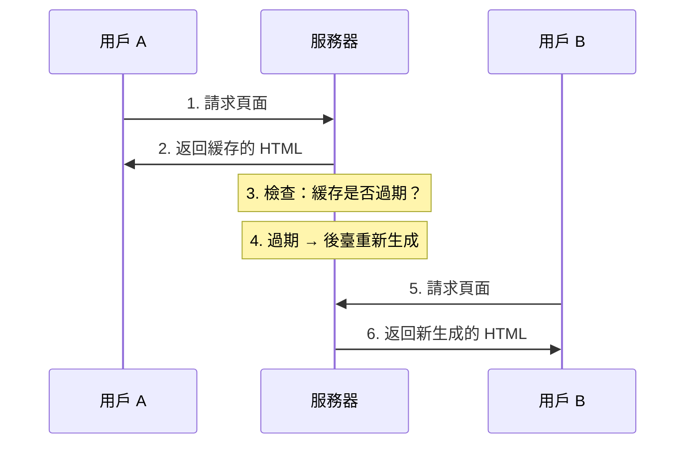

# 2.2.4 半靜態半動態渲染——ISR 增量靜態再生

## 一句話破題

ISR 結合了 SSG 的速度和 SSR 的新鮮度——頁面在構建時生成，但可以在後臺定期更新，無需重新部署。

## 工作原理



### 關鍵概念：Stale-While-Revalidate

1. 用戶請求時，**立即返回緩存內容**（即使可能過期）
2. 如果緩存過期，**後臺異步更新**
3. 下一個用戶得到**新內容**

## ISR 的優缺點

| 優點 | 缺點 |
|------|------|
| 首屏極快（緩存） | 首個用戶可能看到舊數據 |
| 數據可更新 | 更新有延遲 |
| 無需重新部署 | 需要服務器運行時 |
| 服務器壓力小 | 不適合即時數據 |

## 在 Next.js 中實現 ISR

### 基礎用法：revalidate

```typescript
// app/products/page.tsx
async function getProducts() {
  const res = await fetch('https://api.example.com/products', {
    next: { revalidate: 60 }  // 60 秒後重新驗證
  })
  return res.json()
}

export default async function ProductsPage() {
  const products = await getProducts()
  
  return (
    <ul>
      {products.map(product => (
        <li key={product.id}>{product.name}</li>
      ))}
    </ul>
  )
}
```

### 頁面級 revalidate

```typescript
// app/news/page.tsx
export const revalidate = 3600  // 整個頁面 1 小時更新一次

export default async function NewsPage() {
  const news = await getNews()
  return <NewsList news={news} />
}
```

### 按需重新驗證

```typescript
// app/api/revalidate/route.ts
import { revalidatePath, revalidateTag } from 'next/cache'
import { NextRequest } from 'next/server'

export async function POST(request: NextRequest) {
  const { path, tag, secret } = await request.json()
  
  // 驗證密鑰
  if (secret !== process.env.REVALIDATE_SECRET) {
    return Response.json({ error: 'Invalid secret' }, { status: 401 })
  }
  
  // 按路徑重新驗證
  if (path) {
    revalidatePath(path)
  }
  
  // 按標籤重新驗證
  if (tag) {
    revalidateTag(tag)
  }
  
  return Response.json({ revalidated: true })
}
```

## revalidate 時間選擇指南

| 場景 | 建議時間 | 說明 |
|------|----------|------|
| 博客文章 | 3600（1小時） | 內容穩定 |
| 商品價格 | 60（1分鐘） | 需要較新 |
| 新聞頭條 | 300（5分鐘） | 平衡速度和新鮮度 |
| 排行榜 | 600（10分鐘） | 不需要即時 |

## 適用場景

### ✅ 適合 ISR 的場景

- **電商商品頁**：價格會變，但不需要即時
- **新聞資訊**：內容更新，但延遲幾分鐘可接受
- **用戶博客**：作者可能編輯內容
- **CMS 內容**：編輯發佈後自動更新

### ❌ 不適合 ISR 的場景

- **即時股票**：需要秒級更新
- **在線聊天**：必須即時
- **庫存顯示**：過期數據可能導致超賣

## 覺知：ISR 常見問題

### 1. revalidate 設置不當

```typescript
// ❌ 太短：頻繁重新生成，失去緩存意義
export const revalidate = 1

// ❌ 太長：數據過時嚴重
export const revalidate = 86400  // 1天

// ✅ 根據業務需求選擇合適時間
export const revalidate = 60  // 1分鐘，適合商品頁
```

### 2. 混淆 revalidate 和 cache

```typescript
// revalidate: ISR，有緩存但會更新
fetch(url, { next: { revalidate: 60 } })

// cache: 'no-store': SSR，無緩存
fetch(url, { cache: 'no-store' })

// cache: 'force-cache': SSG，永久緩存
fetch(url, { cache: 'force-cache' })
```

## 本節小結

ISR 的核心價值：**靜態速度 + 動態更新**。

| 場景 | 是否適合 ISR |
|------|-------------|
| 商品頁 | ✅ 最佳選擇 |
| 新聞列表 | ✅ 適合 |
| 純靜態頁 | ❌ 用 SSG |
| 即時數據 | ❌ 用 SSR |
