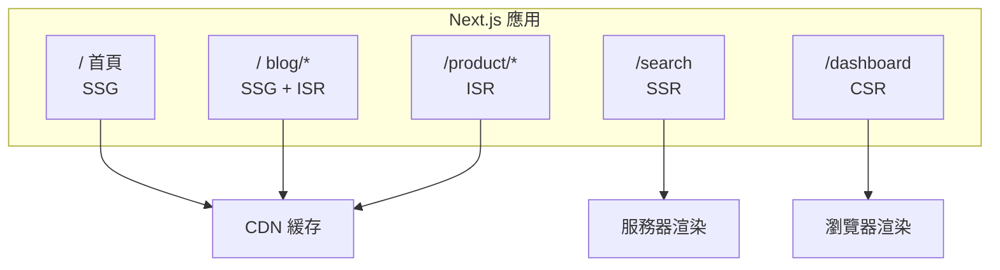
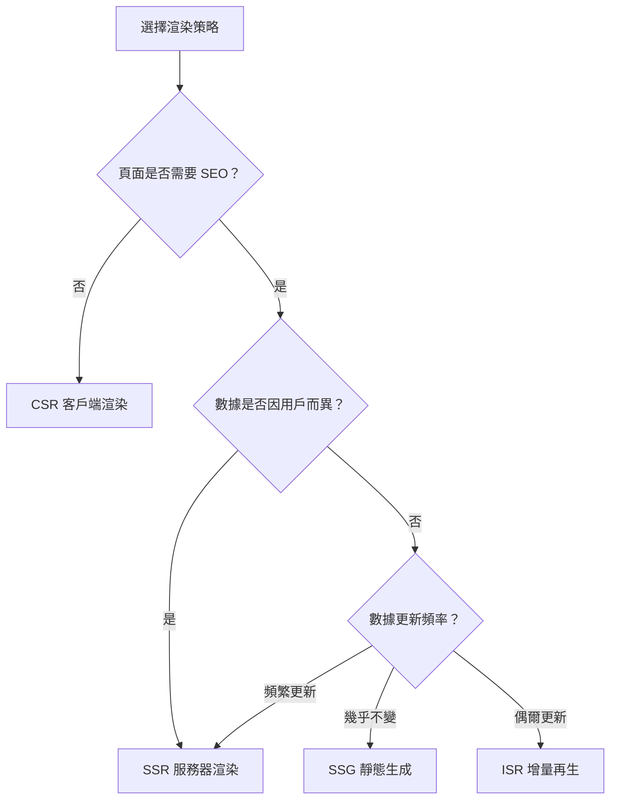

# 2.2.5 具體頁面具體分析——混合渲染

## 一句話破題

Next.js 的真正威力在於：**同一個應用中，不同頁面可以使用不同的渲染策略**——首頁用 SSG，搜索用 SSR，Dashboard 用 CSR，商品頁用 ISR。

## 混合渲染架構



## 典型電商網站的渲染策略

| 頁面 | 策略 | 原因 |
|------|------|------|
| 首頁 | SSG | 內容固定，追求極致速度 |
| 分類頁 | ISR | 商品會更新，但不頻繁 |
| 商品詳情 | ISR | 價格、庫存偶爾變化 |
| 搜索結果 | SSR | 查詢參數決定內容 |
| 購物車 | CSR | 用戶數據，不需 SEO |
| 訂單頁 | CSR | 用戶私有數據 |

## 代碼示例

### 首頁 (SSG)

```typescript
// app/page.tsx
export default async function HomePage() {
  const featured = await getFeaturedProducts()
  
  return (
    <>
      <Hero />
      <FeaturedProducts products={featured} />
    </>
  )
}
```

### 商品頁 (ISR)

```typescript
// app/products/[id]/page.tsx
export const revalidate = 60  // 1分鐘更新

export async function generateStaticParams() {
  const products = await getTopProducts(100)  // 預渲染前 100 個熱門商品
  return products.map(p => ({ id: p.id }))
}

export default async function ProductPage({
  params
}: {
  params: { id: string }
}) {
  const product = await getProduct(params.id)
  return <ProductDetail product={product} />
}
```

### 搜索頁 (SSR)

```typescript
// app/search/page.tsx
export default async function SearchPage({
  searchParams
}: {
  searchParams: { q?: string; category?: string }
}) {
  const results = await searchProducts(searchParams)
  
  return (
    <div>
      <SearchFilters />
      <ProductGrid products={results} />
    </div>
  )
}
```

### 購物車 (CSR)

```typescript
// app/cart/page.tsx
'use client'

import { useCart } from '@/hooks/use-cart'

export default function CartPage() {
  const { items, total, updateQuantity, removeItem } = useCart()
  
  return (
    <div>
      <CartItems items={items} />
      <CartSummary total={total} />
    </div>
  )
}
```

## 同一頁面內的混合策略

```typescript
// app/product/[id]/page.tsx
import { Suspense } from 'react'

export default async function ProductPage({ params }) {
  const product = await getProduct(params.id)  // ISR
  
  return (
    <div>
      {/* 靜態部分 */}
      <ProductInfo product={product} />
      
      {/* 動態部分：流式加載 */}
      <Suspense fallback={<InventorySkeleton />}>
        <RealtimeInventory productId={params.id} />
      </Suspense>
      
      {/* 客戶端交互 */}
      <AddToCartButton product={product} />
    </div>
  )
}

// 即時庫存：SSR
async function RealtimeInventory({ productId }: { productId: string }) {
  const inventory = await getInventory(productId)  // 每次請求獲取
  return <InventoryBadge count={inventory.count} />
}
```

## 決策流程圖



## 驗收清單

當你設計頁面渲染策略時，檢查以下問題：

- [ ] 這個頁面需要被搜索引擎收錄嗎？
- [ ] 內容是所有用戶相同，還是因人而異？
- [ ] 數據多久更新一次？
- [ ] 頁面對首屏速度要求高嗎？
- [ ] 服務器能承受多大併發？

## 本節小結

混合渲染的核心原則：**根據頁面特性選擇最合適的策略，而不是一刀切**。

| 需求 | 策略 |
|------|------|
| 極致速度 + 固定內容 | SSG |
| 速度 + 偶爾更新 | ISR |
| SEO + 動態內容 | SSR |
| 用戶數據 + 交互 | CSR |
